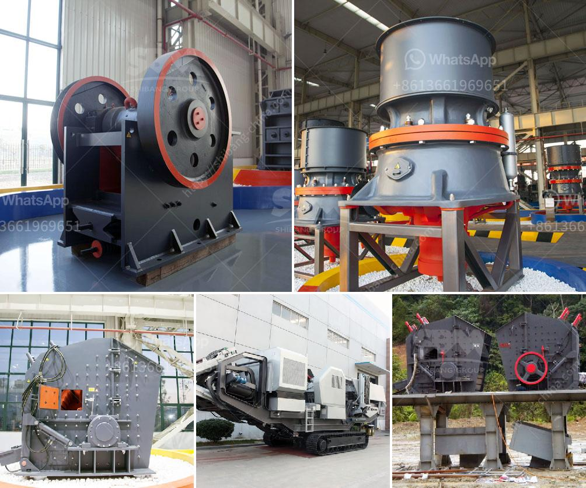

<h3>gold mill equipment zimbabwe</h3>
Zimbabwe is rich in gold ore. The country has increased its gold production from less than 1 ton in 1979 to over 40 tons in 2019, which is an impressive feat. What has caused this incredible growth in gold production? Zimbabwe's gold mining policies and practices have played a crucial role in the increase, particularly in the small-scale mining sector.

With the reintroduction of the Zimbabwe dollar in June 2019, the government allowed local gold miners to directly export gold, removing the need for them to sell it to the central bank at a subsidised exchange rate. This has empowered small-scale miners, who now have the freedom to sell their gold on the international market.

One key component of the gold mining sector in Zimbabwe is the gold mill equipment, also known as gold grinding mills. These mills are used to grind and crush the mined gold ore into a fine powder for further processing.

Gold mill equipment consists of a variety of components, including crushers, feeders, pumps, and classifiers. They are specifically designed for the efficient grinding and crushing of gold ore in various stages of the mining process. The mills utilize heavy metal balls that grind the ore down to the size required for the next stage of processing. The crushed material is then transported to a classifier that separates the finer particles from the coarser ones.

Zimbabwe has a wide range of gold mills available, both locally and internationally. Some popular brands include Stamp mills, Raymond mills, and Ball mills. Each mill has its unique features and strengths, depending on the specific requirements of the gold mining operation.

Stamp mills are widely used in Zimbabwean gold mines and are known for their reliability and ease of operation. These mills use heavy metal stamps to crush gold-bearing ore into small particles, which can then be processed to extract the gold. Although they require regular maintenance and replacement of the stamps, they are a cost-effective option for small-scale miners.

Raymond mills are widely used in the global mining industry and have been adapted for use in Zimbabwe. They offer high efficiency and low energy consumption. These mills use a series of rollers and rotating discs to grind and classify the ore particles, ensuring a consistent particle size for efficient processing.

Ball mills are another common type of gold mill equipment used in Zimbabwean mines. They consist of rotating cylinders partially filled with steel balls. The crushed ore is introduced into the cylinder, and as the cylinder rotates, the steel balls grind the ore into a fine powder. Ball mills are efficient and economical, making them a popular choice for large-scale gold mining operations.

As Zimbabwe's gold production continues to grow, the demand for gold mill equipment is expected to rise. Gold mill equipment Zimbabwe offers many benefits to the local mining investors, which have already been integrated in government policies and are being enforced by the Ministry of Mines and Mining Development. These benefits include increased gold production, job creation, and overall economic growth for the country.

In conclusion, gold mill equipment plays a crucial role in Zimbabwe's gold mining industry. The availability and quality of the equipment directly affect the efficiency and output of the gold mining process. Therefore, it is essential for Zimbabwean investors to consider the selection and maintenance of gold mill equipment carefully. With the right equipment, Zimbabwe's gold mining sector can continue to thrive and contribute positively to the country's economic development.
<h3>Contact us</h3><ul><li><strong>Whatsapp:&nbsp;<a href="https://wa.me/8613661969651">+8613661969651</a></strong></li><li><a href="https://swt.shibang-china.com/?git&amp;zhl&amp;gold mill equipment zimbabwe"><strong>Online Service(chat now)</strong></a></li></ul><h3>Related</h3><ul><li><a href='used jaw crusher japan.md'>used jaw crusher japan</a></li><li><a href='dry processing of coal in south africa.md'>dry processing of coal in south africa</a></li><li><a href='quartz manufacturing plant.md'>quartz manufacturing plant</a></li><li><a href='crusher plant project cost.md'>crusher plant project cost</a></li><li><a href='manufacturer of stone crusher.md'>manufacturer of stone crusher</a></li></ul>