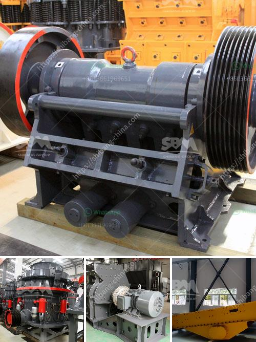

<h3>gold mining equipment for sale at malaysia</h3>
Gold mining in Malaysia has been a prominent industry since the early 19th century, with the discovery of significant gold reserves at the Pahang District. With gold becoming increasingly valuable in recent years, exploration and mining companies have ramped up efforts to extract gold from various locations in Malaysia. To achieve this, reliable and high-quality gold mining equipment is essential. In this article, we will explore the types of gold mining equipment available for sale in Malaysia.

One of the primary tools used in gold mining is the gold detector. These devices are essential for detecting gold deposits hidden underground. Gold detectors operate on certain principles, such as electromagnetic or ground-penetrating radar, which allow them to identify the presence of gold particles in the soil or rock formations. There are various types of gold detectors available in the market, ranging from handheld devices to larger, more advanced machinery. Prospective gold miners in Malaysia can explore these options to find the device best suited to their needs.

Another essential piece of gold mining equipment is the gold pan. This traditional tool has been used for centuries to separate gold particles from sand and gravel. The gold pan is relatively simple in design, consisting of a circular shallow dish with sloping sides. Miners use the gold pan to scoop up sediment from rivers or streams and then gently swirl the pan to let the water carry away lighter particles. The heavier gold particles settle at the bottom of the pan, allowing miners to extract them manually. The gold pan is a cost-effective and readily available tool for small-scale gold mining operations.

For larger mining operations, more sophisticated equipment such as dredges, sluice boxes, and trommels are commonly used. Dredges are mechanical devices that extract gold-rich sediment from riverbeds or ocean floors. These machines work by dragging a bucket-line or suction tube through the water, collecting sediment and transporting it to a designated area for further processing. Sluice boxes are long troughs with riffles that help capture gold particles as sediment flows through them. Miners load sediment into the sluice box, and as it moves along, the riffles create barriers that trap gold particles while allowing lighter materials to wash away. Trommels, on the other hand, are rotating cylindrical screens used to separate gold-bearing sediment from larger rocks and debris.

In Malaysia, mining equipment for gold extraction is readily available for purchase both online and in-person. Local suppliers and manufacturers offer a wide range of options, tailored to different scales and budgets. Prospective gold miners can also explore auction and second-hand platforms to find used equipment in good working condition. However, it is crucial to ensure that any purchased equipment meets safety standards and regulatory requirements to operate legally.

In conclusion, gold mining equipment plays a crucial role in the extraction process, allowing miners to efficiently locate and extract gold particles from the earth. From gold detectors to dredges, sluice boxes, and trommels, various equipment options are available for sale in Malaysia. Prospective gold miners should consider their mining scale and budget to select the most suitable equipment for their operations. Additionally, it is essential to acquire equipment from reputable sources and comply with legal requirements to ensure a safe and successful gold mining venture.
<h3>Contact us</h3><ul><li><strong>Whatsapp:&nbsp;<a href="https://wa.me/8613661969651">+8613661969651</a></strong></li><li><a href="https://swt.shibang-china.com/?git&amp;zhl&amp;gold mining equipment for sale at malaysia"><strong>Online Service(chat now)</strong></a></li></ul><h3>Related</h3><ul><li><a href='rock crushers in south africa.md'>rock crushers in south africa</a></li><li><a href='gypsum powder production line capacity 80 tons per hour.md'>gypsum powder production line capacity 80 tons per hour</a></li><li><a href='iron crusher in mexico.md'>iron crusher in mexico</a></li><li><a href='jaw crusher tanzania.md'>jaw crusher tanzania</a></li><li><a href='stearic acid coating machine for calcium carbonate.md'>stearic acid coating machine for calcium carbonate</a></li></ul>