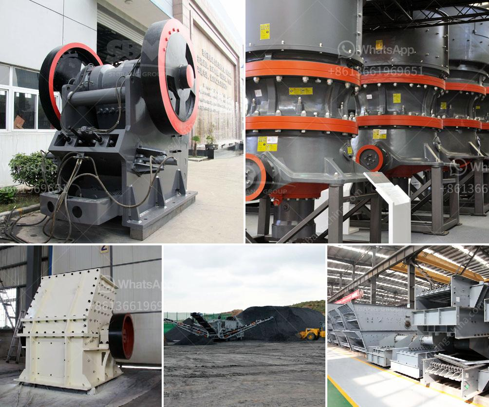

<h3>gold mining equipment suppliers</h3>
Gold mining is a lucrative business that requires extensive planning, expertise, and resources. With the right equipment, individuals or companies can prospect, mine, and process gold-bearing ore to produce pure gold. But finding the right suppliers for your gold mining equipment can be a challenging task.

In recent years, there has been a significant increase in gold mining activities across the globe. This has led to a surge in demand for mining equipment and machinery. Whether you are a small-scale miner or a large-scale corporation, having the right equipment is crucial for successful gold mining operations.

One of the first steps in finding reliable suppliers is to conduct thorough research. Look for suppliers that have a strong reputation in the industry and have been in business for several years. A reputable supplier will have a track record of delivering high-quality equipment that meets industry standards.

One of the key factors to consider when selecting a supplier is the range of equipment they offer. Gold mining requires a wide variety of equipment, including detectors, sluices, shakers, trommels, and crushers. It's crucial to find a supplier that can provide all the necessary equipment to suit your specific needs.

When it comes to gold mining equipment, quality is paramount. Inferior equipment can result in delays, breakdowns, and increased repair costs, ultimately affecting your productivity and profitability. Make sure to choose a supplier that offers equipment made from durable materials and with advanced features. This will ensure that your equipment can withstand the harsh conditions often encountered in gold mining operations and can perform optimally.

Another crucial consideration is the supplier's after-sales service and support. Gold mining equipment is complex and requires regular maintenance and repairs. A reputable supplier should provide comprehensive after-sales service, including spare parts availability, technical support, and training. This will help you minimize downtime and keep your operations running smoothly.

Cost is another important factor to consider when selecting a supplier. While it's tempting to choose the supplier offering the lowest prices, it's essential to evaluate the overall value for money. Look for a supplier that offers competitive prices without compromising on the quality of their equipment and services. It's also worth considering suppliers that offer flexible payment options or financing plans, as gold mining operations can be capital-intensive.

When searching for gold mining equipment suppliers, it's beneficial to seek recommendations from industry peers or join relevant online communities. These platforms can provide valuable insights and recommendations based on real-life experiences. Additionally, attending industry trade shows and conferences can allow you to meet suppliers face-to-face, inspect their equipment, and discuss your specific requirements.

In conclusion, finding reliable gold mining equipment suppliers is crucial for the success of your operations. Conducting thorough research, choosing suppliers with a strong reputation and a wide range of equipment, and considering factors such as quality, after-sales service, and cost will help you make an informed decision. Remember that investing in high-quality equipment from reputable suppliers is an investment in the long-term success of your gold mining venture.
<h3>Contact us</h3><ul><li><strong>Whatsapp:&nbsp;<a href="https://wa.me/8613661969651">+8613661969651</a></strong></li><li><a href="https://swt.shibang-china.com/?git&amp;zhl&amp;gold mining equipment suppliers"><strong>Online Service(chat now)</strong></a></li></ul><h3>Related</h3><ul><li><a href='list of sponge iron factories in hospet.md'>list of sponge iron factories in hospet</a></li><li><a href='lime stone powder making machine in india.md'>lime stone powder making machine in india</a></li><li><a href='china conveyor belts.md'>china conveyor belts</a></li><li><a href='list of equipments needed to start gold mining.md'>list of equipments needed to start gold mining</a></li><li><a href='used jaw mobile crusher in uae.md'>used jaw mobile crusher in uae</a></li></ul>