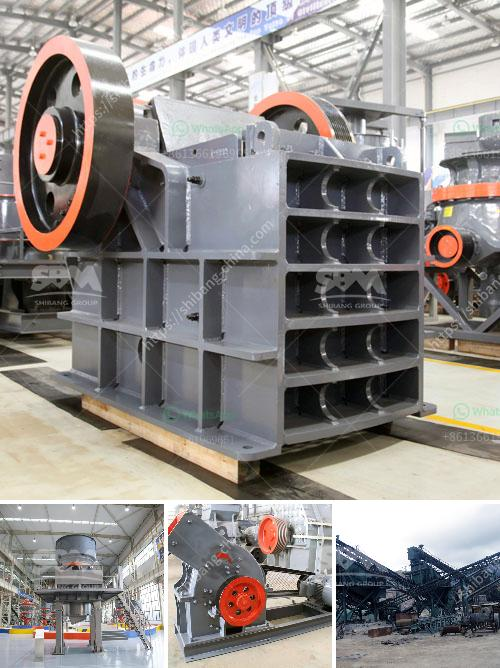

<h3>gold mining equipment washing machines</h3>
Gold mining equipment is essential for the successful extraction of gold from any location. However, choosing the right equipment makes all the difference, which is where washing machines come into play.

Gold mining washing machines are specifically designed to break down the densest sediments found in rivers and streams. Those sediments possess gold particles known as flakes, nuggets, and dust, making their extraction a complex process that requires advanced equipment.

One of the main features of these washing machines is their ability to separate gold particles from other debris, such as rocks, sand, and dirt. This process is achieved by utilizing water and gravity. The gold-bearing material is placed into the washing machine's hopper, where water is pumped through a spraybar system. The high water pressure breaks down the sediments and washes away any unwanted materials, leaving only the gold particles behind.

The washing machines are equipped with riffles or mats, which are specifically designed to capture the gold particles. These riffles create turbulence in the water flow, allowing the heavier gold particles to settle, while the lighter materials are carried away. The captured gold particles are then collected and stored in a separate container.

There are various types and sizes of gold mining washing machines available on the market. Some are designed for small-scale mining operations, while others are more suitable for larger-scale operations. The size of the washing machine will depend on factors such as the amount of material being processed, the desired throughput, and the available water supply.

Furthermore, modern gold mining washing machines are equipped with additional features to improve efficiency and maximize gold recovery. This includes the use of vibrating screens, centrifugal concentrators, and sluice boxes. Vibrating screens help to remove oversized materials, while centrifugal concentrators and sluice boxes further enhance the gold recovery process by concentrating the particles and trapping them in mats or riffles.

In addition to their effectiveness in separating gold particles, these washing machines are also designed to be durable and reliable. They are made from strong materials, such as steel or aluminum, to withstand the harsh conditions of the mining environment. Additionally, they are equipped with powerful motors and pumps to ensure efficient operation.

As technology advances, gold mining washing machines continue to evolve, with new features being introduced to improve performance and ease of use. Some models are now equipped with electronic controls and automation systems, allowing operators to monitor and adjust various parameters, such as water flow, vibration, and concentration levels.

In conclusion, gold mining equipment washing machines are essential tools for the successful extraction of gold from rivers and streams. Their ability to separate gold particles from other materials makes them an indispensable part of any mining operation. The variety of sizes and additional features available ensure that there is a washing machine suitable for every mining scenario. With continued advancements in technology, these machines continue to play a vital role in the gold mining industry.
<h3>Contact us</h3><ul><li><strong>Whatsapp:&nbsp;<a href="https://wa.me/8613661969651">+8613661969651</a></strong></li><li><a href="https://swt.shibang-china.com/?git&amp;zhl&amp;gold mining equipment washing machines"><strong>Online Service(chat now)</strong></a></li></ul><h3>Related</h3><ul><li><a href='vertical cement mill grinding plant.md'>vertical cement mill grinding plant</a></li><li><a href='used coal wash plant canada for sale.md'>used coal wash plant canada for sale</a></li><li><a href='list of price of stone crusher machine in zimbabwe.md'>list of price of stone crusher machine in zimbabwe</a></li><li><a href='jaw crusher plates supplier philippines.md'>jaw crusher plates supplier philippines</a></li><li><a href='vibrator screen for coal.md'>vibrator screen for coal</a></li></ul>