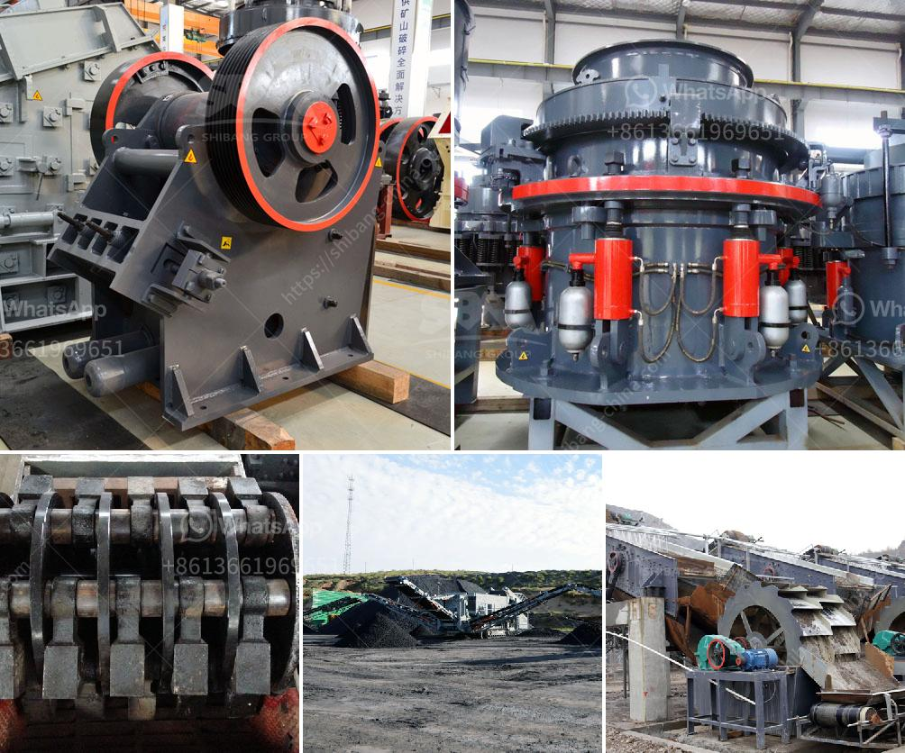

<h3>gold mining machine from germany</h3>
Germany, a country renowned for its engineering expertise and technological advancements, boasts a proud mining heritage. Over the years, German engineers and companies have developed cutting-edge equipment and machinery that has revolutionized the mining industry worldwide. In this article, we will focus on the gold mining machines produced in Germany and their significant contributions to the global mining sector.

German mining equipment manufacturers have a reputation for delivering mining machinery of unparalleled quality. The gold mining machines from Germany are no exception, as they are designed and produced to meet the highest standards of efficiency, durability, and environmental sustainability.

German mining machines employ advanced extraction techniques to efficiently recover gold from ore deposits. These machines utilize state-of-the-art drilling, crushing, and refining technologies that ensure maximum gold recovery with minimal environmental impact. The use of automated processes and precise control systems helps reduce human errors, resulting in increased accuracy and productivity.

German gold mining machines incorporate cutting-edge technologies that enhance their performance and reliability. For instance, advanced sensor technologies are utilized to detect and analyze ore concentrations in real-time, enabling miners to optimize extraction processes. Furthermore, highly efficient power and energy management systems contribute to reduced energy consumption and greenhouse gas emissions.

Safety is a top priority in German gold mining machine design. Strict adherence to safety regulations ensures the protection of mine workers and the prevention of accidents. The machines are equipped with sophisticated safety features, including automatic shutdown mechanisms, emergency stop buttons, and comprehensive monitoring systems. This focus on safety results in minimal downtime, fewer accidents, and increased worker satisfaction.

German gold mining machines are characteristically equipped with intelligent automation systems that streamline operations and reduce human labor requirements. These systems allow for precise and intricate planning, monitoring, and control of mining processes. The integration of robotics and telecommunication technologies enhances the overall efficiency and productivity while minimizing human intervention in hazardous and demanding mining environments.

The German gold mining machines have made a significant impact on the global mining industry. They have empowered smaller mining companies by providing them with access to cutting-edge technology, enabling them to compete with larger enterprises. Furthermore, the efficient extraction methods and lower operating costs associated with German machines have contributed to a sustainable and responsible approach to mining gold on a global scale.

The gold mining machines developed in Germany are a testament to the country's engineering prowess and technological innovation. Through their precision, advanced extraction techniques, cutting-edge technologies, and emphasis on safety and sustainability, these machines have become an invaluable asset to miners worldwide. With Germany's unwavering commitment to engineering excellence, the global mining industry can undoubtedly look forward to continued advancements in the gold mining machinery sector.
<h3>Contact us</h3><ul><li><strong>Whatsapp:&nbsp;<a href="https://wa.me/8613661969651">+8613661969651</a></strong></li><li><a href="https://swt.shibang-china.com/?git&amp;zhl&amp;gold mining machine from germany"><strong>Online Service(chat now)</strong></a></li></ul><h3>Related</h3><ul><li><a href='mobile jaw crusher equipment.md'>mobile jaw crusher equipment</a></li><li><a href='used stone crusher machine for sale in uae.md'>used stone crusher machine for sale in uae</a></li><li><a href='ball mill supplier in malaysia pakistan.md'>ball mill supplier in malaysia pakistan</a></li><li><a href='rock crusher for sale philippines.md'>rock crusher for sale philippines</a></li><li><a href='stone crusher machine price in ethiopia.md'>stone crusher machine price in ethiopia</a></li></ul>