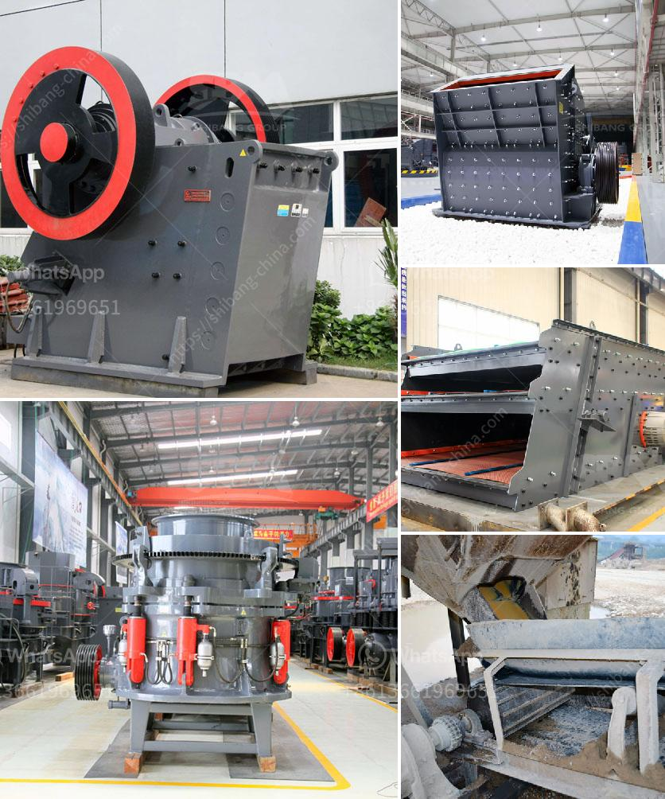

<h3>gold mining processing plant in canada</h3>
Gold mining has been a significant industry in Canada for many years, contributing greatly to the country's economic growth and development. Among the various methods employed to extract gold, one of the most popular is the use of gold mining processing plants. These plants are equipped to process and refine raw gold extracted from mines into a pure and valuable form.

Canada is renowned for its vast reserves of gold, which can be found in numerous locations throughout the country. Gold mining processing plants play a crucial role in harnessing this wealth and turning it into a valuable commodity. These plants are often strategically located near gold mines to minimize transportation costs and streamline the overall extraction process.

The primary objective of a gold mining processing plant is to separate gold ore from waste rock and other impurities. Several techniques are applied to achieve this separation, including crushing, grinding, gravity separation, flotation, and cyanidation. Each method targets different types of gold ores and utilizes various equipment and machinery.

The first step in a gold mining processing plant is the initial crushing of rocks and ores, which are then ground into a fine powder. This process prepares the ore for subsequent separation techniques. The ground material is then subjected to gravity separation, where heavier particles, including gold, are separated from lighter ones. Gravity concentrators, such as jigs, shaking tables, or spiral concentrators, are commonly used for this purpose.

Following gravity separation, the remaining particles undergo further processes to improve the purity of the gold concentrate. Flotation is one of the most widely used techniques in gold mining processing plants. It involves the introduction of certain chemicals that attach to the gold particles, allowing them to float to the surface for collection. This method is particularly effective for separating sulfide minerals from the ore.

Cyanidation is another commonly employed technique in gold mining processing plants. This process involves the use of cyanide to dissolve gold particles from the ore, forming a soluble gold cyanide complex. The gold can then be recovered from the cyanide solution through various means, such as carbon adsorption or precipitation techniques.

Once the desired level of purity is achieved, the gold concentrate is further refined to remove any remaining impurities and contaminants. This refining process typically involves the use of various chemical treatments and smelting to produce pure gold bars or other desired forms.

Gold mining processing plants in Canada are typically large-scale operations that require substantial amounts of investment and infrastructure. They employ advanced equipment and technologies to ensure efficient and environmentally responsible extraction and processing of gold ore. Additionally, these plants adhere to rigorous safety standards to protect workers and minimize any potential environmental impact.

In conclusion, gold mining processing plants in Canada play a crucial role in extracting and refining gold ore into a valuable commodity. Through a series of processes including crushing, grinding, gravity separation, flotation, and cyanidation, these plants transform raw materials into a pure and marketable form of gold. By adhering to strict safety and environmental standards, these plants contribute to the sustainable growth of Canada's gold mining industry.
<h3>Contact us</h3><ul><li><strong>Whatsapp:&nbsp;<a href="https://wa.me/8613661969651">+8613661969651</a></strong></li><li><a href="https://swt.shibang-china.com/?git&amp;zhl&amp;gold mining processing plant in canada"><strong>Online Service(chat now)</strong></a></li></ul><h3>Related</h3><ul><li><a href='price conveyor belts.md'>price conveyor belts</a></li><li><a href='hammer mill machine 20hp.md'>hammer mill machine 20hp</a></li><li><a href='mobile jaw crusher plant.md'>mobile jaw crusher plant</a></li><li><a href='costs of ball mills.md'>costs of ball mills</a></li><li><a href='small sand washing machine.md'>small sand washing machine</a></li></ul>