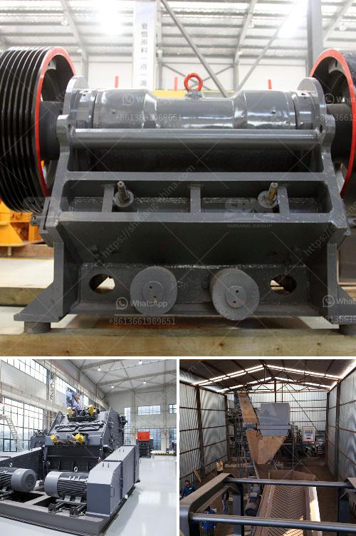

<h3>gold ore hammer mills prices mining supplies in zimbabwe</h3>
Gold mining is a lucrative business in Zimbabwe, and has seen the sector contributing significantly to the country's gross domestic product (GDP). The gold ore hammer mill prices, mining supplies in Zimbabwe, offer a wide range of mills suited for different mining operations. The smaller ones are ideal for individual miners and can be operated using a simple generator. The larger mills, on the other hand, are built to handle the increased production of medium to large-scale mining operations.

The prices of gold ore hammer mills can vary depending on the model, capacity, and operating capabilities of the mills. The materials used in the construction of the mills also affect the prices. Steel mills, for instance, are more expensive than those made from cast iron or aluminum. Additionally, mills with additional features or added functionalities may also be priced higher compared to the basic models.

With gold being the most sought-after mineral in Zimbabwe, finding gold ore hammer mills at competitive prices is crucial for both individual miners and large-scale mining companies. Gold ore hammer mills can crush gold particles into fine powder with minimal effort, making it easier to extract the precious metal from ore. This makes the process more efficient and increases the profitability of gold mining operations.

Moreover, the availability of mining supplies in Zimbabwe is essential for a smooth mining operation. It is important for miners to have access to reliable suppliers who can provide them with the necessary tools and equipment to carry out their work effectively. This includes not only gold ore hammer mills but also other essential items such as diesel generators, water pumps, explosives, protective gear, and even transportation vehicles to move mined ore.

It is important to note that acquiring mining supplies in Zimbabwe might not always be an easy task, given the numerous challenges that the country faces. Economic difficulties, scarcity of foreign currency, and poor infrastructure can hamper the availability and accessibility of mining supplies. However, there are still suppliers who manage to navigate these challenges and provide high-quality products at competitive prices to meet the needs of the mining sector.

Mining supplies in Zimbabwe are not limited to just equipment and machinery. There is also a need for appropriate training and guidance on how to utilize these supplies efficiently and safely. Safety should always be a priority in any mining operation, and miners must be trained to operate the equipment correctly to avoid accidents and protect themselves from potential hazards.

In conclusion, gold ore hammer mills prices and mining supplies in Zimbabwe play a crucial role in the mining sector. They provide miners with essential tools and equipment to extract gold efficiently and maximize their profits. However, it is essential for miners to find reliable suppliers who can offer competitive prices and ensure the availability of quality products. Additionally, adequate training and safety measures must be put in place to protect the miners and ensure sustainable mining practices that benefit both the economy and the environment.
<h3>Contact us</h3><ul><li><strong>Whatsapp:&nbsp;<a href="https://wa.me/8613661969651">+8613661969651</a></strong></li><li><a href="https://swt.shibang-china.com/?git&amp;zhl&amp;gold ore hammer mills prices mining supplies in zimbabwe"><strong>Online Service(chat now)</strong></a></li></ul><h3>Related</h3><ul><li><a href='cement cement grinding ball mill.md'>cement cement grinding ball mill</a></li><li><a href='production process clinker zurich switzerland.md'>production process clinker zurich switzerland</a></li><li><a href='process of mining silica rock crusher.md'>process of mining silica rock crusher</a></li><li><a href='how to crusher granite.md'>how to crusher granite</a></li><li><a href='mobile stone crusher suppliers.md'>mobile stone crusher suppliers</a></li></ul>