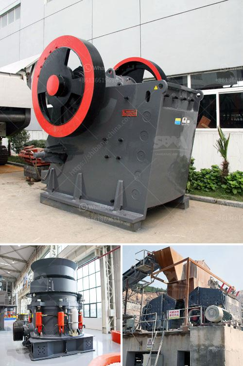

<h3>gold processing machinery in china</h3>
Gold has been considered a precious metal, glittering with immense value and beauty, for centuries. It holds a special place in both history and the global economy. As the demand for gold continues to rise, China has emerged as a dominant player in the gold processing machinery industry.

China's gold processing machinery industry has witnessed tremendous growth over the years. With advancements in technology and increased production capacity, China now stands at the forefront of gold processing machinery manufacturing. The country's rich reserves of gold, coupled with its skilled workforce and state-of-the-art machinery, have contributed to its success in this sector.

China's gold processing machinery industry encompasses a wide range of equipment used in the extraction, refining, and processing of gold ore. Some of the key machinery used in this process includes crushers, vibrating feeders, conveyors, ball mills, spiral classifiers, and flotation machines. These machines work together to extract and separate gold from its ore, ensuring maximum efficiency and productivity.

One of the factors that contribute to China's dominance in the gold processing machinery industry is the country's mining industry. China is one of the largest gold producers in the world, with significant reserves spread across various provinces. This extensive supply of gold ore provides a stable and abundant source for processing, and subsequently, the production of gold processing machinery.

China's gold processing machinery manufacturers have invested heavily in research and development to produce innovative and high-quality equipment. These manufacturers have adopted advanced technologies to improve the efficiency and effectiveness of gold processing machinery. For example, they have developed machines equipped with sensors and automated controls that optimize the extraction process, ensuring higher yields and reducing operational costs.

Moreover, China's gold processing machinery manufacturers have also focused on environmental sustainability. They have incorporated eco-friendly practices to minimize the impact on the environment during the gold extraction and processing process. These include the use of water recycling systems, dust control mechanisms, and energy-efficient technologies, among others. Such initiatives showcase China's commitment to responsible and sustainable mining practices.

The rise of China's gold processing machinery industry has not gone unnoticed by the international market. Chinese manufacturers have gained recognition for their high-quality and cost-effective equipment. As a result, China has become a major exporter of gold processing machinery to countries around the world. This has further boosted the country's standing as a leading player in the global gold processing machinery market.

In conclusion, China's gold processing machinery industry has experienced remarkable growth, thanks to its rich gold reserves, skilled workforce, and technological advancements. Chinese manufacturers have excelled in producing innovative and eco-friendly equipment, ensuring maximum efficiency, productivity, and sustainability. As the global demand for gold continues to surge, China's gold processing machinery industry is set to play a pivotal role in meeting this demand and shaping the future of the gold market.
<h3>Contact us</h3><ul><li><strong>Whatsapp:&nbsp;<a href="https://wa.me/8613661969651">+8613661969651</a></strong></li><li><a href="https://swt.shibang-china.com/?git&amp;zhl&amp;gold processing machinery in china"><strong>Online Service(chat now)</strong></a></li></ul><h3>Related</h3><ul><li><a href='used coal wash plant canada for sale.md'>used coal wash plant canada for sale</a></li><li><a href='jaw roll crusher.md'>jaw roll crusher</a></li><li><a href='clay grinding plant.md'>clay grinding plant</a></li><li><a href='komatsu br 380 crusher for sale in malaysia.md'>komatsu br 380 crusher for sale in malaysia</a></li><li><a href='complete crushing plant 150 200t.md'>complete crushing plant 150 200t</a></li></ul>