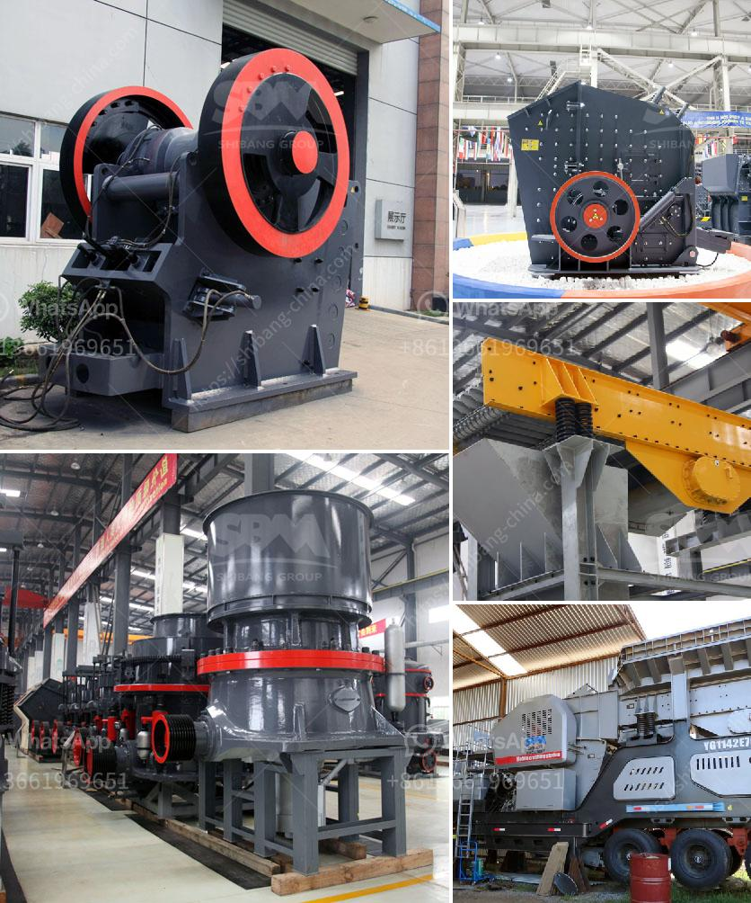

<h3>gold processing mecury sales gauteng</h3>
Gauteng, a province in South Africa known for its rich gold deposits, has become a hotbed for gold processing and mercury sales. While gold processing presents an opportunity for employment and economic growth, it also carries an alarming environmental and health hazard due to the dangerous use of mercury in the process.

Mercury, a toxic heavy metal, is widely used in informal gold processing operations in Gauteng. Its primary function is to extract gold from ore through a process known as amalgamation. However, the improper handling and disposal of mercury pose severe risks to human health and the environment. Despite the known risks, mercury remains widely sought after due to its affordability, availability, and effectiveness in extracting gold.

Mercury sales in Gauteng are widespread, predominantly taking place in informal markets where the demand for the chemical is high. These markets often operate without proper regulations, inspections, or safety measures. Consequently, workers and communities involved in gold processing are highly vulnerable to the negative effects of mercury exposure.

The health impacts of mercury on humans are numerous and devastating. Mercury vapors, which are released during gold processing, can cause severe respiratory problems, neurological disorders, and even death. In addition, long-term exposure to mercury has been linked to developmental issues in children and reproductive problems. The mercury contamination does not only affect the workers directly exposed to it but also spreads to nearby communities through air, water, and food sources.

Environmental damage is another grave consequence of mercury use in gold processing. Mercury is a persistent pollutant and can remain in the environment for a long time, accumulating in soil and water bodies. It has detrimental effects on aquatic life and can contaminate ecosystems, disrupting natural food chains.

Efforts to control and regulate the mercury trade in Gauteng are necessary to prevent further environmental degradation and safeguard human health. Authorities should strengthen regulations, conduct regular inspections, and raise awareness about the dangers of mercury usage. Additionally, alternatives to mercury-based gold processing methods, such as the use of environmentally friendly technologies, should be promoted and invested in.

Gold processing mercury sales in Gauteng may offer economic benefits, but the price paid in terms of human lives and environmental destruction far outweighs any short-term gains. It is crucial for all stakeholders, including government entities, gold processing operators, and communities, to come together and prioritize the implementation of responsible and sustainable gold processing methods that eliminate the use of mercury. Only by doing so can Gauteng strike a balance between economic prosperity and the preservation of its natural resources and the health of its people.
<h3>Contact us</h3><ul><li><strong>Whatsapp:&nbsp;<a href="https://wa.me/8613661969651">+8613661969651</a></strong></li><li><a href="https://swt.shibang-china.com/?git&amp;zhl&amp;gold processing mecury sales gauteng"><strong>Online Service(chat now)</strong></a></li></ul><h3>Related</h3><ul><li><a href='used hammer mill.md'>used hammer mill</a></li><li><a href='best machine for coal grinding.md'>best machine for coal grinding</a></li><li><a href='sample of project proposal on small scale mining.md'>sample of project proposal on small scale mining</a></li><li><a href='sand screens and sieves dealers contacts.md'>sand screens and sieves dealers contacts</a></li><li><a href='chrome concentrate wash plant for sale.md'>chrome concentrate wash plant for sale</a></li></ul>