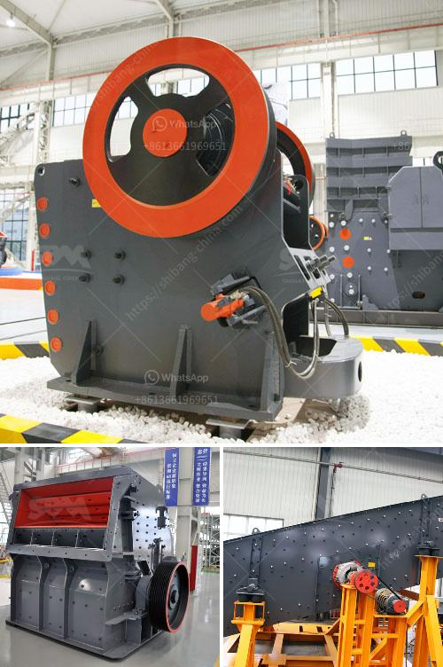

<h3>gold processing plant for sale</h3>
In the realm of precious metals, gold has always held a special place as a highly sought-after commodity. Its exceptional value and enduring appeal have made it a favorite among investors and individuals alike. To meet the growing demand for gold resources, the market for gold processing plants has experienced a significant surge. With an array of options available, potential buyers can discover a thriving business opportunity in the acquisition of a gold processing plant for sale.

The sale of a gold processing plant presents a remarkable chance for business enthusiasts to tap into the lucrative gold mining industry. These plants are equipped with cutting-edge machinery and equipment designed to extract gold efficiently and expediently. From crushing and grinding to cyanidation and recovery, each stage of the gold processing process is carefully streamlined to optimize productivity and maximize gold yield.

1. High Revenue Potential: A successfully operated gold processing plant can generate substantial returns on investment. The global demand for gold remains robust, and its value continues to appreciate over time. Owning a gold processing plant allows investors to capitalize on this enduring demand and generate substantial revenue streams.

2. Diversification: Investing in a gold processing plant offers diversification opportunities. Gold is often viewed as a safe haven asset that provides a hedge against economic uncertainties. By incorporating gold mining operations into their investment portfolio, individuals can mitigate risks associated with traditional investments.

3. Environmental Responsibility: Most modern gold processing plants adhere to environmentally-friendly practices. Utilizing advanced technologies, these plants strive to minimize their carbon footprint and implement sustainable mining techniques, ensuring responsible resource extraction.

The availability of gold processing plants for sale presents an enticing opportunity for those seeking to venture into the gold mining industry. These plants offer a platform for investors to capitalize on the enduring demand for gold, generate substantial revenue streams, and contribute to the global supply of this precious metal. With careful research and due diligence, potential buyers can acquire a gold processing plant and embark on a profitable journey in the world of gold mining.
<h3>Contact us</h3><ul><li><strong>Whatsapp:&nbsp;<a href="https://wa.me/8613661969651">+8613661969651</a></strong></li><li><a href="https://swt.shibang-china.com/?git&amp;zhl&amp;gold processing plant for sale"><strong>Online Service(chat now)</strong></a></li></ul><h3>Related</h3><ul><li><a href='steel slag cement manufacture process ppt.md'>steel slag cement manufacture process ppt</a></li><li><a href='conventional stone crushers in peru.md'>conventional stone crushers in peru</a></li><li><a href='quote for stone crusher.md'>quote for stone crusher</a></li><li><a href='how to shim a jaw crusher.md'>how to shim a jaw crusher</a></li><li><a href='suppliers of coveyor belting in durban.md'>suppliers of coveyor belting in durban</a></li></ul>