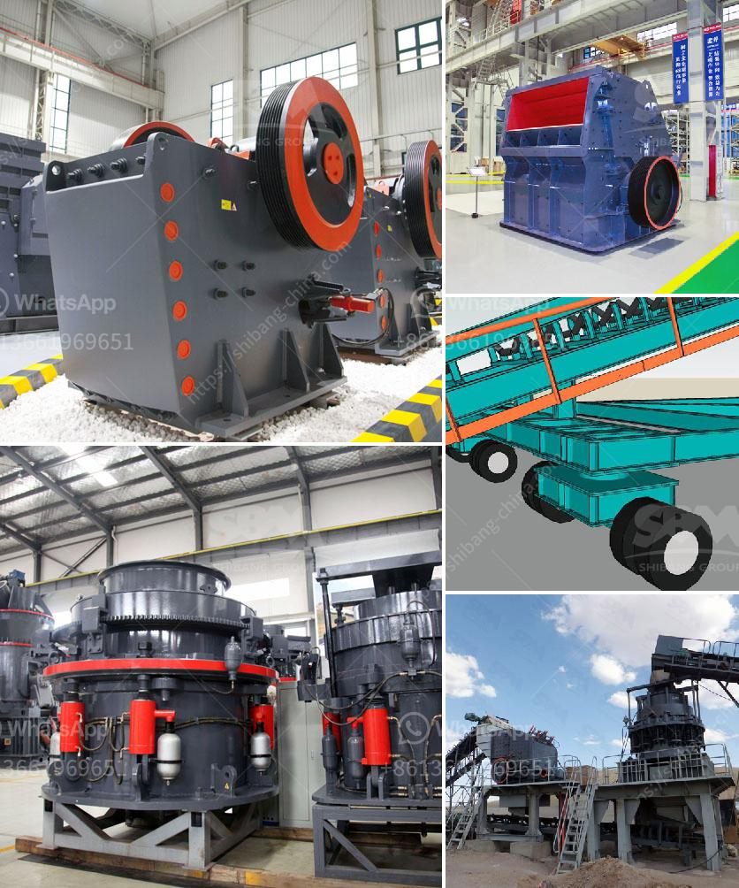

<h3>gold refinery in philippines south africa</h3>
Gold has long been a symbol of wealth and prosperity, and its allure has captivated people for centuries. However, the journey of gold from mines to markets is not as straightforward as it may seem. Before it can be transformed into the glittering jewelry or bars we see, gold needs to go through a meticulous refining process. In this article, we will explore the gold refinery industry in the Philippines and South Africa and how these countries are revolutionizing the way precious metals are processed.

The Philippines, a country rich in natural resources, has been a significant player in the gold mining industry for many years. With its abundant gold deposits and strategic location in Southeast Asia, the Philippines has become a prime destination for gold refining. One of the leading gold refineries in the country is the Philippine Gold Processing and Refining Corporation (PGPRC).

PGPRC, located in the scenic province of Masbate, is known for its state-of-the-art gold refinery facilities. Equipped with cutting-edge technology, PGPRC has the capacity to process more than 200 tons of gold per year. The refinery adheres to the highest industry standards in terms of safety, environmental protection, and product quality. Moreover, it employs a highly skilled workforce to ensure that the refining process is carried out with utmost precision.

South Africa, on the other hand, is a dominant force in the global gold mining industry. As the world's largest producer of gold, South Africa boasts numerous refineries that cater to both domestic and international markets. One prominent gold refinery in South Africa is the Rand Refinery, which has been in operation for over a century.

The Rand Refinery, located in the city of Germiston, plays a critical role in refining and smelting gold from mines across South Africa and neighboring countries. With a refining capacity of more than 600 tons of gold per year, the Rand Refinery is renowned for its expertise and reliability. It has implemented stringent quality control measures to ensure that its gold products meet international standards.

Both the Philippine Gold Processing and Refining Corporation and the Rand Refinery are at the forefront of technological advancements, constantly striving to improve the efficiency and sustainability of the refining process. Moreover, they are committed to responsible sourcing, ensuring that the gold they process is obtained through ethical and environmentally-friendly mining practices.

In conclusion, gold refineries in the Philippines and South Africa are revolutionizing the way precious metals are processed. Through state-of-the-art technology, adherence to strict quality control measures, and a commitment to sustainable practices, these refineries are setting new standards in the gold industry. As the demand for gold continues to rise, the gold refinery industry in these countries will undoubtedly play a crucial role in meeting global needs while ensuring the integrity and purity of this precious metal.
<h3>Contact us</h3><ul><li><strong>Whatsapp:&nbsp;<a href="https://wa.me/8613661969651">+8613661969651</a></strong></li><li><a href="https://swt.shibang-china.com/?git&amp;zhl&amp;gold refinery in philippines south africa"><strong>Online Service(chat now)</strong></a></li></ul><h3>Related</h3><ul><li><a href='iron ore crushing plant in germany.md'>iron ore crushing plant in germany</a></li><li><a href='used stone crusher machine in italia.md'>used stone crusher machine in italia</a></li><li><a href='crusher plant distributor in saudi arabia.md'>crusher plant distributor in saudi arabia</a></li><li><a href='lime production line price.md'>lime production line price</a></li><li><a href='grinding machine manufacturers and suppliers in india.md'>grinding machine manufacturers and suppliers in india</a></li></ul>