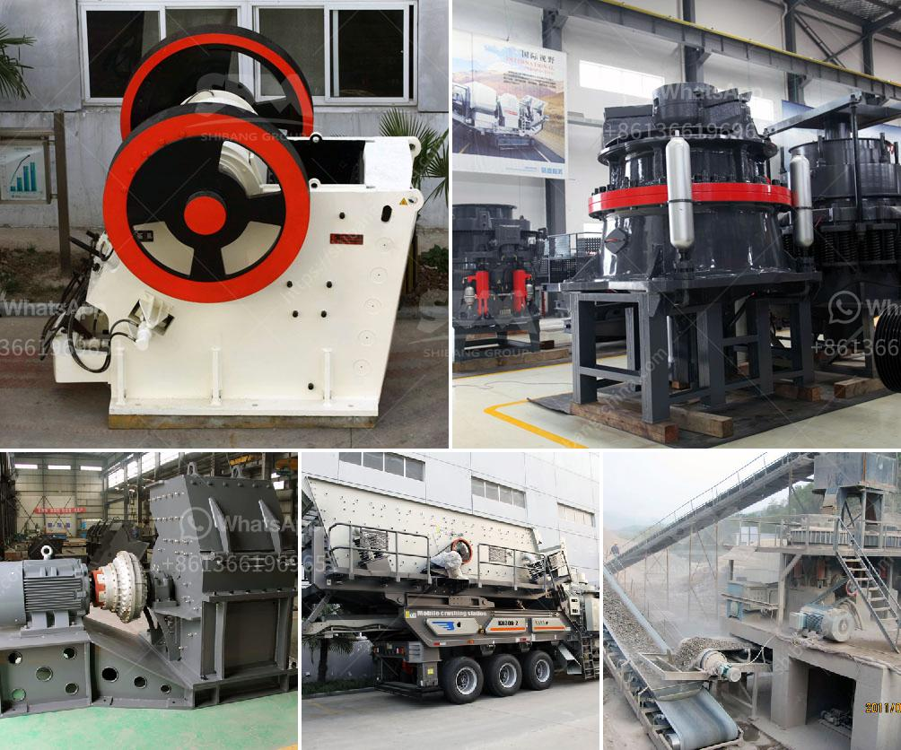

<h3>gold refining equipment toronto</h3>
Gold refining is a meticulous process that requires specialized equipment to extract the precious metal from its impurities. In Toronto, there is a range of gold refining equipment available for those looking to refine their gold to obtain the highest purity levels. These equipment options, utilized by professional gold refining companies in Toronto, ensure the removal of impurities and result in valuable gold products.

One of the essential pieces of equipment used in gold refining in Toronto is the crucible. A crucible is a ceramic or metal container that withstands the high temperatures required in the refining process. It is used to melt the impure gold material and separate it from any unwanted elements. Crucibles come in various sizes, allowing for customization depending on the quantity of gold being processed.

Another crucial piece of gold refining equipment is the furnace. Furnaces are used to heat the crucible and melt the gold material. They come in different types, such as electric, gas, or induction furnaces. Electric furnaces are popular in Toronto due to their efficiency and precise temperature control. Additionally, they have a minimal impact on the environment as they do not produce harmful emissions.

To separate impurities from the molten gold, professionals in Toronto utilize a process called electrolysis. This process requires an electrolytic cell, where the gold material is immersed in an electrolyte solution. The electrolysis equipment consists of an anode and a cathode. The impure gold material serves as the anode, while a pure gold plate or rod acts as the cathode. When an electric current passes through the cell, the gold material dissolves from the anode and deposits onto the cathode, resulting in purified gold.

Another essential component of gold refining equipment in Toronto is the chemical lab. This lab is equipped with various chemicals, such as nitric acid and aqua regia, used to dissolve impurities in the gold material. The chemical lab ensures the precise measurement and accurate mixture of chemicals, guaranteeing effective purification. Additionally, professionals in Toronto employ sophisticated analytical instruments to test the purity of the refined gold accurately.

In Toronto, several companies provide gold refining services using the latest refining equipment. These companies specialize in processing gold materials from various sources, including jewelry, electronic waste, and mining. They offer reliable and efficient refining processes, adhering to industry standards and regulations.

Investing in gold refining equipment in Toronto is a wise decision for individuals or businesses looking to unlock the full value of their gold materials. By utilizing professional equipment, one can obtain gold with high purity levels, increasing its market value. Whether it is jewelry, electronics, or gold mining, refining equipment in Toronto ensures the transformation of impure gold material into a valuable asset.
<h3>Contact us</h3><ul><li><strong>Whatsapp:&nbsp;<a href="https://wa.me/8613661969651">+8613661969651</a></strong></li><li><a href="https://swt.shibang-china.com/?git&amp;zhl&amp;gold refining equipment toronto"><strong>Online Service(chat now)</strong></a></li></ul><h3>Related</h3><ul><li><a href='used crushers for sale in usa.md'>used crushers for sale in usa</a></li><li><a href='complete gold mining equipment for small scale mines.md'>complete gold mining equipment for small scale mines</a></li><li><a href='concrete breakers for sale in south africa.md'>concrete breakers for sale in south africa</a></li><li><a href='jaw crusher 150 250 para la venta.md'>jaw crusher 150 250 para la venta</a></li><li><a href='dust control for crushing plants.md'>dust control for crushing plants</a></li></ul>