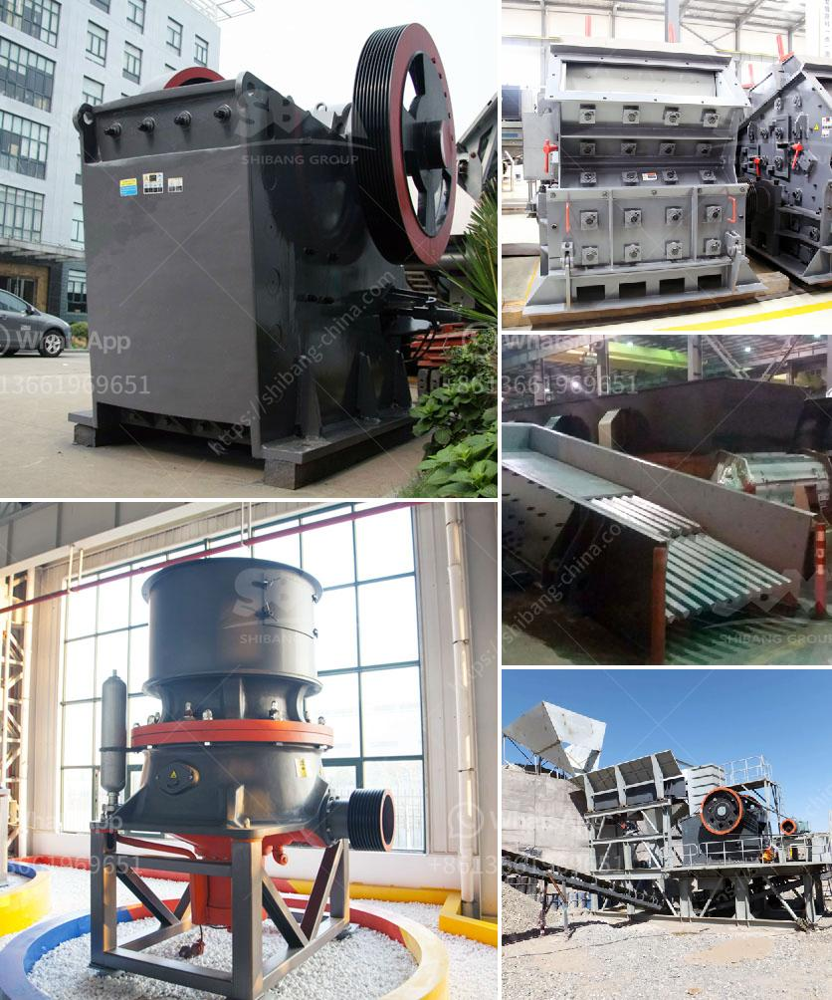

<h3>gold refining machines from germany</h3>
Gold refining machines from Germany are renowned for their quality and efficiency. German gold refiners have a long history of producing state-of-the-art machinery and equipment to separate precious metals from gold ore. These machines are widely used in the gold mining industry and are highly sought after due to their reliability and precision.

One of the leading manufacturers of gold refining machines in Germany is Xinhai Machinery. They have been in the industry for several decades and have perfected the art of gold refining. Their machines are equipped with advanced technology and are designed to handle large quantities of gold ore efficiently.

The gold refining process involves several steps, including crushing the gold ore into smaller particles, then extracting the gold using chemicals or heat. German gold refining machines are designed to perform all these steps seamlessly, ensuring maximum yield and purity of gold.

These machines are known for their robust construction and durability, which makes them suitable for heavy-duty operations. They can process large quantities of gold ore continuously, saving time and reducing labor costs.

German gold refining machines also incorporate advanced safety measures to ensure the well-being of operators and protect the environment. These machines are equipped with state-of-the-art filtration systems and utilize eco-friendly processes to minimize waste and emissions.

Additionally, German gold refining machines come with user-friendly interfaces and are easy to operate. They can be customized to meet specific refining requirements, allowing for flexibility and versatility in the refining process.

Overall, gold refining machines from Germany are a testament to the country's engineering excellence and commitment to producing high-quality machinery. With their reliability, precision, and advanced features, these machines have become the gold standard in the gold refining industry.
<h3>Contact us</h3><ul><li><strong>Whatsapp:&nbsp;<a href="https://wa.me/8613661969651">+8613661969651</a></strong></li><li><a href="https://swt.shibang-china.com/?git&amp;zhl&amp;gold refining machines from germany"><strong>Online Service(chat now)</strong></a></li></ul><h3>Related</h3><ul><li><a href='to buy medium mounted stone crusher in uk.md'>to buy medium mounted stone crusher in uk</a></li><li><a href='portable crushing equipment.md'>portable crushing equipment</a></li><li><a href='mini cement plant project report of cost setting in india.md'>mini cement plant project report of cost setting in india</a></li><li><a href='cement manufacturing equipment pdf.md'>cement manufacturing equipment pdf</a></li><li><a href='enquiry about crusher.md'>enquiry about crusher</a></li></ul>