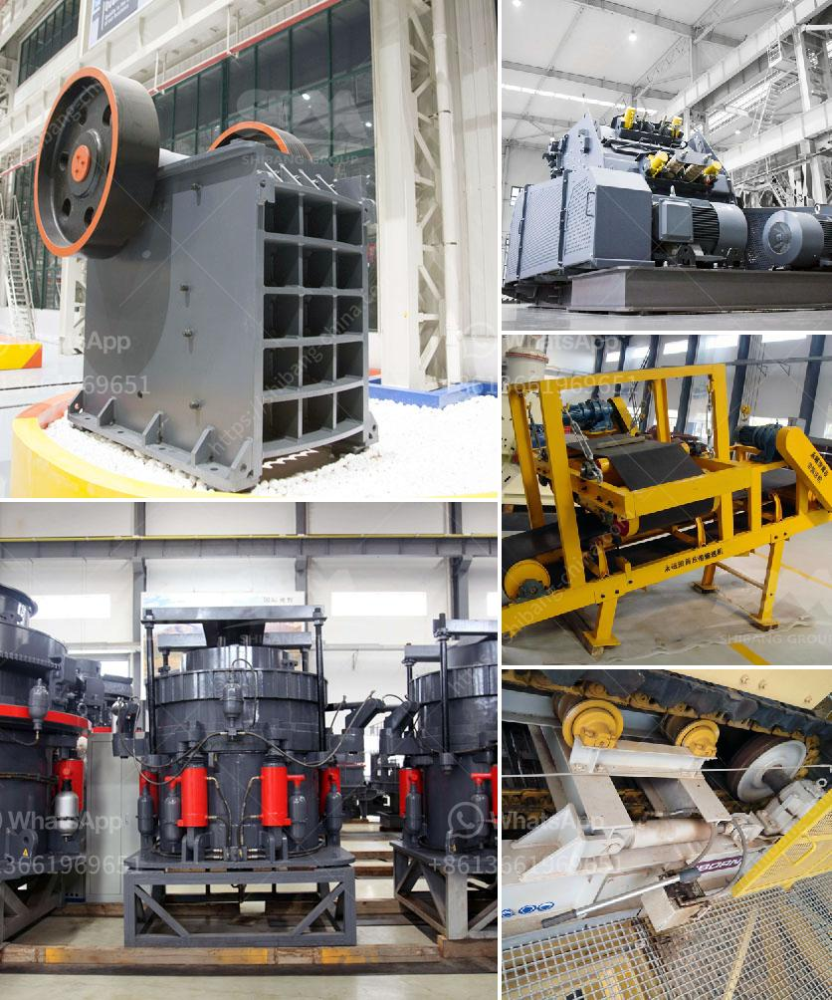

<h3>gold sand separation equipment philippines</h3>
Gold mining in the Philippines has been a controversial topic for years. Illegal mining operations, rampant use of mercury for gold extraction, and a lack of government regulations and controls have resulted in environmental destruction and health hazards for local communities. However, there are also responsible and legal gold mining operations in the country that focus on sustainable practices and the use of advanced equipment to ensure the efficient extraction of gold from sand.

Gold sand separation equipment plays a crucial role in gold mine processing. The traditional way of separating gold from sand is called panning. However, it is a tedious and time-consuming process, requiring a lot of patience and skill. In addition, the gold particles are very small and tend to get lost in the process. To overcome these challenges, modern equipment has been developed to maximize the recovery of gold from sand.

One such equipment is the gold shaking table. It is a gravity separation equipment specially designed to separate gold from sand and other heavy minerals. The gold shaking table uses a shaking motion to separate the gold particles from the sand particles. It is equipped with riffles and grooves that capture the gold as it flows across the table. The heavy minerals and sand particles are washed away, leaving only the gold behind.

Another efficient method for gold sand separation is the gold centrifugal concentrator. This equipment uses centrifugal force to separate the gold particles from the sand. The gold sand mixture is fed into a rotating bowl, and as the bowl spins, the centrifugal force pushes the heavier gold particles towards the outer edge of the bowl. The lighter sand particles are then washed away, leaving the concentrated gold in the bowl.

These advanced gold sand separation equipment have revolutionized the gold mining industry in the Philippines. They have increased the efficiency of gold extraction, reduced the environmental impact, and improved the livelihoods of local communities. Responsible mining companies are now utilizing these technologies to ensure the sustainable extraction of gold while minimizing the negative impacts on the environment and local communities.

In conclusion, gold sand separation equipment is essential for efficient and responsible gold mining in the Philippines. Traditional methods like panning are inefficient and time-consuming, while also causing environmental damage. The use of modern equipment like the gold shaking table and the gold centrifugal concentrator has revolutionized the gold mining industry by improving the extraction process and reducing environmental impacts. With the right equipment and responsible mining practices, the Philippines can continue to harness its rich gold resources while protecting the environment and benefiting local communities.
<h3>Contact us</h3><ul><li><strong>Whatsapp:&nbsp;<a href="https://wa.me/8613661969651">+8613661969651</a></strong></li><li><a href="https://swt.shibang-china.com/?git&amp;zhl&amp;gold sand separation equipment philippines"><strong>Online Service(chat now)</strong></a></li></ul><h3>Related</h3><ul><li><a href='chrome washing plant in south africa.md'>chrome washing plant in south africa</a></li><li><a href='roks vertical mill.md'>roks vertical mill</a></li><li><a href='roller mill ultrafine.md'>roller mill ultrafine</a></li><li><a href='vibrating screens pictures.md'>vibrating screens pictures</a></li><li><a href='rock crusher suppliers.md'>rock crusher suppliers</a></li></ul>