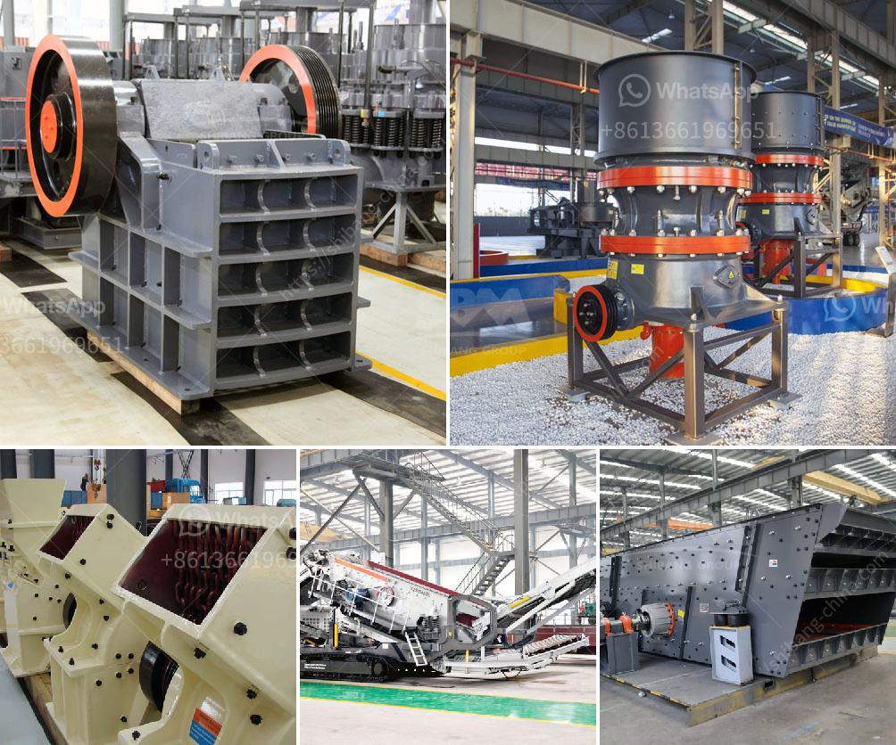

<h3>gold screening machines south africa</h3>
Gold mining has been a crucial industry in South Africa for over a century, propelling the nation to become the world's leading producer of gold. In recent years, however, South African gold mining has become a force to reckon with due to the boom in the gold prices and continuous advancements in extraction technology. One such technological innovation that has revolutionized the industry is the gold screening machine.

Gold screening machines are advanced pieces of equipment designed to efficiently separate gold particles from other materials. These machines are widely used in mining operations across South Africa to analyze the composition of soil, rock, and other materials found during the mining process. By accurately identifying gold-bearing materials, these machines help miners optimize their extraction processes, maximize production, and reduce overall operating costs.

One of the key advantages of gold screening machines is their ability to quickly and accurately identify valuable gold deposits. These machines utilize a variety of techniques, including sieving, centrifugal force, and gravity separation, to differentiate gold particles based on their size, weight, and density. With their high-speed processing capabilities, gold screening machines can analyze vast quantities of material within a short period.

South African mines have embraced the use of gold screening machines due to their numerous benefits. These machines enhance productivity by eliminating the need for manual sorting, thereby reducing human error and increasing operational efficiency. Additionally, the machines improve safety by automating the screening process, reducing the risk of accidents and exposure to hazardous materials.

Moreover, gold screening machines play a crucial role in sustainable mining practices. By accurately analyzing the composition of materials, miners can minimize waste and optimize their operations, reducing the environmental impact associated with gold mining. This technological advancement aligns with South Africa's commitment to responsible mining practices and the protection of natural resources.

As South Africa continues its reign as a major player in the gold mining industry, gold screening machines will remain indispensable. These machines not only enhance efficiency and productivity but also contribute to sustainable mining practices. With ongoing technological advancements, it is likely that gold screening machines will continue to evolve, further maximizing the potential of the South African gold mining industry.
<h3>Contact us</h3><ul><li><strong>Whatsapp:&nbsp;<a href="https://wa.me/8613661969651">+8613661969651</a></strong></li><li><a href="https://swt.shibang-china.com/?git&amp;zhl&amp;gold screening machines south africa"><strong>Online Service(chat now)</strong></a></li></ul><h3>Related</h3><ul><li><a href='machines used for cement manufacturing.md'>machines used for cement manufacturing</a></li><li><a href='silica sand grinding machine.md'>silica sand grinding machine</a></li><li><a href='stone crussing machines in pakistan.md'>stone crussing machines in pakistan</a></li><li><a href='iron processing machine.md'>iron processing machine</a></li><li><a href='cost of crusher run in las vegas.md'>cost of crusher run in las vegas</a></li></ul>