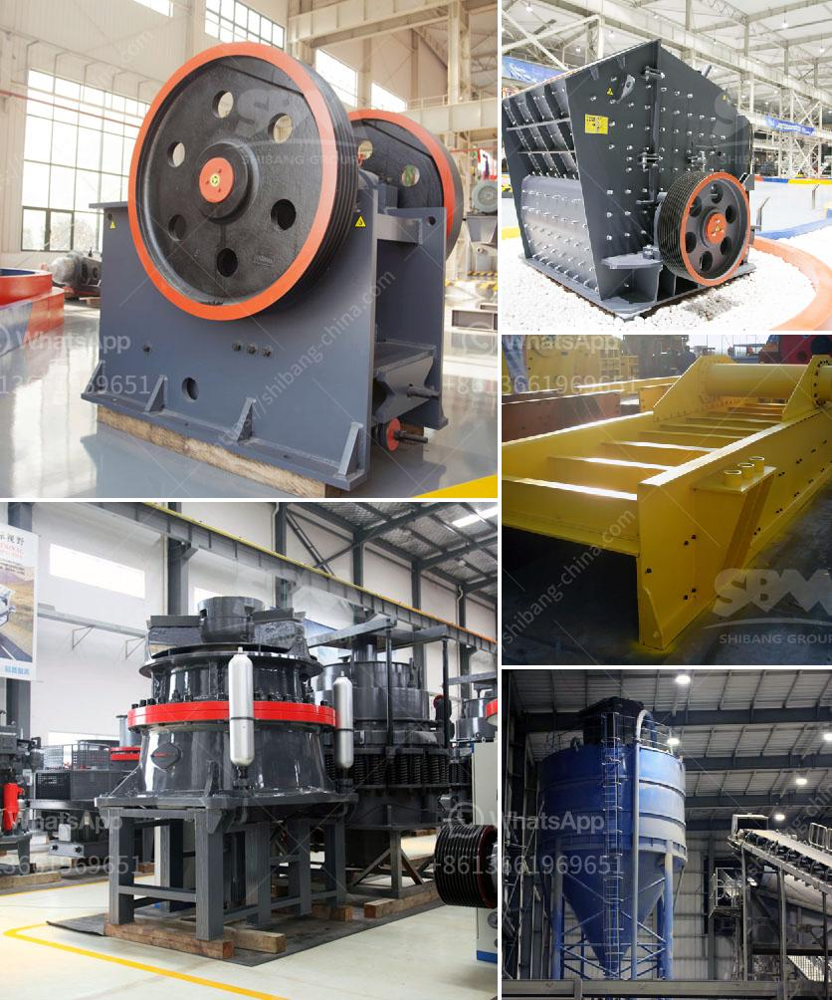

<h3>gold wash plants built in the northwest</h3>
In the picturesque landscapes of the Northwest, where majestic mountains meet cascading rivers, lies a hidden opportunity waiting to be unearthed - gold mining. With a rich history of gold discoveries, the region's miners have long been drawn to the promise of fortune hidden beneath the earth's surface. And in their quest for the precious metal, gold wash plants have emerged as an effective and efficient tool to extract gold nuggets in a cost-effective manner. In this article, we delve into the world of gold wash plants built in the Northwest, highlighting their significance, functionality, and impact on the region's mining industry.

Gold wash plants are specifically designed machinery built to efficiently separate gold particles from sediments, gravels, and other materials found in rivers, creeks, and deposits. These plants offer a streamlined process that maximizes gold recovery, minimizing the amount of time and effort required for successful extraction. In an era where technological advancements have revolutionized the mining industry, gold wash plants embody the perfect blend of traditional methods with modern engineering.

Gold wash plants typically consist of several key components, each playing a vital role in the extraction process. The heart of these plants lies in a powerful vibrating sluice box, also known as a trommel, which effectively filters and separates gold from other materials. Water jets within the sluice box create a pulsating motion that helps dissolve clays and wash away unwanted sediments, allowing gold particles to settle down and be collected.

Another important component is the gold trommel screen, which efficiently sizes the mined material. By utilizing different mesh sizes, the trommel screen helps segregate finer particles, ensuring optimal gold recovery efficiency.

Additionally, gold wash plants are equipped with various mechanisms to further enhance the extraction process. This includes the utilization of specialized gold centrifuges and electromagnetic separators that offer refined extraction capabilities, ensuring that the precious metal is separated from other minerals and materials with precision.

The introduction of gold wash plants has revolutionized gold mining in the Northwest, bringing numerous benefits to the industry and its players. The enhanced recovery efficiency provided by these plants has significantly increased overall gold production, attracting more miners to the region. This influx of miners has not only brought economic growth to local communities but has also created job opportunities and stimulated business activities.

Moreover, the use of gold wash plants has minimized environmental impact by reducing the need for destructive mining practices such as river dredging or widespread excavation. These plants offer a more sustainable and eco-friendly way of mining, ensuring that the natural beauty and integrity of the region are preserved for future generations.

In the Northwest, where the allure of gold mining continues to captivate adventurous spirits, gold wash plants stand as a testament to the evolving nature of the industry. Designed to optimize gold extraction, these plants have become a vital tool for miners in the region, delivering increased efficiency, higher yields, and new job opportunities. As gold wash plants continue to evolve with advancements in technology and engineering, the Northwest's mining industry is assured a golden future.
<h3>Contact us</h3><ul><li><strong>Whatsapp:&nbsp;<a href="https://wa.me/8613661969651">+8613661969651</a></strong></li><li><a href="https://swt.shibang-china.com/?git&amp;zhl&amp;gold wash plants built in the northwest"><strong>Online Service(chat now)</strong></a></li></ul><h3>Related</h3><ul><li><a href='silica sand grinding machine.md'>silica sand grinding machine</a></li><li><a href='jaw crushers machine for sale.md'>jaw crushers machine for sale</a></li><li><a href='fine powder milling machines.md'>fine powder milling machines</a></li><li><a href='price three roll mill machinery.md'>price three roll mill machinery</a></li><li><a href='crusher for sale in dubai.md'>crusher for sale in dubai</a></li></ul>