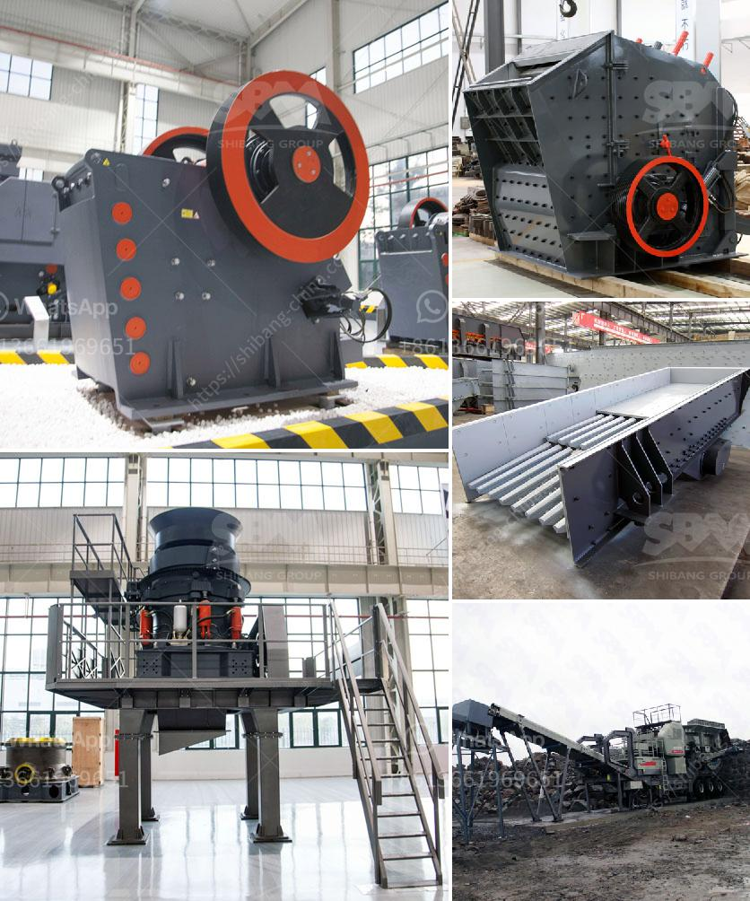

<h3>gold washing machine from rock</h3>
Gold mining has long been a lucrative yet hazardous endeavor. Miners worldwide have dedicated their lives to extracting the precious metal from hard rock formations, facing dangerous conditions underground and at risk from collapses and toxic gases. However, a groundbreaking invention has revolutionized the industry, making gold extraction safer, more efficient, and environmentally friendly: the gold washing machine from rock.

Traditionally, extracting gold from rock involves a labor-intensive process that requires crushing the ore and then using mercury to separate the gold particles from other minerals. Mercury, a highly toxic substance, poses severe health risks to miners and can contaminate water sources, leading to devastating environmental consequences. Additionally, the manual extraction process consumes a significant amount of time, energy, and labor, often yielding only a small fraction of gold compared to the rock processed.

In light of these challenges, the introduction of the gold washing machine from rock has transformed the industry's landscape. This innovative technology allows for large-scale processing of gold-bearing rocks, ensuring safe and efficient extraction while reducing adverse environmental impacts.

The gold washing machine from rock incorporates a series of advanced techniques and mechanisms. Initially, the rock-bearing gold is crushed into smaller particles using a powerful hydraulic crusher. This process increases the surface area of the rocks, allowing for a more effective extraction of gold. The crushed rock is then mixed with water and chemicals, creating a slurry that is further processed using various mechanisms.

One of the key features of the gold washing machine from rock is its ability to utilize gravity separation techniques. The slurry is introduced into a specially designed sluice box, where the heavier gold particles settle due to their greater mass, while the lighter materials are carried away. This process, known as gold panning, is efficient in separating gold from other minerals, resulting in a high gold recovery rate.

Furthermore, the gold washing machine from rock employs highly advanced filtration systems to remove harmful substances and further purify the extracted gold. This ensures that the final product meets the highest purity standards, making it more valuable in the market.

Aside from its efficiency and safety advantages, the gold washing machine from rock also offers significant environmental benefits. By eliminating the need for mercury, the technology helps mitigate the toxic risks associated with traditional extraction methods. Moreover, the use of water in the process is significantly reduced, minimizing water consumption and alleviating stress on local water sources.

The introduction of the gold washing machine from rock has created a paradigm shift in the gold mining industry. Miners now have access to a safer and more efficient method of gold extraction, allowing them to increase their productivity and profitability. Additionally, the reduced environmental impact of this technology contributes to sustainable mining practices and preserves delicate ecosystems.

In conclusion, the gold washing machine from rock is a groundbreaking innovation that has transformed the gold mining industry. By combining advanced techniques and mechanisms, this technology enables safe and efficient extraction of gold, while significantly reducing the environmental impact. As more miners adopt this revolutionary machine, we can expect to see increased productivity, improved safety conditions, and a more sustainable approach to gold extraction.
<h3>Contact us</h3><ul><li><strong>Whatsapp:&nbsp;<a href="https://wa.me/8613661969651">+8613661969651</a></strong></li><li><a href="https://swt.shibang-china.com/?git&amp;zhl&amp;gold washing machine from rock"><strong>Online Service(chat now)</strong></a></li></ul><h3>Related</h3><ul><li><a href='ball mill calcium.md'>ball mill calcium</a></li><li><a href='vertical milling machine used for calcium carbonate.md'>vertical milling machine used for calcium carbonate</a></li><li><a href='tractor pto stone crusher for sale.md'>tractor pto stone crusher for sale</a></li><li><a href='crusher for sale in dubai.md'>crusher for sale in dubai</a></li><li><a href='conveyor belt for fly ash.md'>conveyor belt for fly ash</a></li></ul>