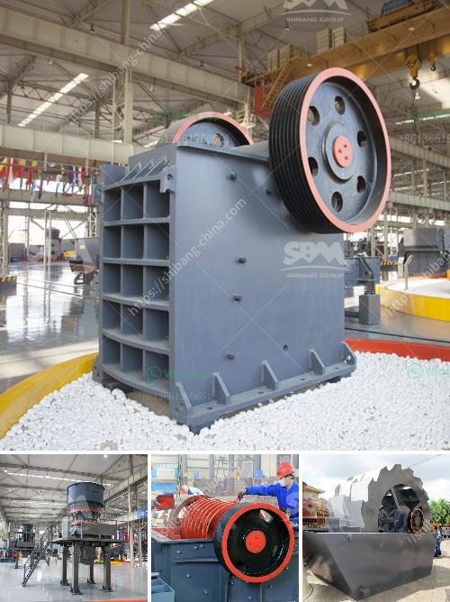

<h3>granite crusher machine</h3>
Granite is a common type of igneous rock that comprises a large percentage of the Earth's crust. It is known for its durability, aesthetic appeal, and plethora of applications. In various industries, granite is used as a raw material for construction, countertops, flooring, and even artwork. To transform raw granite into usable materials, a granite crusher machine is required. With its powerful crushing capabilities, it can process granite into different sizes and shapes efficiently.

A granite crusher machine is used in a variety of industries such as mining, smelting, building materials, roads, railways, water conservancy, and chemical industries. Because it has a wide range of applications, many customers are looking to buy a granite crusher machine. They usually see granite material regularly on construction projects, so they are aware of its immense value and demand.

One of the most important features of a granite crusher machine is its high-performance capacity, resulting in smooth and efficient crushing operations. The machine is equipped with a robust crushing mechanism, which is responsible for breaking down larger pieces of granite into smaller, more manageable sizes. This process is essential because smaller granite rocks are easier to handle and transport.

Another significant feature of the granite crusher machine is its versatility. It can be adjusted to produce different sizes of crushed granite depending on the specific requirements of the project. Whether a customer needs coarse or fine crushed granite, the machine can be easily modified to meet their needs.

Furthermore, the machine is designed with user-friendliness in mind. It is equipped with advanced automation systems that ensure easy and convenient operation. With just a few simple commands, operators can control the speed, feeding rate, and other crucial parameters of the crushing process. Additionally, safety features are integrated into the machine to protect operators from potential hazards.

In terms of maintenance, a granite crusher machine is relatively easy to maintain. Its components are designed to be durable and long-lasting, reducing the need for frequent replacements. Regular inspections and proper lubrication can help extend the lifespan of the machine and ensure its optimal performance.

Overall, a granite crusher machine is an essential tool in the granite processing industry. It enables businesses to process granite efficiently, turning raw materials into valuable products. Whether it is used in large-scale mining operations or small construction projects, the machine is capable of crushing granite into various sizes and shapes, meeting the diverse needs of customers.

Investing in a high-quality granite crusher machine is certainly a wise decision for any business involved in granite processing. The machine's efficiency, versatility, and ease of maintenance make it a reliable and cost-effective solution. As the demand for granite continues to grow, having a reliable granite crusher machine will enable businesses to meet the market's demands and thrive in the industry.
<h3>Contact us</h3><ul><li><strong>Whatsapp:&nbsp;<a href="https://wa.me/8613661969651">+8613661969651</a></strong></li><li><a href="https://swt.shibang-china.com/?git&amp;zhl&amp;granite crusher machine"><strong>Online Service(chat now)</strong></a></li></ul><h3>Related</h3><ul><li><a href='granite mining in zimbabwe.md'>granite mining in zimbabwe</a></li><li><a href='ball mill sale in malaysia.md'>ball mill sale in malaysia</a></li><li><a href='ecotec line for grinding of calcium carbonate.md'>ecotec line for grinding of calcium carbonate</a></li><li><a href='crusher suppliers in kenya.md'>crusher suppliers in kenya</a></li><li><a href='small ore grinding mill with 50 tpd for sale.md'>small ore grinding mill with 50 tpd for sale</a></li></ul>