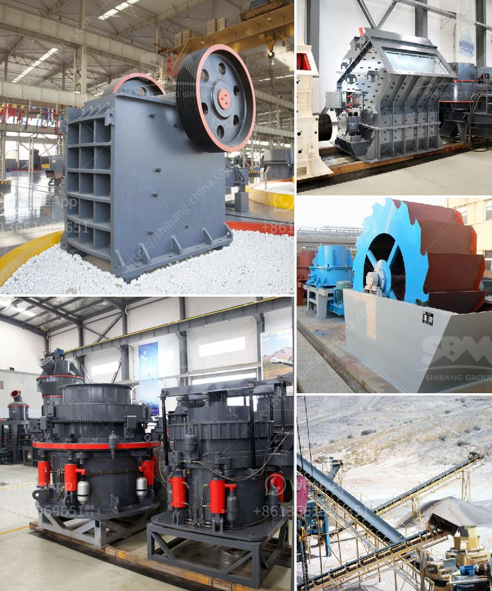

<h3>granite crusher machines</h3>
Granite is a common type of igneous rock that is granular in texture. Granite is widely used in construction, monuments, and decorative projects due to its durability and stunning appearance. To transform large blocks of granite into usable aggregate, granite crusher machines are essential equipment.

Granite crushers are designed specifically for reducing the size and breaking down granite into smaller pieces. These machines have several uses, such as:

1. Primary Crushing: The granite crusher machine is used in the first stage of crushing, where larger granite stones are broken down into smaller pieces. This machine is ideal for producing a uniform and high-quality crushed granite stone for various construction applications.

2. Secondary Crushing: Sometimes, the initial crushing using a primary crusher may not produce the desired result. In such cases, a secondary granite crusher machine is used to further reduce the size of the granite stone. This ensures that the final product meets the required specifications.

3. Recycling: Granite crushers can also be used for recycling purposes. Old granite countertops or leftover construction materials can be processed and turned into aggregate or small stones that can be used in new construction projects.

When selecting a granite crusher machine, it is important to consider factors such as the production capacity, the required end product size, and the energy consumption of the machine. Different machines come with varying capabilities, so it is essential to choose the right one that suits one's specific needs.

Granite crusher machines come in various types and sizes, ranging from portable machines to stationary ones. Some machines are designed for small-scale domestic projects, while others are suitable for large-scale commercial operations. It is important to assess the project requirements and choose the appropriate machine accordingly.

In conclusion, granite crusher machines are vital equipment in the granite mining and construction industry. They efficiently break down large granite blocks into smaller pieces, making them suitable for various applications. Whether for primary crushing, secondary crushing, or recycling purposes, granite crushers play a crucial role in processing granite and creating valuable materials for construction projects.
<h3>Contact us</h3><ul><li><strong>Whatsapp:&nbsp;<a href="https://wa.me/8613661969651">+8613661969651</a></strong></li><li><a href="https://swt.shibang-china.com/?git&amp;zhl&amp;granite crusher machines"><strong>Online Service(chat now)</strong></a></li></ul><h3>Related</h3><ul><li><a href='list of sponge iron factories in hospet.md'>list of sponge iron factories in hospet</a></li><li><a href='barite powder manufacturing machinery.md'>barite powder manufacturing machinery</a></li><li><a href='second hand quarry machinery price in india.md'>second hand quarry machinery price in india</a></li><li><a href='raymond grinding machine.md'>raymond grinding machine</a></li><li><a href='rock crusher saudi arabia.md'>rock crusher saudi arabia</a></li></ul>