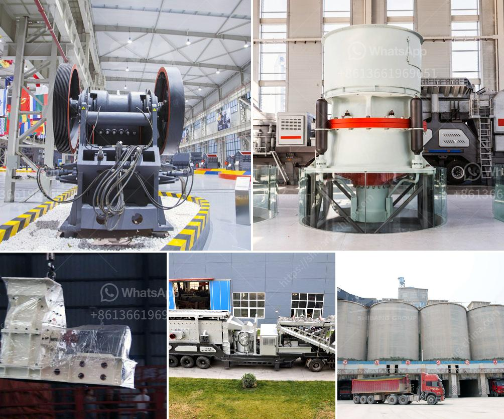

<h3>granite crusher price in nigeria</h3>
Granite is a common type of igneous rock that is granular in texture. Due to its high hardness, wear resistance, and durability, it is widely used in construction and architecture. However, the cost of buying granite can vary greatly depending on a number of factors. In Nigeria, granite is a scarce resource that is not widely distributed across the country.

Granite deposits in Nigeria are found in locations such as Kogi, Ogun, Ekiti, Kwara, and Cross River. These regions have abundant reserves of granite, which is why several companies have set up granite quarries in these areas. The availability of granite in Nigeria plays a crucial role in ensuring that construction projects are efficiently executed.

When considering the purchase of granite crusher equipment in Nigeria, it is essential to consider the type and specification of the equipment. Some crushers are able to effectively crush hard materials like granite, while others are better suited for softer rocks. It is important to choose a crusher that matches the specific needs of the project.

The price of granite crusher equipment in Nigeria is determined by factors such as the market demand in the region, the quality and specifications of the equipment, and the price of raw materials. The cost of purchasing granite crushers primarily includes the cost of the actual machine or equipment, transportation, installation, and necessary maintenance.

Choosing the right granite crusher supplier will greatly influence the purchase cost and the production efficiency of the crushing plant. To help customers choose a suitable supplier, we suggest that customers should carefully consider the reputation, scale, and after-sales service of the supplier. It is also beneficial to compare the prices of multiple suppliers to ensure a reasonable purchase.

In conclusion, the price of granite crusher is influenced by various factors in Nigeria. By considering the quality, specifications, reputation of suppliers, and market demand, one can find affordable options for their crushing needs. It is crucial for project owners to conduct proper research and make a wise investment to ensure the success of their projects.
<h3>Contact us</h3><ul><li><strong>Whatsapp:&nbsp;<a href="https://wa.me/8613661969651">+8613661969651</a></strong></li><li><a href="https://swt.shibang-china.com/?git&amp;zhl&amp;granite crusher price in nigeria"><strong>Online Service(chat now)</strong></a></li></ul><h3>Related</h3><ul><li><a href='vertical raw mill industry.md'>vertical raw mill industry</a></li><li><a href='hp cone crusher.md'>hp cone crusher</a></li><li><a href='impact crusher dealer.md'>impact crusher dealer</a></li><li><a href='slag crusher plant supplier india.md'>slag crusher plant supplier india</a></li><li><a href='mobile crushers philippines.md'>mobile crushers philippines</a></li></ul>