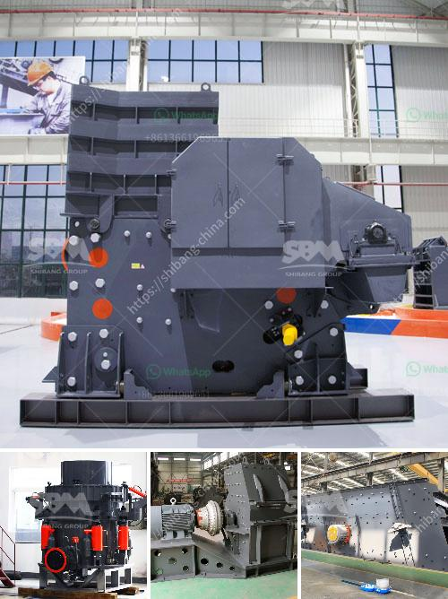

<h3>granite crushing plant</h3>
Granite is a common type of igneous rock that is granular in texture. Due to its high hardness and durability, it has become one of the most popular stones for construction and decoration purposes. Therefore, the demand for granite is constantly increasing, leading to the establishment of granite crushing plants.

A granite crushing plant can be a really profitable business but it is important for you to make the right choice when it comes to design of granite crushing plant. You need to know everything about this business in order to make money and choosing the right design is extremely important. In this article, we will discuss how you should go about the design of granite crushing plant.

Geologically, granite is an igneous rock containing mica, feldspar, and quartz among other crystals. You need certain types of crushers in line for efficient processing of the granite stone. The primary crusher recommended for a granite crushing plant is a jaw crusher. A well-designed jaw crusher is available in a many different processing capacities ranging from 1 ton to more than 1000 ton each hour. As far as the output size is concerned, you can also choose the output size ranging from 10 to 300 mm or even more.

There are also other types of crushers such as cone crusher, tertiary crusher, and impact crusher to choose. Due to the high hardness of granite, it is necessary to adopt the cone crusher for the secondary crushing. Tertiary crusher is optional and it has features of high crushing ratio, high efficiency, and high handling capacity. Last but not least, impact crusher is used for the production of high-quality sand and stone aggregate for the construction of highways, high-speed railways, and concrete mixing plants.

To increase the production capacity of your granite crushing plant, you should optimize the design of your crushing system that suits your plant. By cutting down unnecessary elments, such as screens, dump trucks and double cycles, you can focus on optimizing other devices within your machine. In addition, you should also consider implementing advanced control systems that can help in monitoring and optimizing the plant's productivity.

Besides choosing the right design for your granite crushing plant, you should also consider other factors when starting your business. Location is one of the key factors to consider. It should be easily accessible and close to your target market. Additionally, you need to consider the financial aspects of setting up a granite crushing plant. This includes the initial cost of purchasing the necessary equipment, obtaining permits and licenses, as well as the ongoing expenses such as electricity, maintenance, and labor costs.

In conclusion, setting up a granite crushing plant is a good choice for you if you are in the construction industry. This is because granite has high hardness and abrasion resistance. It is also highly durable and can withstand harsh weather conditions. However, it is important to choose the right design and location for your granite crushing plant to ensure its success. Additionally, you should also consider other factors such as cost, permits, and ongoing expenses of running the plant. With the right planning and execution, a granite crushing plant can be a profitable venture.
<h3>Contact us</h3><ul><li><strong>Whatsapp:&nbsp;<a href="https://wa.me/8613661969651">+8613661969651</a></strong></li><li><a href="https://swt.shibang-china.com/?git&amp;zhl&amp;granite crushing plant"><strong>Online Service(chat now)</strong></a></li></ul><h3>Related</h3><ul><li><a href='small jaw crusher.md'>small jaw crusher</a></li><li><a href='complete crushing plant 150 200t.md'>complete crushing plant 150 200t</a></li><li><a href='iron crusher manufacturer.md'>iron crusher manufacturer</a></li><li><a href='gold mining equipment for sale at malaysia.md'>gold mining equipment for sale at malaysia</a></li><li><a href='200tph vsi crushers.md'>200tph vsi crushers</a></li></ul>