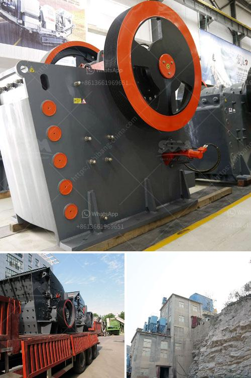

<h3>granite crushing plants</h3>
Granite is one of the hardest rocks found in nature. It is formed from molten lava and magma, subjected to immense heat and pressure for millions of years. This natural process creates a dense, strong, and durable material that has been sought after for centuries. Today, granite is widely used in construction, decoration, and various other applications. To meet the growing demand, granite crushing plants have become increasingly popular in the stone processing industry.

Granite crushing plants are specifically designed to meet the crushing needs of the granite countertop materials. They are robustly constructed and their high load-bearing capacity enables them to withstand the high-pressure force exerted by granite rocks. Furthermore, these plants are equipped with advanced technology and modern machinery that ensure efficient and precise crushing of granite rocks.

One of the key advantages of granite crushing plants is their ability to produce different sizes of crushed granite. The granite rocks extracted from the quarry are first processed into smaller pieces, known as aggregates. These aggregates are then further crushed to achieve the desired size for various applications. This versatility in producing different sizes of crushed granite makes these plants highly sought after by builders, architects, and interior designers.

Granite crushing plants also play a crucial role in recycling granite waste. When granite countertops or other granite products reach the end of their life cycle, they can be crushed and reused in other construction projects. This not only reduces the demand for new granite extraction but also helps in reducing the environmental impact of granite mining. Recycling granite waste through crushing plants is an eco-friendly solution that promotes sustainable development in the stone processing industry.

In addition to their functional benefits, granite crushing plants also contribute to the aesthetic appeal of a project. The crushed granite produced by these plants can be used as a decorative element in landscaping, driveways, and pathways. Its natural color and durability make it an attractive choice for enhancing the overall visual appeal of a space.

Modern granite crushing plants are designed with safety as a top priority. They are equipped with advanced safety features to protect workers and prevent accidents. These features include emergency stop buttons, safety guards, and automatic lubrication systems. This emphasis on safety ensures a secure and productive working environment for the operators.

In conclusion, granite crushing plants have revolutionized the stone processing industry. Their ability to produce different sizes of crushed granite, recycle granite waste, and enhance the aesthetic appeal of a space makes them a valuable asset in construction, decoration, and landscaping projects. Furthermore, their advanced technology and safety features ensure efficient and secure operations. As the demand for granite continues to grow, investing in a granite crushing plant is a wise choice for businesses in the stone processing industry.
<h3>Contact us</h3><ul><li><strong>Whatsapp:&nbsp;<a href="https://wa.me/8613661969651">+8613661969651</a></strong></li><li><a href="https://swt.shibang-china.com/?git&amp;zhl&amp;granite crushing plants"><strong>Online Service(chat now)</strong></a></li></ul><h3>Related</h3><ul><li><a href='mill price of hammer mill.md'>mill price of hammer mill</a></li><li><a href='china ball valve grinding machine.md'>china ball valve grinding machine</a></li><li><a href='used jaw crusher japan.md'>used jaw crusher japan</a></li><li><a href='vertical roller mill.md'>vertical roller mill</a></li><li><a href='used concrete crushers uk.md'>used concrete crushers uk</a></li></ul>