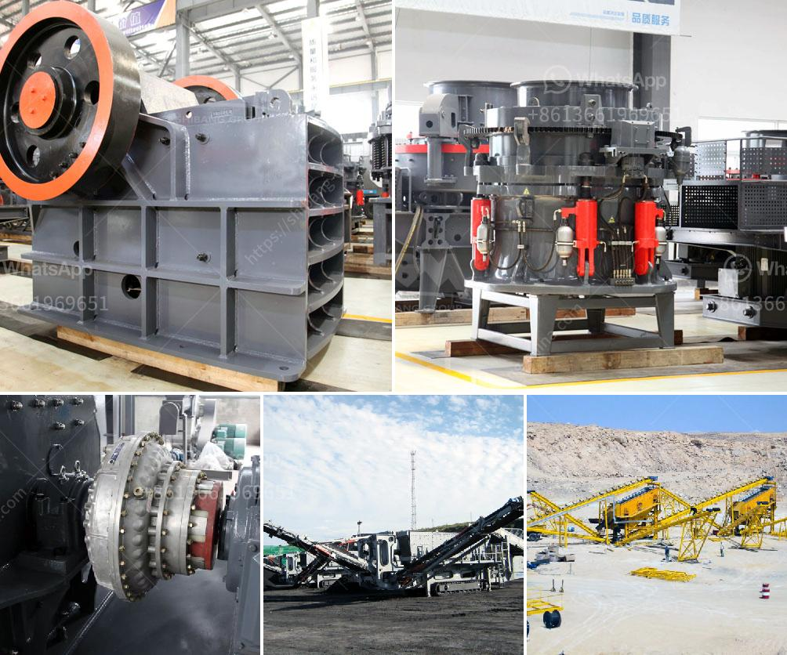

<h3>granite mining in zimbabwe</h3>
Granite, one of Zimbabwe’s most sought-after resources, is extensively mined in the country. As a naturally occurring rock, granite is used in various industries such as construction, infrastructure development, and interior design. The mining of granite in Zimbabwe has played a pivotal role in the country’s economic growth, contributing significantly to its GDP.

Granite mining in Zimbabwe is mainly concentrated in the Mashonaland Central province, with the mineral being found in abundance throughout the area. Boasting unique features such as durability, attractiveness, and low maintenance requirements, Zimbabwean granite has gained popularity both domestically and internationally.

The mining process involves various stages, starting with the extraction of granite blocks from quarries using explosives. These blocks are then transported to processing plants, where they are cut into slabs or tiles of various sizes and shapes. Modern machinery and advanced technology have made the mining process more efficient, resulting in increased production capacity and improved quality control.

The granite mining industry has had a positive impact on Zimbabwe’s economy in multiple ways. Firstly, it has created employment opportunities for thousands of individuals, thereby reducing unemployment rates and alleviating poverty in the region. Additionally, the industry has contributed to the growth of ancillary businesses such as transportation, equipment suppliers, and stone fabricators, further stimulating economic development.

From an environmental perspective, granite mining poses certain challenges. The extraction of granite can cause deforestation and habitat destruction, leading to the displacement of wildlife. However, responsible mining practices are being adopted to minimize these environmental impacts. Efforts are also being made to rehabilitate and regenerate the affected areas, ensuring the sustainability of the granite mining industry.

In conclusion, granite mining in Zimbabwe is a vital sector that contributes significantly to economic growth. With the country's abundant granite resources and increasing demand both domestically and internationally, it offers tremendous potential for further development. Through sustainable and responsible mining practices, Zimbabwe can continue to harness the benefits of its granite resources while minimizing environmental impacts.
<h3>Contact us</h3><ul><li><strong>Whatsapp:&nbsp;<a href="https://wa.me/8613661969651">+8613661969651</a></strong></li><li><a href="https://swt.shibang-china.com/?git&amp;zhl&amp;granite mining in zimbabwe"><strong>Online Service(chat now)</strong></a></li></ul><h3>Related</h3><ul><li><a href='cheap gravel crusher.md'>cheap gravel crusher</a></li><li><a href='production process of gypsum.md'>production process of gypsum</a></li><li><a href='sample busines project proposal for stone crusher.md'>sample busines project proposal for stone crusher</a></li><li><a href='mobile crushers hire south africa.md'>mobile crushers hire south africa</a></li><li><a href='layout design for stone crushing plant.md'>layout design for stone crushing plant</a></li></ul>