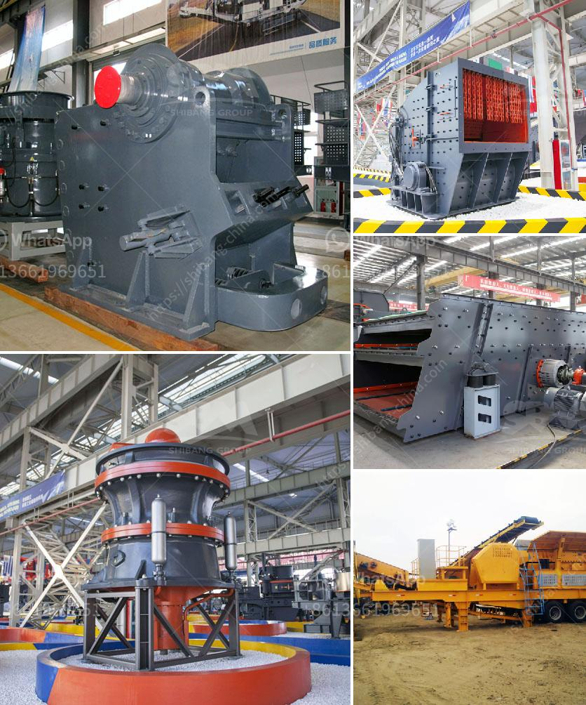

<h3>granite processing equipment for sale nigeria</h3>
Granite is a hard and dense stone that is primarily used as a building material. It has been used for centuries in various construction projects, such as countertops, flooring, and monuments. In Nigeria, granite is abundant and Nigeria has a wide variety of granite colors and types to choose from. With the increasing demand for granite in the construction industry, there is a need for granite processing equipment that will ensure the granite can be transformed into different forms and sizes for various applications.

Granite processing equipment includes crushers, ball mills, screens, separators, conveyors, and other specialized machinery used to process granite. The market for granite processing equipment is constantly growing due to the increasing demand for granite in the construction industry. Nigeria's granite can be found in various states, including Kaduna, Kogi, Ogun, and Ekiti.

Investing in granite processing equipment in Nigeria can be a profitable venture. The equipment can be used to process granite into different sizes and shapes according to the specific needs of customers. This allows businesses to cater to a wide range of clients and expand their customer base.

One important factor to consider when purchasing granite processing equipment is the quality and durability of the machinery. It is advisable to choose equipment from reputable manufacturers known for their high-quality products. This ensures that the machinery can withstand the demands of the granite processing industry and provide reliable performance.

There are various suppliers in Nigeria that offer granite processing equipment for sale. It is important to research the suppliers and compare their prices, product quality, and after-sales service before making a purchase. It is also recommended to visit the manufacturer's facilities or request product samples to ensure the equipment meets the required technical specifications.

In conclusion, investing in granite processing equipment in Nigeria can be a lucrative business opportunity. With the increasing demand for granite in the construction industry, there is a need for high-quality processing equipment that can transform granite into different forms and sizes. Conducting thorough research and choosing reputable suppliers can help ensure the equipment meets the required standards and specifications, allowing businesses to meet the demands of their customers and thrive in the granite processing market.
<h3>Contact us</h3><ul><li><strong>Whatsapp:&nbsp;<a href="https://wa.me/8613661969651">+8613661969651</a></strong></li><li><a href="https://swt.shibang-china.com/?git&amp;zhl&amp;granite processing equipment for sale nigeria"><strong>Online Service(chat now)</strong></a></li></ul><h3>Related</h3><ul><li><a href='materials hammer mill.md'>materials hammer mill</a></li><li><a href='the process of limestone to cement.md'>the process of limestone to cement</a></li><li><a href='mineral grinding mill unit.md'>mineral grinding mill unit</a></li><li><a href='quarry equipment for sale brisbane.md'>quarry equipment for sale brisbane</a></li><li><a href='quartz crusher machine.md'>quartz crusher machine</a></li></ul>