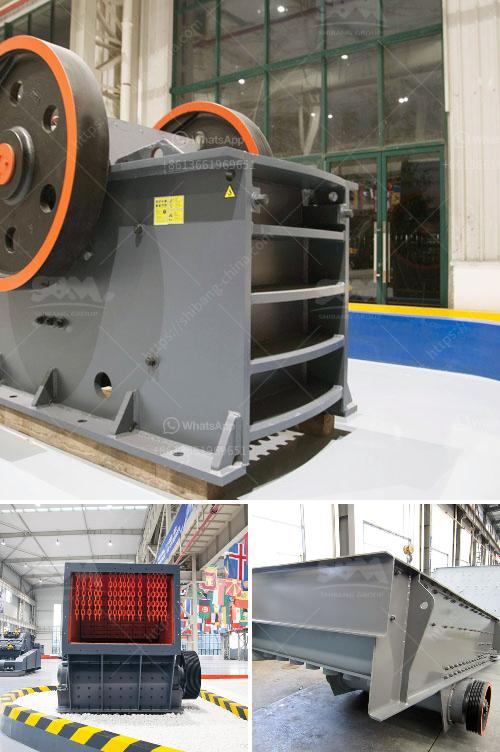

<h3>granite quarrying and processing firm in kaduna</h3>
Granite is a rock formed from the solidification of molten magma, and it is one of the hardest and strongest rocks in existence. In Nigeria, granite is abundant and can be found in various states, one of which is Kaduna. Kaduna, located in the northern region of the country, is renowned as a major hub for granite quarrying and processing firms. These firms have played a significant role in the economic development of the state and have contributed to the overall growth of the region.

One such notable firm in Kaduna is XYZ Granite Quarrying and Processing. With years of expertise and experience, XYZ Granite has emerged as one of the leading industry players in the state. The firm is known for its comprehensive operations, from quarrying the raw granite blocks to processing them into finished slabs and tiles. The entire process is carried out meticulously, ensuring the production of high-quality granite products.

The quarrying process starts with identifying potential granite deposits within the vicinity. This requires extensive exploration and geological studies to determine the quality and quantity of the granite. Once a suitable deposit is found, the extraction phase begins. Heavy machinery and equipment are used to break down the rocks and extract the granite blocks. This process requires skilled labor to ensure efficiency and safety.

After the extraction, the granite blocks are transported to the processing facility. Here, the blocks are further refined through cutting, polishing, and finishing. Skilled craftsmen use state-of-the-art machinery to shape the granite into various forms, such as slabs, tiles, countertops, and monuments. The processing stage requires precision and attention to detail to achieve the desired end products.

XYZ Granite Quarrying and Processing not only focuses on the extraction and processing of granite but also adheres to sustainable practices. The firm ensures that quarrying is carried out responsibly, minimizing environmental impact and promoting ecosystem preservation. They have implemented measures to manage waste and minimize pollution, contributing to the conservation of the surrounding natural resources.

The impact of the granite quarrying and processing industry in Kaduna cannot be overstated. It has created employment opportunities for the local population, stimulating economic growth and reducing unemployment rates. Skilled and semi-skilled workers are employed in various stages of the process, contributing to the overall development and well-being of the community.

Furthermore, the granite products produced by firms like XYZ Granite Quarrying and Processing have immense commercial value. The granite slabs and tiles are widely used in construction projects, both locally and internationally. The durability, aesthetic appeal, and versatility of granite make it a highly sought-after building material. Thus, Kaduna's granite industry experiences consistent demand, leading to steady revenue generation for the firms involved.

In conclusion, the granite quarrying and processing industry in Kaduna, spearheaded by firms like XYZ Granite Quarrying and Processing, has made a significant impact on the economic development of the region. It has created employment opportunities, utilized sustainable practices, and contributed to the growth of the local economy. The industry's commitment to quality and excellence has positioned Kaduna as a notable player in the global granite market.
<h3>Contact us</h3><ul><li><strong>Whatsapp:&nbsp;<a href="https://wa.me/8613661969651">+8613661969651</a></strong></li><li><a href="https://swt.shibang-china.com/?git&amp;zhl&amp;granite quarrying and processing firm in kaduna"><strong>Online Service(chat now)</strong></a></li></ul><h3>Related</h3><ul><li><a href='harga mobile stone crusher surabaya.md'>harga mobile stone crusher surabaya</a></li><li><a href='open cast coal mining machinery process.md'>open cast coal mining machinery process</a></li><li><a href='talc grinding plant.md'>talc grinding plant</a></li><li><a href='removing iron from silica sand.md'>removing iron from silica sand</a></li><li><a href='basalt rock crusher suppliers in dubai.md'>basalt rock crusher suppliers in dubai</a></li></ul>