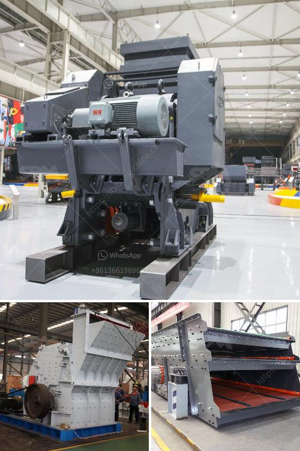

<h3>granite rock crusher</h3>
In construction and mining industries, the demand for high-quality granite rock crushers is increasing rapidly. With the ever-growing infrastructure development projects and mineral extraction endeavors, the market is expected to witness substantial growth in the coming years. A granite rock crusher is crucial for the successful completion of these projects as it breaks down the granite into smaller pieces that can be used for various construction purposes.

Granite, a type of igneous rock, is commonly used in construction and infrastructure projects due to its durability, strength, and aesthetic appeal. However, extracting granite from quarries and turning it into usable materials requires advanced machinery and equipment. This is where a granite rock crusher comes into the picture.

A granite rock crusher is a piece of equipment designed to take large granite rocks and reduce them into smaller rocks, gravel, or rock dust. Granite rock crushers have different types and varieties, such as jaw crushers, impact crushers, cone crushers, and vertical shaft impact crushers. These crushers perform different crushing tasks based on their capabilities and features.

One of the most important considerations when choosing a granite rock crusher is its reliability. Construction and mining projects often operate on tight schedules, and any equipment failure can result in costly delays. Therefore, it is essential to invest in a reliable granite rock crusher that can withstand heavy-duty operations and provide consistent performance.

A reliable granite rock crusher is built with high-quality materials and components that can withstand harsh environments and continuous operation. It should have a robust construction, durable wear parts, and a powerful crushing mechanism. Additionally, a reliable granite rock crusher should also have a user-friendly design, allowing for easy maintenance and minimal downtime.

Furthermore, a granite rock crusher should be equipped with advanced features and technologies that enhance its efficiency and productivity. For instance, some modern crushers come with automated systems that regulate the feed rate, ensure consistent product size, and automatically adjust the crusher's settings to optimize performance. These features not only improve the overall efficiency of the crusher but also reduce the risk of operator errors.

Additionally, a granite rock crusher should have adequate safety features to protect operators and prevent accidents. Safety measures, such as emergency stop buttons, protective guards, and clear warning labels, are crucial in ensuring the well-being of operators and minimizing potential hazards.

Investing in a high-quality and reliable granite rock crusher can save construction and mining companies valuable time and money. It enables them to process granite efficiently, reduce material waste, and produce high-quality aggregates required for various construction applications. Moreover, a reliable granite rock crusher can contribute to a project's success by meeting production targets, minimizing downtime, and ensuring a smooth workflow.

In conclusion, the demand for granite rock crushers is growing due to the increasing number of construction and mining projects. To meet this demand and ensure the successful completion of these projects, it is essential to invest in a reliable and efficient granite rock crusher. By considering factors such as reliability, durability, efficiency, and safety, construction and mining companies can make an informed choice and select a granite rock crusher that best suits their requirements.
<h3>Contact us</h3><ul><li><strong>Whatsapp:&nbsp;<a href="https://wa.me/8613661969651">+8613661969651</a></strong></li><li><a href="https://swt.shibang-china.com/?git&amp;zhl&amp;granite rock crusher"><strong>Online Service(chat now)</strong></a></li></ul><h3>Related</h3><ul><li><a href='calcite mining plant.md'>calcite mining plant</a></li><li><a href='cheap gravel crusher.md'>cheap gravel crusher</a></li><li><a href='gypsum stone crusher.md'>gypsum stone crusher</a></li><li><a href='cone crusher germany.md'>cone crusher germany</a></li><li><a href='portable gold rock crushing machine.md'>portable gold rock crushing machine</a></li></ul>