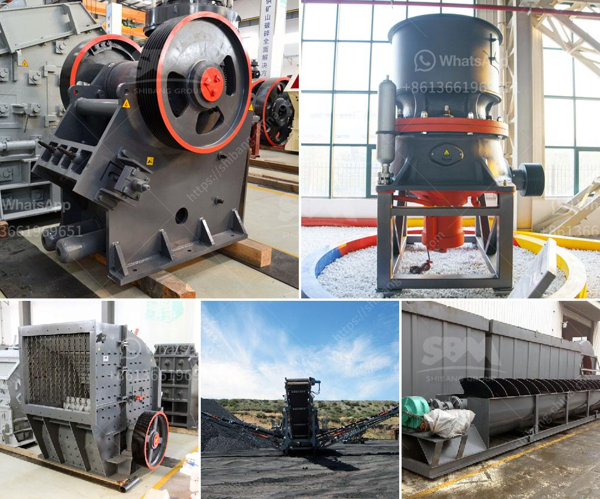

<h3>granite roller mill</h3>
Nestled in the heart of a small town, the Granite Roller Mill stands as a testament to the rich history of a community once driven by agriculture and industry. The mill, which has been in operation for over a century, has recently undergone extensive renovations, breathing new life into this historic landmark.

Built in the late 1800s, the Granite Roller Mill became the focal point of a thriving local economy. Farmers from the surrounding areas would bring their grain here to be processed, turning it into flour that would be used locally and exported to neighboring towns. For years, the mill served as the lifeblood of the community, providing employment and sustenance to countless families.

However, as technology advanced and industrialization took hold, the Granite Roller Mill's significance began to wane. The advent of large-scale flour production facilities made the once bustling mill seem outdated and obsolete. The business struggled to compete and slowly fell into disrepair.

Fortunately, a group of dedicated individuals recognized the value of preserving this historic gem. They formed a nonprofit organization and embarked on an ambitious plan to restore the Granite Roller Mill to its former glory. Through diligent fundraising efforts and grants from historical preservation organizations, the team was able to secure the necessary funds to carry out the renovations.

The restoration project included repairing and upgrading the mill's machinery, restoring the original wooden framework, and ensuring the building complied with safety regulations. The team also sought to maintain the mill's authenticity, carefully preserving its unique architectural features and charm.

Today, the Granite Roller Mill proudly stands as a testament to the resilience and determination of a community. It serves not only as a reminder of the town's storied past but also as a vibrant hub for locals and tourists alike. The mill now operates as a tourist attraction, offering guided tours that take visitors on a journey through the rich history of flour milling.

In addition to preserving the mill's architectural heritage, the restoration project has also had a tangible impact on the surrounding community. The reopening of the Granite Roller Mill has created new job opportunities, stimulating the local economy and providing a sense of pride for the town's residents.

The Granite Roller Mill stands as a symbol of the unwavering commitment to preserving history and revitalizing local landmarks. Its story serves as an inspiration for communities worldwide, encouraging them to embrace their past while looking towards a brighter future.
<h3>Contact us</h3><ul><li><strong>Whatsapp:&nbsp;<a href="https://wa.me/8613661969651">+8613661969651</a></strong></li><li><a href="https://swt.shibang-china.com/?git&amp;zhl&amp;granite roller mill"><strong>Online Service(chat now)</strong></a></li></ul><h3>Related</h3><ul><li><a href='how much does a crusher.md'>how much does a crusher</a></li><li><a href='sand business plan.md'>sand business plan</a></li><li><a href='crushing equipment philippines.md'>crushing equipment philippines</a></li><li><a href='ball mill for starch damage.md'>ball mill for starch damage</a></li><li><a href='what is the cost of limestone crushing process.md'>what is the cost of limestone crushing process</a></li></ul>