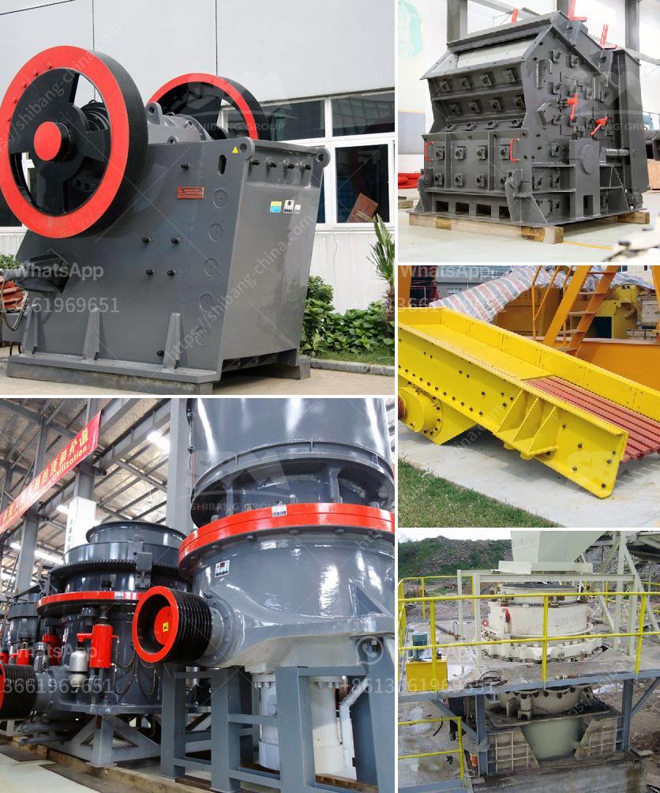

<h3>graphite mine slurry ball mill</h3>
Graphite is a naturally occurring form of crystalline carbon that has many exceptional properties, making it an essential material for various industries. Known for its high thermal stability, electrical conductivity, and lubricity, graphite finds extensive use in batteries, electrodes, lubricants, and many other applications. However, before these graphite-based products can be manufactured, the graphite ore must undergo a series of rigorous processing steps, one of which is grinding the ore into a fine powder using a slurry ball mill.

A slurry ball mill is a type of grinder that grinds materials into fine particles using a liquid medium. Unlike dry milling processes which utilize air, slurry ball mills maintain a mixture of water and solid components inside the mill for efficient grinding. This makes it particularly suitable for processing graphite ore, which is soft and formable, eliminating the risk of airborne graphite dust particles.

The primary advantage of using a slurry ball mill for graphite ore processing lies in its ability to keep the graphite particles evenly dispersed within the slurry, ensuring a uniform grind. This is crucial as it prevents the formation of graphite agglomerates that could negatively impact downstream processes. By maintaining a stable slurry, the ball mill achieves optimum particle size reduction, resulting in a powder with consistent properties.

Moreover, the use of a slurry ball mill minimizes the potential for graphite dust inhalation, a health hazard faced by workers in dry milling operations. Inhalation of airborne graphite dust can lead to respiratory issues such as graphite pneumoconiosis, a lung disease caused by the deposition of graphite in the lungs over time. The wet grinding process in a slurry ball mill significantly reduces the generation of graphite dust, creating a safer working environment.

From an environmental standpoint, slurry ball mills contribute to sustainable mining practices. By employing a liquid medium instead of air, the ball mill consumes less energy and reduces greenhouse gas emissions. Additionally, the water used in the process can be recycled, minimizing the overall water footprint of the graphite mine.

When implementing a slurry ball mill in graphite ore processing, it is essential to consider the mill's design and operation parameters. Factors such as the mill speed, slurry concentration, and grinding media size must be optimized to achieve the desired particle size distribution and maximize grinding efficiency. Furthermore, the choice of grinding media material should be carefully considered, as it can impact not only the grinding performance but also the wear resistance of the mill.

In conclusion, the use of a slurry ball mill in graphite ore processing offers numerous benefits ranging from improved worker safety to reduced environmental impact. This sustainable approach ensures uniform grinding of the graphite ore into a fine powder, while minimizing the generation of graphite dust. As the demand for graphite continues to rise in various industries, integrating slurry ball mills into graphite mining operations can play a crucial role in achieving sustainable processing practices.
<h3>Contact us</h3><ul><li><strong>Whatsapp:&nbsp;<a href="https://wa.me/8613661969651">+8613661969651</a></strong></li><li><a href="https://swt.shibang-china.com/?git&amp;zhl&amp;graphite mine slurry ball mill"><strong>Online Service(chat now)</strong></a></li></ul><h3>Related</h3><ul><li><a href='used crushers for sale in usa.md'>used crushers for sale in usa</a></li><li><a href='price of a large mobile crusher.md'>price of a large mobile crusher</a></li><li><a href='mineral grinding mill unit.md'>mineral grinding mill unit</a></li><li><a href='coal drying plant manufacturers in china.md'>coal drying plant manufacturers in china</a></li><li><a href='new gypsum board plant in india.md'>new gypsum board plant in india</a></li></ul>