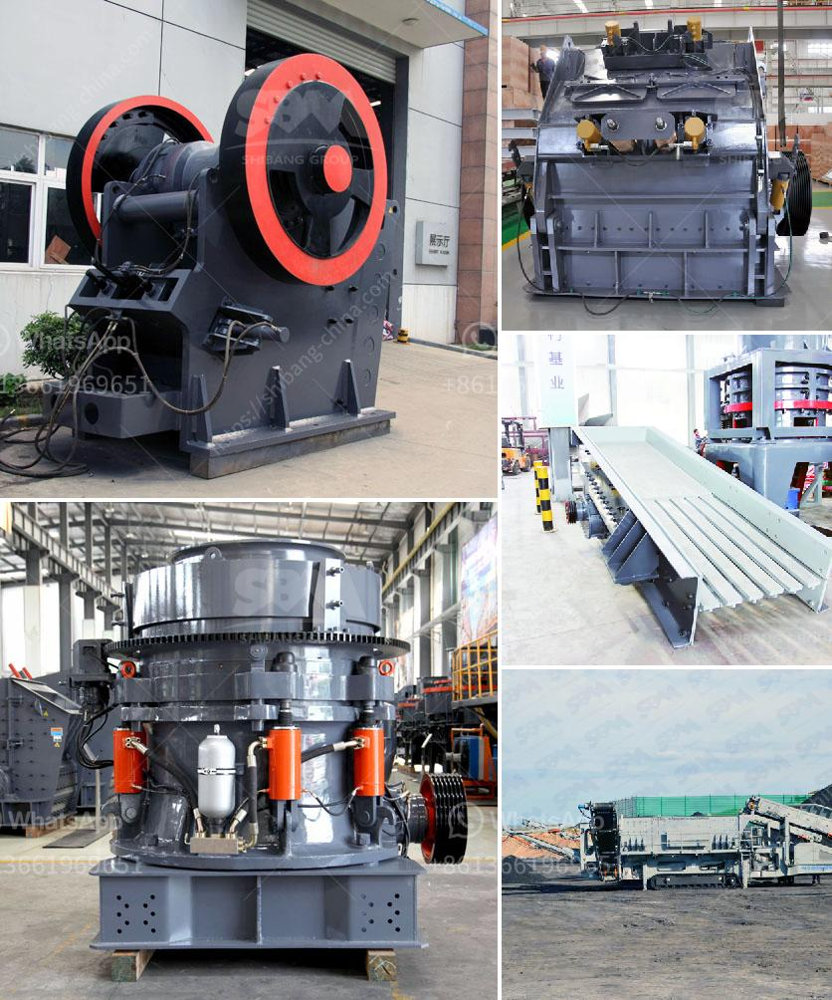

<h3>gravel screening equipment</h3>
Gravel screening equipment is crucial for many construction, landscaping, and excavation projects. It efficiently separates different sizes of gravel, ensuring high-quality materials are used for the intended purpose. Screening equipment plays a significant role in improving overall productivity and reducing costs, as it eliminates the need for manual screening processes.

One of the most common types of gravel screening equipment is a vibrating screen. This equipment vibrates to separate the gravel into various sizes. The vibration allows the smaller particles to fall through the screen, while the larger ones are conveyed to the end of the machine. Vibrating screens are available in various sizes and configurations to suit specific project requirements. Additionally, they can be adjusted to obtain different sizes of gravel to meet different project needs.

Another type of gravel screening equipment is a trommel screen. This equipment rotates and screens the gravel material, allowing the smaller particles to pass through while retaining the larger ones. Trommel screens are highly efficient and can handle large volumes of gravel. They are commonly used in mining and construction industries where high-capacity screening is required.

Gravel screening equipment can vary in design and features, depending on the manufacturer and its intended application. Some equipment includes additional features such as adjustable screen angles, multiple decks, and hydraulic systems for ease of operation and maintenance.

Investing in gravel screening equipment offers several advantages. Firstly, it saves time and labor, as the equipment can quickly screen a large volume of gravel with minimal operator intervention. This leads to increased productivity and cost savings. Secondly, using screening equipment ensures that the gravel is of high quality and free from unwanted debris, which is crucial for construction and landscaping projects.

In conclusion, gravel screening equipment is an essential tool for any project involving gravel. It improves efficiency, saves time and labor, and ensures high-quality materials are used. Whether it be a vibrating screen or a trommel screen, investing in this equipment will undoubtedly benefit any construction, landscaping, or excavation project, leading to successful and satisfactory outcomes.
<h3>Contact us</h3><ul><li><strong>Whatsapp:&nbsp;<a href="https://wa.me/8613661969651">+8613661969651</a></strong></li><li><a href="https://swt.shibang-china.com/?git&amp;zhl&amp;gravel screening equipment"><strong>Online Service(chat now)</strong></a></li></ul><h3>Related</h3><ul><li><a href='coal crusher machine manufacturer in india.md'>coal crusher machine manufacturer in india</a></li><li><a href='beast crusher price.md'>beast crusher price</a></li><li><a href='stone crusher plant price.md'>stone crusher plant price</a></li><li><a href='second hand german jaw crusher for sale.md'>second hand german jaw crusher for sale</a></li><li><a href='for selection of coal mill.md'>for selection of coal mill</a></li></ul>