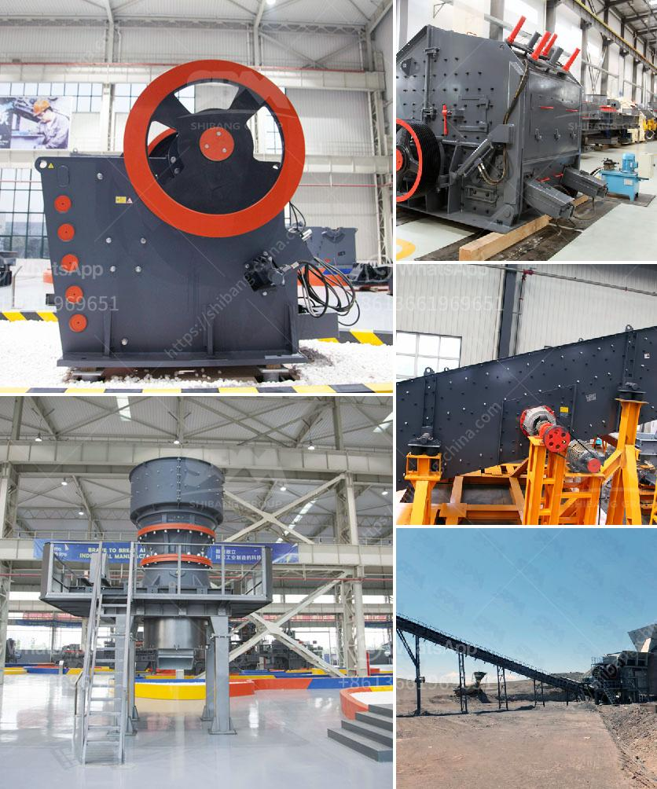

<h3>gravel stone crusher plant</h3>
Gravel stone crusher plant is a kind of machine which is used to crush the large gravel stones into small ones. It is widely used in crushing gravel, sand, river stone, boulders, limestone, rock, aggregate and other minerals. It has many uses in various industries. Considering the specific requirements of our customers, we have designed various gravel crushing plants for different types of gravel stones.

The gravel crushing plant includes gravel crusher and gravel mill or other related gravel crushing equipment. Gravel crusher is a stone crusher specially used for crushing gravel or sand stone. Our independent R & D gravel crusher can meet different demands of our clients in gravel or other stone crushing industry.

Gravel stone crusher plants play a crucial role in delivering the required gravel aggregate to the construction site. Most crushing plants are now designed on the lines shown in Fig. 1, which is a diagrammatic view of a two-stage arrangement. The ore from the mine is dumped in the coarse ore bin, from which an automatic feeder delivers it over a grizzly to the primary breaker, the latter being of the jaw type in the case of a small plant and of the gyratory type in the case of a large one. The reduction ratio—that is, the ratio between the “ inch size ” of the largest lump entering the machine and that of the largest piece leaving it—is usually between 4 and 6 to one.

Gravel stone crusher plant manufacturer offers the customer with detailed descriptions of each crusher. This helps the customer to understand the exact specifications of the machines that can help them in achieving the desired output and quantity of gravel products. The primary goal of the gravel stone crusher plant is to offer versatile solutions to meet the customer satisfaction levels. The purpose of the crusher plant is to determine product output size, size of the crushed materials, size reduction ratio, feed size, and much more for an efficient and economical operation.

In conclusion, gravel stone crusher plant is a perfect choice for crushing stones. It can be used to crush various types of gravel stones into diverse particle sizes for various construction purposes. Gravel stone crusher plant can offer efficient, reliable performance and high production capacity. Moreover, it is freely installed and adjusted by the customer according to different demands. As a leading stone crushing plant manufacturer, our experience and expertise will provide you with perfect service for your gravel success.
<h3>Contact us</h3><ul><li><strong>Whatsapp:&nbsp;<a href="https://wa.me/8613661969651">+8613661969651</a></strong></li><li><a href="https://swt.shibang-china.com/?git&amp;zhl&amp;gravel stone crusher plant"><strong>Online Service(chat now)</strong></a></li></ul><h3>Related</h3><ul><li><a href='the roller grinding mill.md'>the roller grinding mill</a></li><li><a href='estimasi biaya usaha stone crusher.md'>estimasi biaya usaha stone crusher</a></li><li><a href='portable stone crusher for sale.md'>portable stone crusher for sale</a></li><li><a href='cement plant for sale intpd.md'>cement plant for sale intpd</a></li><li><a href='china granite crusher.md'>china granite crusher</a></li></ul>