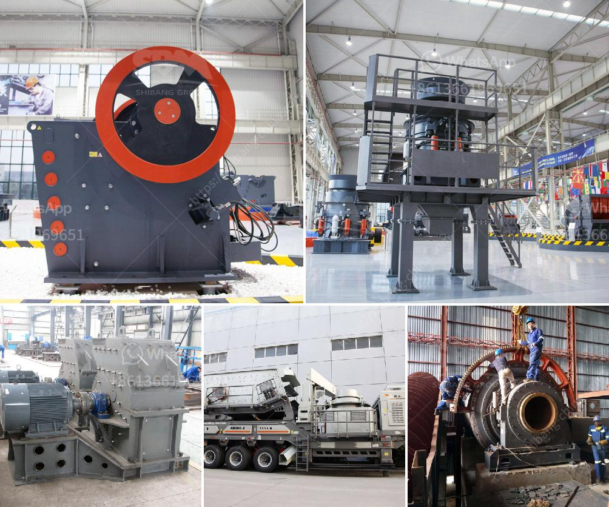

<h3>grinding balls in tanzania</h3>
Mining is one of Tanzania's leading industries, contributing significantly to the country's economy. The extraction of valuable minerals, such as gold, diamonds, and copper, requires efficient and reliable equipment to crush and grind the ore into smaller particles. This is where grinding balls come into play.

Grinding balls, also known as grinding media, are steel or ceramic balls used to grind the material inside mills and crushers. They aid in the pulverization process, ensuring consistent and efficient grinding of the ore. Without these grinding balls, the entire mining process would be inefficient and time-consuming.

In recent years, Tanzania has seen a rising demand for grinding balls due to the growth in the mining industry. This demand has led to the establishment of various manufacturing companies specializing in the production of grinding balls. These companies ensure that the grinding balls are made of premium quality materials to withstand the harsh operating conditions inside the mills and crushers.

The presence of reliable and locally produced grinding balls in Tanzania has significantly benefited the mining industry. The availability of these grinding balls reduces the cost of importing them from other countries, making mining operations more cost-effective. Additionally, the timely supply of grinding balls ensures uninterrupted production, minimizing downtime for the mining companies.

Furthermore, the production of grinding balls in Tanzania has also created employment opportunities for the local population. These manufacturing companies employ skilled workers, who are trained in producing high-quality grinding balls. The increase in job opportunities not only improves the livelihoods of individuals but also contributes to the overall economic growth of the country.

It is crucial for the Tanzanian mining industry to prioritize the procurement of these essential grinding balls from local manufacturers. This not only supports the local economy but also ensures a steady supply of high-quality grinding balls, which are crucial for efficient mining operations.

In conclusion, grinding balls play a significant role in the mining industry in Tanzania. They aid in the pulverization of minerals and ensure consistent and efficient grinding of ores. With the rise in demand for grinding balls, Tanzania has witnessed the establishment of local manufacturing companies, creating job opportunities and contributing to economic growth. It is essential for the mining industry to prioritize sourcing grinding balls locally to support the economy and ensure uninterrupted production.
<h3>Contact us</h3><ul><li><strong>Whatsapp:&nbsp;<a href="https://wa.me/8613661969651">+8613661969651</a></strong></li><li><a href="https://swt.shibang-china.com/?git&amp;zhl&amp;grinding balls in tanzania"><strong>Online Service(chat now)</strong></a></li></ul><h3>Related</h3><ul><li><a href='zinc ash crusher machine required.md'>zinc ash crusher machine required</a></li><li><a href='mobile fine jaw crusher at saudi arabia.md'>mobile fine jaw crusher at saudi arabia</a></li><li><a href='sand wash plant for sale in india.md'>sand wash plant for sale in india</a></li><li><a href='belt conveyor design.md'>belt conveyor design</a></li><li><a href='crusher for crushing limestone.md'>crusher for crushing limestone</a></li></ul>