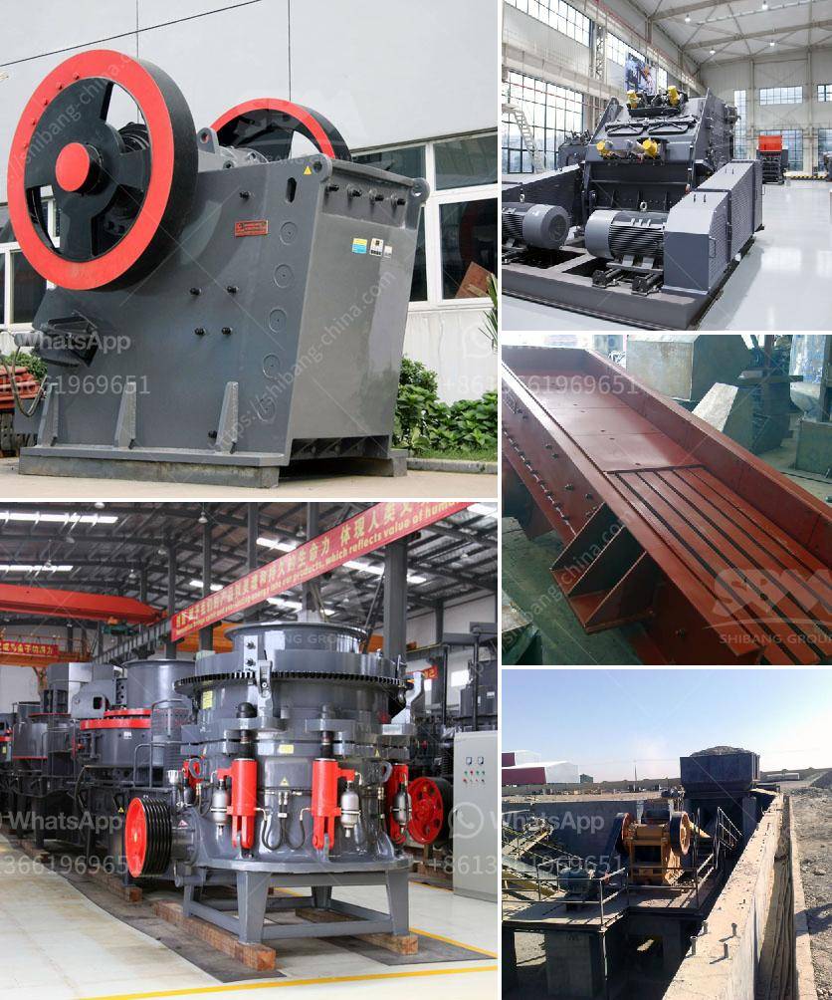

<h3>grinding machine manufacturers and suppliers in india</h3>
Grinding machines are widely used in the manufacturing industry for efficient grinding of various materials. They are essentially used for cutting, shaping, and finishing metals, plastics, and other materials. With the growing demand for precision and efficiency in the manufacturing sector, grinding machines have become an essential tool for many industries.

In India, there are numerous grinding machine manufacturers and suppliers offering high-quality grinding machines with advanced features. These machines are designed to meet the diverse grinding requirements of various industries. Whether it is automotive, aerospace, medical, or any other industry, grinding machines play a crucial role in achieving precision and smoothness in the final product.

One prominent manufacturer in India is Prayosha Enterprise. They offer a wide range of grinding machines, including hydraulic surface grinding machines, Cylindrical grinding machines, and CNC grinding machines. Their machines are known for their robust construction, high performance, and cost-effectiveness. Prayosha Enterprise emphasizes continuous innovation and technology upgradations to meet the evolving needs of the industry.

Another reputable manufacturer is Bhurji Surface Grinder. They specialize in manufacturing precision surface grinding machines that deliver exceptional accuracy and surface finish. Their machines incorporate advanced features such as automatic lubrication, electronic and hydraulic control systems, and high-quality grinding wheels. Bhurji Surface Grinder has earned a strong reputation for providing reliable and efficient grinding solutions.

In addition to manufacturers, several suppliers in India cater to the growing demand for grinding machines. These suppliers source high-quality machines from both domestic manufacturers and international brands. They provide comprehensive solutions to customers, including installation, training, maintenance, and after-sales service.

In conclusion, grinding machine manufacturers and suppliers in India offer a wide range of grinding machines to meet the diverse needs of various industries. With their commitment to innovation and technology, these manufacturers and suppliers play a crucial role in enhancing the efficiency and productivity of the manufacturing sector. The availability of reliable and high-performance grinding machines further strengthens India's position as a leading manufacturing hub.
<h3>Contact us</h3><ul><li><strong>Whatsapp:&nbsp;<a href="https://wa.me/8613661969651">+8613661969651</a></strong></li><li><a href="https://swt.shibang-china.com/?git&amp;zhl&amp;grinding machine manufacturers and suppliers in india"><strong>Online Service(chat now)</strong></a></li></ul><h3>Related</h3><ul><li><a href='hammer mill machine 20hp.md'>hammer mill machine 20hp</a></li><li><a href='grinding mill prices in zimbabwe.md'>grinding mill prices in zimbabwe</a></li><li><a href='gypsum mines in orissa india.md'>gypsum mines in orissa india</a></li><li><a href='slag vertical mill.md'>slag vertical mill</a></li><li><a href='quartz crushing plant german tecnology.md'>quartz crushing plant german tecnology</a></li></ul>