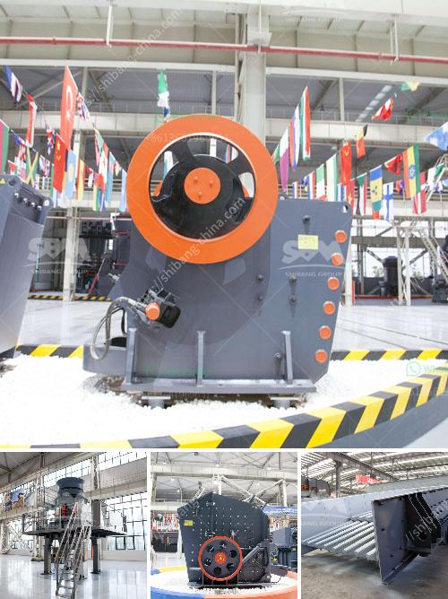

<h3>grinding machines sales in namibia</h3>
Namibia, located on the southwestern coast of Africa, has been experiencing significant industrial growth in recent years. As the country continues to expand its manufacturing sector, the demand for efficient and high-quality grinding machines has also been on the rise. These machines play a crucial role in various industries, such as mining, construction, automotive, and agriculture. The sales of grinding machines in Namibia have witnessed notable growth, driving advancements and productivity in the industrial landscape.

The mining sector is one of the key contributors to Namibia's economy, accounting for a substantial share of the country's GDP. From diamond extraction to mineral exploration, mining operations require advanced equipment to process raw materials efficiently. Grinding machines are essential in this process as they are used to break down large rocks and ores into smaller, more manageable sizes. The demand for grinding machines in the mining sector has seen a steady increase in Namibia due to the country's rich mineral resources and growing investment in mining projects.

Another industry that heavily relies on grinding machines is construction. Namibia, with its growing urbanization and infrastructure development, requires sturdy and finely crafted buildings and structures. The preparation of construction materials, including concrete and asphalt, often involves grinding processes. Construction companies in Namibia are investing in high-quality grinding machines to ensure the accuracy and smoothness of surfaces, leading to durable and visually appealing structures.

The automotive sector also plays a significant role in Namibia's industrial growth, primarily driven by automobile assembly, spare parts manufacturing, and repair services. Grinding machines are indispensable in the production of precise and standardized parts for automobiles, ensuring their smooth operation. The increase in automotive sales and the growing demand for aftermarket services have led to a surge in the sales of grinding machines in Namibia's automotive industry.

The agriculture sector, which is crucial for Namibia's food security, has also embraced grinding machines to enhance crop production. Grinding machines are used to process various agricultural products, including grains, seeds, and feed, to produce fine powders or flours. Namibian farmers are increasingly adopting grinding machines to increase productivity, reduce manual labor, and improve the quality of their products.

To cater to the growing demand for grinding machines in Namibia, both domestic and international manufacturers have expanded their presence in the country. Local companies have capitalized on this opportunity to offer competitively priced grinding machines with localized support and servicing. Foreign companies have also seized the potential of the Namibian market by introducing innovative products equipped with the latest technological advancements. These solutions not only boost productivity but also align with global standards of efficiency and sustainability.

Government initiatives and policies aimed at promoting industrial growth have also played a significant role in driving grinding machine sales in Namibia. Incentives such as tax breaks and subsidies have encouraged local industries to adopt advanced machinery, including grinding machines, to enhance their competitiveness in both regional and international markets. Furthermore, collaborations and partnerships between industry players and research institutions have facilitated the development of customized grinding machines tailored to Namibia's specific industrial needs.

In conclusion, the sales of grinding machines in Namibia have observed substantial growth, driven by the expanding industrial sectors, including mining, construction, automotive, and agriculture. These machines have become crucial in processing raw materials, producing precise parts, and improving efficiency across various industries. The availability of innovative and reliable grinding machines, combined with government support and industry collaborations, is propelling Namibia's industrial growth and positioning the country on the path of sustainable development.
<h3>Contact us</h3><ul><li><strong>Whatsapp:&nbsp;<a href="https://wa.me/8613661969651">+8613661969651</a></strong></li><li><a href="https://swt.shibang-china.com/?git&amp;zhl&amp;grinding machines sales in namibia"><strong>Online Service(chat now)</strong></a></li></ul><h3>Related</h3><ul><li><a href='alluvial mobile diamond processing plant.md'>alluvial mobile diamond processing plant</a></li><li><a href='ballast crusher kenya.md'>ballast crusher kenya</a></li><li><a href='cone crusher mobile uk.md'>cone crusher mobile uk</a></li><li><a href='product curve jaw crusher.md'>product curve jaw crusher</a></li><li><a href='mobile gold processing plant 1 2 tph.md'>mobile gold processing plant 1 2 tph</a></li></ul>