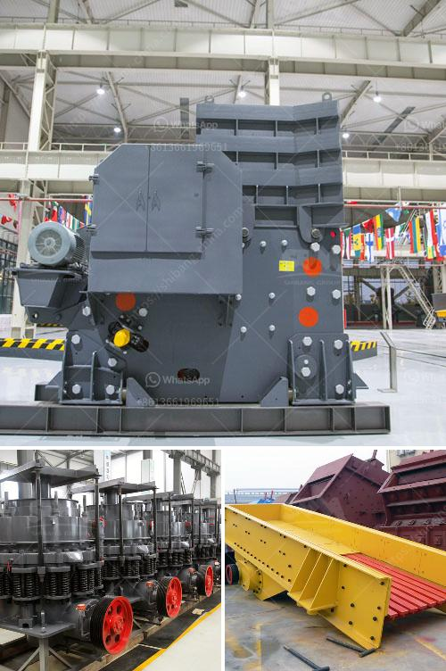

<h3>grinding mill prices in zimbabwe</h3>
Grinding mill prices in Zimbabwe have surged recently due to the massive inflation rate that has affected the country. Many Zimbabweans have been forced to source alternative ways of grinding mealie-meal due to the unavailability of grinding mills in the rural areas. The escalating cost of essentials has driven up the prices of the grinding mills drastically.

Grinding mills are essential for those who want to process their own grains, such as maize, into mealie-meal, a staple food in Zimbabwe. The grinding mills convert the grains into flour or meal, which is then used for cooking purposes.

In recent years, the Zimbabwean economy has been on a downward spiral, with hyperinflation plaguing the country. As a result, the prices of goods and services have skyrocketed, making it difficult for the ordinary citizens to afford basic necessities. Grinding mill prices have not been spared either.

In the rural areas, where most of the population resides, grinding mills have become scarce and expensive. To counter this problem, some have resorted to using traditional methods of grinding grain, such as pounding it with a pestle and mortar. However, this process is time-consuming and labor-intensive, which has led to a surge in demand for grinding mills.

The high cost of grinding mills in Zimbabwe has led to a shortage in the market, prompting some Zimbabweans to resort to unorthodox methods of grinding grain. For instance, some individuals have taken to renting grinding mills, which can cost over $100 per week depending on the size and type.

Others have gone to the extent of using diesel-powered grinding mills, which are not only expensive but also harmful to the environment due to the emissions they produce. This has raised concerns about the sustainability of such practices in the long run.

The skyrocketing grinding mill prices have also affected the farmers who rely on selling their surplus produce to earn a living. With the high cost of processing their maize into mealie-meal, many farmers have been left with no choice but to sell their maize to middlemen at low prices. This has resulted in reduced profitability for the farmers and a decrease in overall agricultural production.

In an effort to address the grinding mill crisis, the Zimbabwean government has introduced subsidies for the millers to make the prices more affordable for the citizens. However, these subsidies have not been enough to bring the prices down significantly, leaving many struggling to make ends meet.

In conclusion, grinding mill prices in Zimbabwe have reached unprecedented levels due to the country's hyperinflation crisis. The scarcity of grinding mills has forced many Zimbabweans to resort to traditional grinding methods or expensive alternatives. The high prices have also impacted farmers, who are unable to afford the cost of processing their maize into mealie-meal. While the government has introduced subsidies to alleviate the situation, more needs to be done to make grinding mills accessible and affordable for all Zimbabweans.
<h3>Contact us</h3><ul><li><strong>Whatsapp:&nbsp;<a href="https://wa.me/8613661969651">+8613661969651</a></strong></li><li><a href="https://swt.shibang-china.com/?git&amp;zhl&amp;grinding mill prices in zimbabwe"><strong>Online Service(chat now)</strong></a></li></ul><h3>Related</h3><ul><li><a href='gold screening machines south africa.md'>gold screening machines south africa</a></li><li><a href='pulverizer raymond mill.md'>pulverizer raymond mill</a></li><li><a href='harga mesin sekunder stone crusher bekas.md'>harga mesin sekunder stone crusher bekas</a></li><li><a href='200tph vsi crushers.md'>200tph vsi crushers</a></li><li><a href='the cost of the stone crusher machine.md'>the cost of the stone crusher machine</a></li></ul>