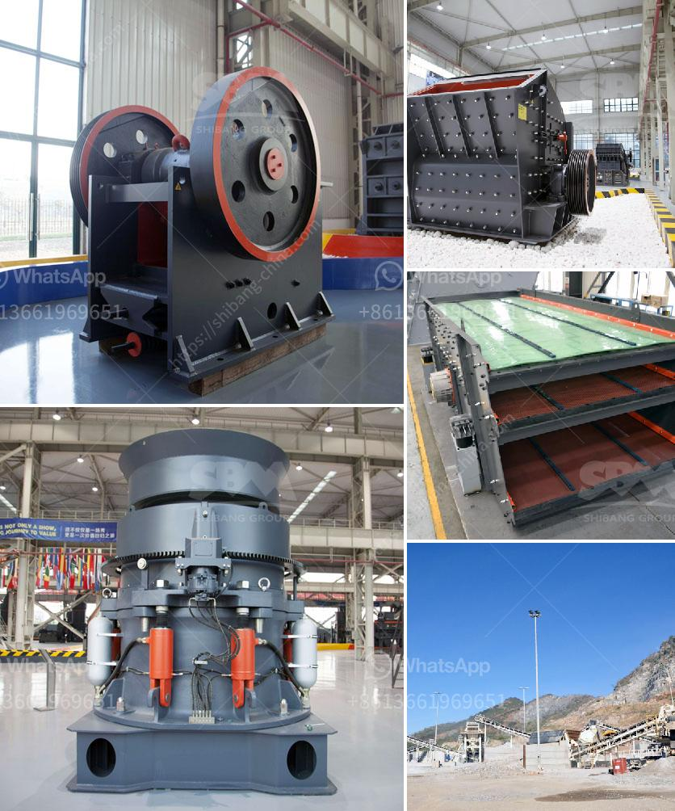

<h3>grinding silica sand to get 325 mesh product</h3>
Silica sand is one of the most abundant materials on the earth's crust. However, it is not always readily available in the desired specifications. To effectively and efficiently obtain silica sand that is in the range of 325 mesh, grinding or pulverizing is necessary. Grinding silica sand to obtain 325 mesh product is one of the most sought-after processes in many industries.

Silica sand, also known as quartz, is used mainly in the production of glass, ceramics, and foundry sand. The excellent properties of silica sand make it an essential component in these industries, making the grinding process crucial for obtaining 325 mesh products.

Grinding is typically done using a mill that consists of a rotating drum filled with grinding media, such as steel balls or rods. As the mill rotates, these media crush and grind the silica sand particles into a fine powder. The resulting material is then sieved through a mesh screen to separate it into different particle sizes. The desired product, in this case, is the silica sand that has been ground to 325 mesh.

The 325 mesh specification is widely used in various applications. For example, in the glass industry, finer silica sands are preferred as they produce smoother, clearer, and more durable glass products. Similarly, in ceramics, the 325 mesh product ensures better glazing and firing characteristics, enhancing the final product's quality. Foundries also rely on finely ground silica sand to produce high-quality molds and cores for casting metals.

The grinding process not only ensures the desired 325 mesh product size but also has other advantages. For instance, by reducing the particle size, the surface area of silica sand increases, which enhances its reactivity in various chemical reactions. Moreover, grinding silica sand can improve its physical properties by increasing its density and controlling the moisture content.

In conclusion, grinding silica sand to obtain a 325 mesh product is a crucial process in various industries to enhance product quality and optimize performance. The use of finely ground silica sand ensures desirable properties, such as smooth glass surfaces, superior ceramics, and high-quality foundry molds. By employing efficient grinding techniques, industries can produce high-performance materials that meet their specific requirements, ultimately improving their overall productivity and competitiveness.
<h3>Contact us</h3><ul><li><strong>Whatsapp:&nbsp;<a href="https://wa.me/8613661969651">+8613661969651</a></strong></li><li><a href="https://swt.shibang-china.com/?git&amp;zhl&amp;grinding silica sand to get 325 mesh product"><strong>Online Service(chat now)</strong></a></li></ul><h3>Related</h3><ul><li><a href='stone crusher plant layout.md'>stone crusher plant layout</a></li><li><a href='cost of bentonite manufacturing processing plant.md'>cost of bentonite manufacturing processing plant</a></li><li><a href='list of price of stone crusher machine in zimbabwe.md'>list of price of stone crusher machine in zimbabwe</a></li><li><a href='impact jaw crusher.md'>impact jaw crusher</a></li><li><a href='mini track jaw crushers for sale.md'>mini track jaw crushers for sale</a></li></ul>