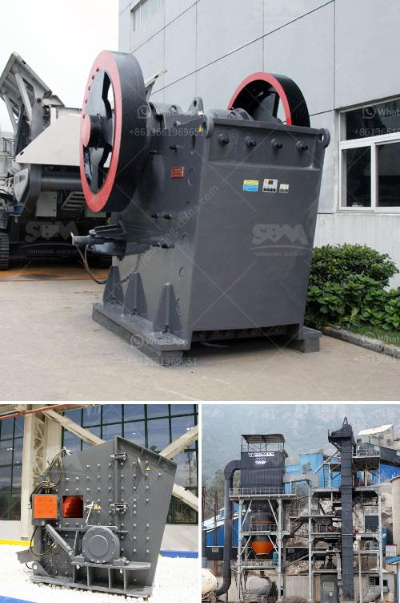

<h3>gypsum board manufacturing process</h3>
Gypsum board, also known as drywall or plasterboard, is a commonly used construction material. It is made by compressing gypsum plaster (a white or gray powder) between two layers of paper, resulting in a rigid board. The manufacturing process of gypsum board involves several steps, from the extraction of gypsum ore to the final product.

1. Gypsum Extraction: Gypsum ore is mined using open-pit or underground mining methods. The ore is then crushed into smaller pieces and transported to a processing plant.

2. Crushing and Grinding: The gypsum ore is crushed in a primary crusher and then further reduced to a finer size in a secondary crusher. The finely crushed gypsum is mixed with water and transported to a grinding mill where it is pulverized to a powder.

3. Calcination: The powder is then heated in a calcination kiln, also known as a calciner. The calcination process removes the chemically bonded water from the gypsum, converting it into a dry powder called plaster of Paris. This process involves high temperatures to drive off the excess water, resulting in a chemically stable and heat-resistant material.

4. Mixing and Forming: The calcined gypsum powder is mixed with additives such as starch, foam agents, and other compounds to enhance performance and improve workability. The mixture is then poured onto a continuous moving sheet of paper. Another layer of paper is then placed on top, creating a sandwich-like structure.

5. Drying: The gypsum board sandwich is passed through a dryer where the excess moisture is removed. This step is crucial to ensure that the board maintains its stability and strength. The drying process may involve using heat or forced air to evaporate the moisture.

6. Cutting and Edging: Once dry, the gypsum board is cut into specific sizes and edges are beveled or tapered. These modifications enable easier installation, create smooth joints, and contribute to the aesthetic appeal of the final product.

7. Final Inspection and Packaging: After cutting, each gypsum board panel undergoes a final quality inspection to check for defects, such as cracks or uneven surfaces. Once deemed satisfactory, the panels are packaged and prepared for distribution.

The gypsum board manufacturing process is highly automated, with most of the steps being mechanized or conducted by specialized machinery. This ensures consistent quality and helps meet the high demand for construction materials.

Gypsum board is a versatile material that offers several benefits in construction. Its fire resistance property makes it an excellent choice for improving building safety. It also provides good insulation against heat and sound, contributes to moisture control, and offers a smooth surface for painting and finishing.

In conclusion, the manufacturing process of gypsum board involves extracting gypsum ore, crushing and grinding it, calcining the powder, mixing and forming the board, drying, cutting and edging, and final inspection and packaging. This process results in the production of a durable and versatile construction material that is widely used for various applications around the world.
<h3>Contact us</h3><ul><li><strong>Whatsapp:&nbsp;<a href="https://wa.me/8613661969651">+8613661969651</a></strong></li><li><a href="https://swt.shibang-china.com/?git&amp;zhl&amp;gypsum board manufacturing process"><strong>Online Service(chat now)</strong></a></li></ul><h3>Related</h3><ul><li><a href='mini cement plant project report of cost setting in india.md'>mini cement plant project report of cost setting in india</a></li><li><a href='feldspar ball mill in kenya.md'>feldspar ball mill in kenya</a></li><li><a href='portable jaw crushers.md'>portable jaw crushers</a></li><li><a href='removing iron from silica sand.md'>removing iron from silica sand</a></li><li><a href='crusher prices in cameroon.md'>crusher prices in cameroon</a></li></ul>