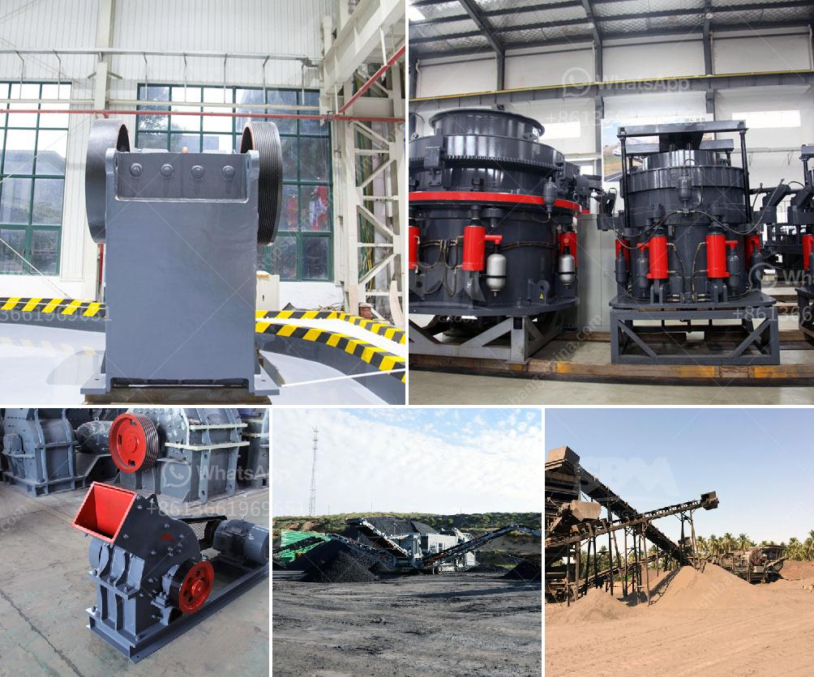

<h3>gypsum board powder plant in ethiopia</h3>
Ethiopia is a country blessed with an abundance of natural resources and a growing economy. With increasing urbanization and industrialization, the demand for construction materials is on the rise. One such material that has gained prominence in recent years is gypsum board.

Gypsum board, also known as drywall or plasterboard, is a building material used for interior walls and ceilings. It is made from a mineral called gypsum, which is found in abundance in various parts of Ethiopia. The gypsum board plant in Ethiopia is designed to produce gypsum board powder, which is used as raw material for gypsum board, plaster, cornice, and other gypsum products.

The plant is a trusted and reliable supplier to local and regional construction firms and contractors. It has a production capacity of 1,000 tons of gypsum powder per day, ensuring a steady and consistent supply of high-quality material. The plant is equipped with state-of-the-art machinery and equipment, ensuring efficient and safe production processes.

In addition to supplying the local market, the gypsum board powder plant in Ethiopia also exports its products to neighboring countries. This contributes to the country's foreign exchange earnings and helps promote economic growth. The plant is renowned for its commitment to quality control and customer satisfaction. It adheres to international standards and guidelines, making its products highly sought after in both the domestic and international markets.

One of the key advantages of gypsum board is its fire-resistant properties. This makes it a preferred choice for buildings and structures where fire safety is of utmost importance. It is also known for its thermal insulation capabilities, which can help reduce energy consumption in buildings. Additionally, gypsum board is easy to install, reducing construction time and costs.

The gypsum board powder plant in Ethiopia is also an eco-friendly establishment. Gypsum is a natural and recyclable material, making it an environmentally sustainable choice for construction. The plant takes measures to minimize waste generation and water usage during the production process. It also ensures proper disposal of by-products and adheres to environmental regulations.

Furthermore, the plant contributes to the local community by providing employment opportunities. It directly employs a significant number of skilled and semi-skilled workers, helping alleviate unemployment in the region. The plant also supports local suppliers and businesses by sourcing raw materials and services from nearby communities.

In conclusion, the gypsum board powder plant in Ethiopia plays a crucial role in the construction industry, both domestically and regionally. It supplies high-quality gypsum powder to meet the growing demand for gypsum board and other gypsum products. The plant's commitment to quality, sustainability, and customer satisfaction has made it a trusted and reliable supplier in the market. Additionally, it contributes to the country's economy by exporting its products and generating employment opportunities. Overall, the plant is a testament to Ethiopia's potential in utilizing its natural resources and promoting sustainable economic growth.
<h3>Contact us</h3><ul><li><strong>Whatsapp:&nbsp;<a href="https://wa.me/8613661969651">+8613661969651</a></strong></li><li><a href="https://swt.shibang-china.com/?git&amp;zhl&amp;gypsum board powder plant in ethiopia"><strong>Online Service(chat now)</strong></a></li></ul><h3>Related</h3><ul><li><a href='sayaji stone crusher machine.md'>sayaji stone crusher machine</a></li><li><a href='iron processing machine.md'>iron processing machine</a></li><li><a href='used crusher plant in uae.md'>used crusher plant in uae</a></li><li><a href='conveyor belt for fly ash.md'>conveyor belt for fly ash</a></li><li><a href='complete crusher for sale.md'>complete crusher for sale</a></li></ul>