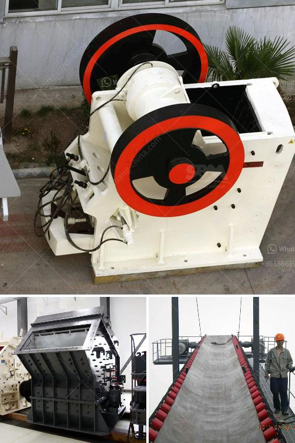

<h3>gypsum crushing machine price</h3>
Gypsum is a form of mineral that is commonly used in the construction industry. It is used for a variety of purposes such as making building materials, cement, and soil conditioning. In recent years, there has been increasing demand for gypsum crushing machines in the market.

Firstly, the size of the machine is a key factor to consider. The larger the machine, the higher the price. This is because bigger machines usually have higher production capacities and are capable of crushing larger quantities of gypsum.

Secondly, the technology and quality of the machine also play a significant role in determining the price. Machines with advanced technology and superior quality materials tend to be more expensive. However, they also offer better performance and durability, ensuring a long-term investment for the buyer.

Another factor is the brand reputation and market competition. Well-established brands with a good reputation in the industry often charge a premium for their products. On the other hand, there are also smaller or lesser-known brands that offer competitive prices to gain market share. Buyers should consider their requirements and budget while making a choice.

Additionally, the machine's capacity is directly proportional to its price. Machines with higher capacity are usually more expensive. For instance, a machine that can crush 50 tons of gypsum per hour will be priced higher than a machine that can only crush 30 tons per hour.

Moreover, the location of the manufacturer can also affect the price. Manufacturing costs differ across regions due to factors like labor costs, raw material availability, and transport expenses. Machines manufactured in developed countries with higher labor costs tend to be more expensive compared to those made in developing countries.

Furthermore, the after-sales service and warranty provided by the manufacturer should be considered. A machine that comes with excellent after-sales service and a long warranty period may have a higher upfront cost but can save the buyer maintenance costs in the long run.

Lastly, market demand and supply also impact the price. If the demand for gypsum crushing machines is high and the supply is low, prices may go up. Conversely, if there is excess supply in the market, prices may be more competitive.

In conclusion, the price of gypsum crushing machines is determined by various factors such as machine size, technology, quality, brand reputation, market competition, capacity, manufacturing location, after-sales service, and market demand. Buyers should carefully evaluate these factors to make an informed decision and choose a machine that best meets their requirements and budget. It is always advisable to compare different options, read customer reviews, and seek expert advice before making a purchase.
<h3>Contact us</h3><ul><li><strong>Whatsapp:&nbsp;<a href="https://wa.me/8613661969651">+8613661969651</a></strong></li><li><a href="https://swt.shibang-china.com/?git&amp;zhl&amp;gypsum crushing machine price"><strong>Online Service(chat now)</strong></a></li></ul><h3>Related</h3><ul><li><a href='chrome concentrate wash plant for sale.md'>chrome concentrate wash plant for sale</a></li><li><a href='jaw crushers machine for sale.md'>jaw crushers machine for sale</a></li><li><a href='crusher plant germany.md'>crusher plant germany</a></li><li><a href='second hand mobile crusher plant.md'>second hand mobile crusher plant</a></li><li><a href='automatic terrazzo pressing machine.md'>automatic terrazzo pressing machine</a></li></ul>