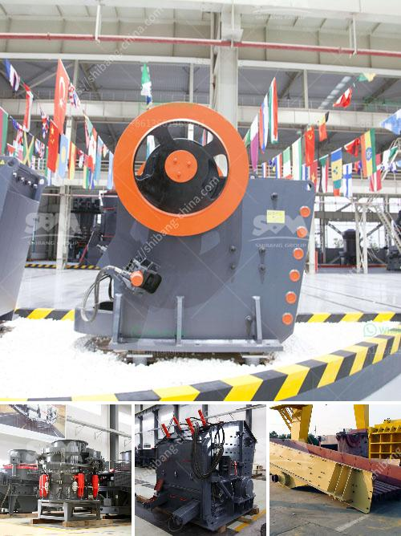

<h3>gypsum crushing machines</h3>
Gypsum is a soft sulfate mineral composed of calcium sulfate dihydrate. It has been used as a building material for centuries due to its durability and fire resistance. In recent years, gypsum has become a popular material for home renovation projects and construction in general.

To extract gypsum and process it into various products such as plaster, gypsum powder, and gypsum board, crushing is the first step. The traditional crushing process usually involves multiple stages, including the primary crushing, secondary crushing, and tertiary crushing. However, with the advancement of technology, gypsum crushing machines have evolved into highly efficient and versatile equipment that can simplify the process and increase productivity.

One of the common gypsum crushing machines is a jaw crusher. It is a heavy-duty machine that is generally used for crushing different kinds of raw materials into smaller pieces. The jaw crusher can be used for coarse crushing or fine crushing, depending on the size and hardness of the materials. It can handle materials with a compressive strength up to 320 MPa.

Another type of gypsum crushing machine is the impact crusher. It is usually used in secondary or tertiary crushing applications to reduce the size of gypsum and further process it into smaller particles. The impact crusher uses a series of hammers to crush materials, providing high-speed impact forces to break down the gypsum into smaller fragments.

Hammer mills are also commonly used gypsum crushing machines. They consist of a rotating shaft with free-swinging hammers attached to it. The hammers are repeatedly struck against the gypsum, resulting in the fragmentation of the material into smaller pieces. Hammer mills are particularly suitable for crushing gypsum with a high moisture content as they can effectively dry and grind the material simultaneously.

In addition to these primary crushing machines, there are also various types of secondary crushers, such as cone crushers and roller crushers. Cone crushers are commonly used in the mining industry to crush materials with high hardness and abrasive properties. Roller crushers, on the other hand, are more suitable for crushing materials with medium hardness.

When selecting a gypsum crushing machine, it is essential to consider factors such as the feed size, capacity, and desired finished product size. The feed size determines the maximum size of the materials that can be fed into the machine, while the capacity indicates the amount of material the machine can handle per hour. The desired finished product size determines the type and configuration of the crushing machine required.

Overall, gypsum crushing machines provide essential equipment for the gypsum processing industry. As the market demand for gypsum products continues to increase, the use of gypsum crushing machines will also rise. Efficient gypsum crushing machines will be increasingly sought after for their environmentally friendly attributes and high productivity. 

In conclusion, gypsum crushing machines are an essential piece of equipment in the gypsum processing industry. They can simplify the crushing process, reduce the cost of operation, and enhance the overall efficiency of gypsum production lines.
<h3>Contact us</h3><ul><li><strong>Whatsapp:&nbsp;<a href="https://wa.me/8613661969651">+8613661969651</a></strong></li><li><a href="https://swt.shibang-china.com/?git&amp;zhl&amp;gypsum crushing machines"><strong>Online Service(chat now)</strong></a></li></ul><h3>Related</h3><ul><li><a href='cement grinding machine.md'>cement grinding machine</a></li><li><a href='decibels declined jaw crusher hebro.md'>decibels declined jaw crusher hebro</a></li><li><a href='list of quarry crusher company in the philippines.md'>list of quarry crusher company in the philippines</a></li><li><a href='cement plant in assam.md'>cement plant in assam</a></li><li><a href='india herzog pulverizer hp m 100 p venta.md'>india herzog pulverizer hp m 100 p venta</a></li></ul>