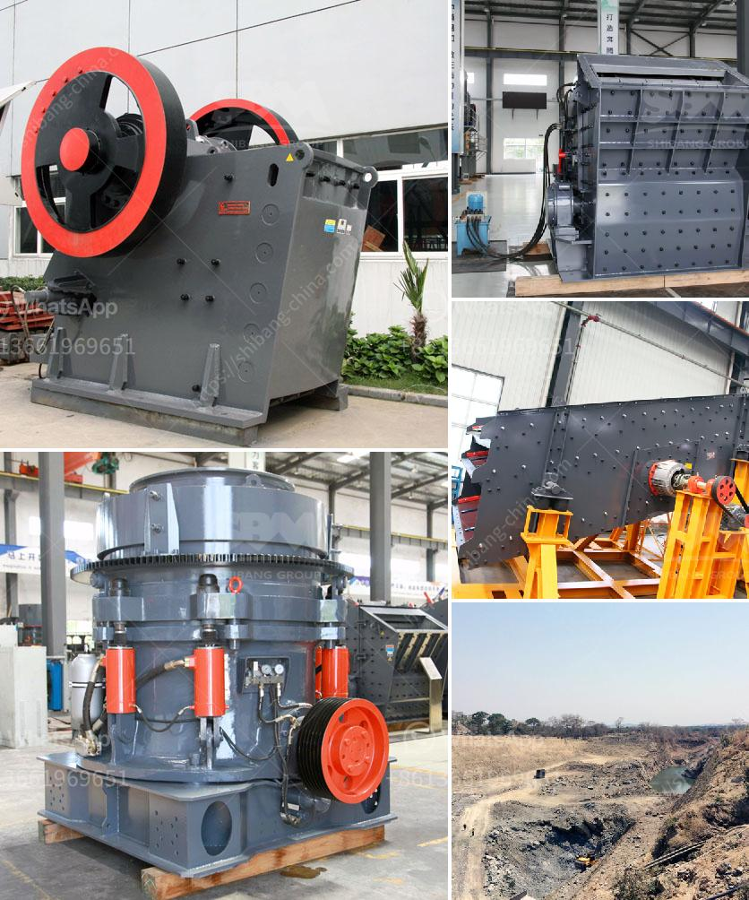

<h3>gypsum making machine</h3>
Gypsum, also known as calcium sulfate dihydrate, is a soft mineral that is commonly used in the manufacture of decorative materials such as wall panels, plasterboard, and ceramics. Gypsum is lightweight, fire-resistant, and has excellent soundproofing properties, making it a versatile and popular choice for interior construction.

To meet the growing demand for gypsum products, manufacturers rely on efficient machinery that can produce high-quality gypsum boards or other products. One such machine is the gypsum making machine.

The gypsum making machine is a mechanical device that compresses gypsum powder into solid and regular-shaped gypsum blocks. This machine also produces gypsum boards and other gypsum-based products for construction purposes.

The gypsum making machine consists of several key components. The first is the drying system. This system is responsible for removing the excess moisture from the gypsum powder and preparing it for the next stage of the process. The drying system typically consists of a dryer, a hot air generator, and a dust collector.

Once the gypsum powder has been dried, it enters the mixer. In the mixer, additives such as foaming agents, accelerators, and water are added to the dried powder. This helps to enhance the properties of the final gypsum product.

The mixed gypsum powder then enters the forming machine. The forming machine consists of a hydraulic compression system that applies pressure to the powder, shaping it into solid blocks or boards. The size and shape of the final product can be adjusted according to the customer's requirements.

After the gypsum blocks or boards have been formed, they are moved to the curing chamber. In this chamber, the blocks or boards are left to cure and harden. The curing process typically takes several hours or even days, depending on the desired strength and durability of the final product.

Once the curing process is complete, the gypsum blocks or boards are ready for packaging and shipping. They can be used for various applications, including interior wall and ceiling construction, decorative moldings, and acoustic panels.

The gypsum making machine offers numerous benefits to manufacturers. Firstly, it greatly improves productivity and efficiency. The machine can produce a large number of gypsum blocks or boards in a relatively short period of time, reducing production costs and increasing profitability.

Secondly, the machine ensures consistent and high-quality output. Each gypsum block or board produced by the machine has the same shape, size, and density, guaranteeing uniformity in construction projects.

Furthermore, the gypsum making machine is environmentally friendly. The production process does not generate harmful emissions or waste, making it a sustainable choice for construction manufacturers.

In conclusion, the gypsum making machine plays a crucial role in the production of gypsum blocks, boards, and other gypsum-based products. Its efficient, reliable, and environmentally friendly operation makes it an essential investment for construction manufacturers. With the growing demand for gypsum products, the gypsum making machine will continue to contribute to the development of the construction industry.
<h3>Contact us</h3><ul><li><strong>Whatsapp:&nbsp;<a href="https://wa.me/8613661969651">+8613661969651</a></strong></li><li><a href="https://swt.shibang-china.com/?git&amp;zhl&amp;gypsum making machine"><strong>Online Service(chat now)</strong></a></li></ul><h3>Related</h3><ul><li><a href='quarry machine for sale.md'>quarry machine for sale</a></li><li><a href='crusher for aggregate.md'>crusher for aggregate</a></li><li><a href='ball mill 5 tonnes.md'>ball mill 5 tonnes</a></li><li><a href='rock crusher for sale philippines.md'>rock crusher for sale philippines</a></li><li><a href='iron ore processing plant design pdf.md'>iron ore processing plant design pdf</a></li></ul>