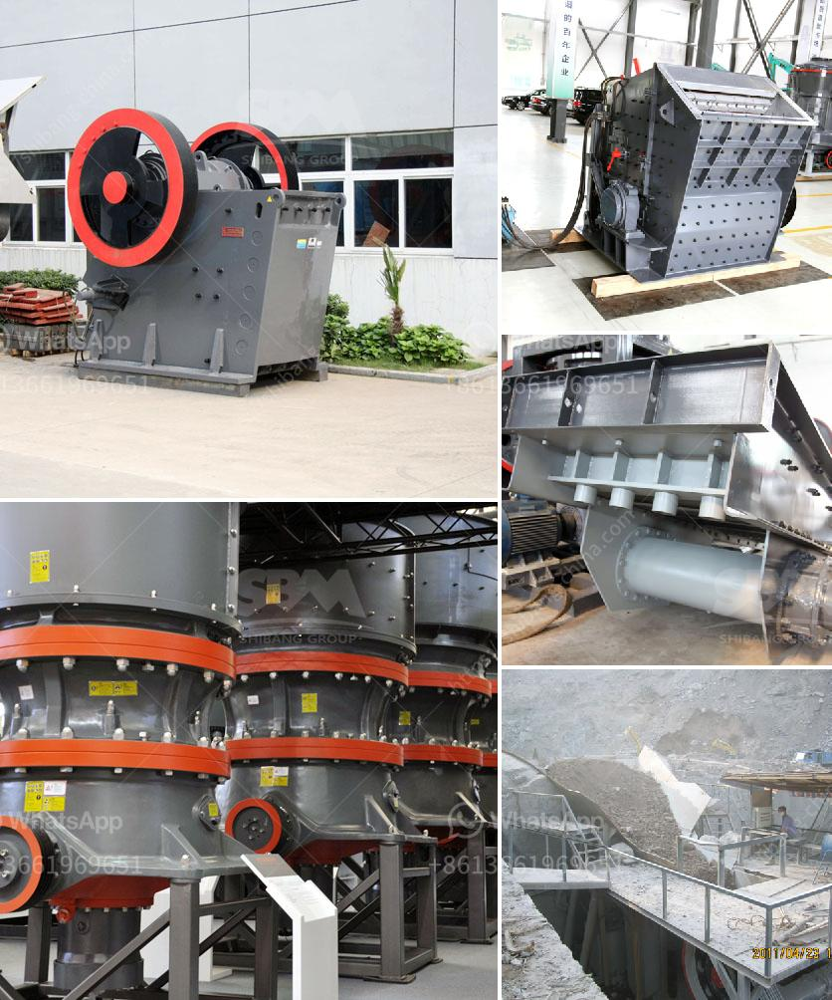

<h3>gypsum manufacturing equipment</h3>
Gypsum is a mineral that has been used in construction for centuries due to its versatility and durability. It is widely known for its use in drywall, but it is also used in a variety of other applications such as cement products, plaster of Paris, soil conditioning, and many more. 

To meet the growing demand for gypsum products, manufacturers rely on advanced equipment that enhances production efficiency and ensures consistent quality. Gypsum manufacturing equipment plays a crucial role in delivering high-quality products to the market. Let's explore some of the essential equipment used in the gypsum manufacturing process.

One of the primary pieces of equipment in gypsum production is the crusher. This machinery is responsible for crushing large-sized gypsum rocks into smaller pieces that can be further processed. The crusher uses powerful pressure to break the mineral into manageable sizes, making it easier to transport and process.

Following the crushing stage, the gypsum is then heated in a calciner. A calciner, often referred to as a gypsum calciner, is capable of converting the raw gypsum into its usable form. This process involves exposing the gypsum to high temperatures to remove any excess water molecules, resulting in a dry and powder-like substance.

Once the gypsum has been calcined, it is conveyed to a storage and blending area, where additives and other materials can be added. This area is equipped with a series of conveyors, hoppers, and mixers to ensure proper blending and homogeneity of the gypsum powder.

The next vital piece of equipment is the dryer. As the name suggests, the dryer eliminates any remaining moisture in the gypsum powder, which is crucial for maintaining its stability. It achieves this by exposing the powder to high temperatures and using hot air to evaporate residual moisture.

After drying, the gypsum powder is ready to be distributed and used in various applications. However, to enhance its usability, manufacturers often opt for gypsum processing equipment. This equipment includes mills and classifiers that further reduce the particle size and improve the fineness of the gypsum powder.

Finally, packaging equipment is essential for the final stage of the gypsum manufacturing process. It allows the gypsum powder to be packaged in bags or other forms of containers, ensuring ease of handling and transportation. This equipment is designed to efficiently package gypsum powder, either manually or automatically, while maintaining product integrity.

In conclusion, gypsum manufacturing equipment is an essential component of the gypsum production process. From crushing and calcining to blending and packaging, each piece of equipment plays a crucial role in ensuring high-quality gypsum products. It is through the utilization of advanced equipment that manufacturers can meet the growing demand and deliver reliable and consistent gypsum products to the market.
<h3>Contact us</h3><ul><li><strong>Whatsapp:&nbsp;<a href="https://wa.me/8613661969651">+8613661969651</a></strong></li><li><a href="https://swt.shibang-china.com/?git&amp;zhl&amp;gypsum manufacturing equipment"><strong>Online Service(chat now)</strong></a></li></ul><h3>Related</h3><ul><li><a href='difference between ball mill and roller mill.md'>difference between ball mill and roller mill</a></li><li><a href='marble ball mill.md'>marble ball mill</a></li><li><a href='how to grind stone into fine powder.md'>how to grind stone into fine powder</a></li><li><a href='harga mesin molen di medan.md'>harga mesin molen di medan</a></li><li><a href='price and sales of quarry crusher in nigeria.md'>price and sales of quarry crusher in nigeria</a></li></ul>