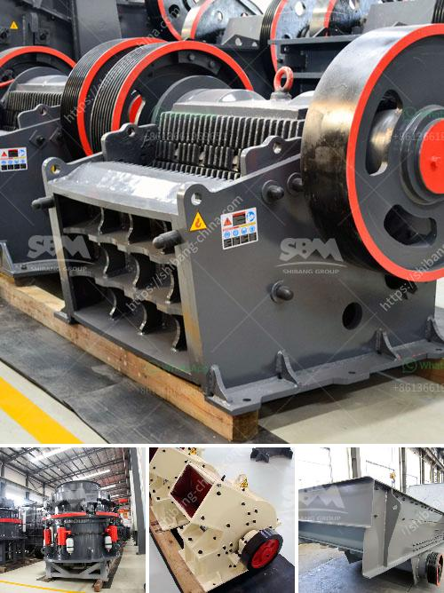

<h3>gypsum mines in orissa india</h3>
Title: Gypsum Mines in Odisha, India: A Hidden Resource Driving Agricultural and Industrial Development

Located in the eastern Indian state of Odisha, gypsum mines play a crucial role in driving agricultural and industrial development in the region. With vast reserves and a growing demand for gypsum-based products, these mines have emerged as a hidden resource, contributing significantly to the state's economy.

The gypsum mines in Odisha have a long and rich history, dating back to ancient times. Odisha boasts extensive deposits of high-quality gypsum, primarily located in the districts of Cuttack, Khurda, Kendujhar, and Rayagada. The mineral is primarily found in layers of sedimentary rocks and is the result of ancient marine evaporation.

Gypsum is widely recognized as a vital soil amendment, enhancing fertility and overall crop yield. The abundant availability of gypsum in Odisha has brought great benefits to the state's agriculture sector. By incorporating gypsum into soil, farmers can improve soil structure, facilitate better water penetration, and enhance nutrient availability to plants. Gypsum also mitigates the adverse effects of soil salinity, making it particularly valuable for regions with high salinity levels, such as coastal areas. Consequently, the mining and distribution of gypsum in Odisha have contributed significantly to promoting sustainable and profitable agriculture.

Beyond its agricultural applications, gypsum has gained increasing importance in various industries. Its versatile properties make it an appealing material for construction, cement, fertilizer, and plasterboard production. Odisha's gypsum mines play a crucial role in meeting this growing demand. By extracting and supplying gypsum to industries, these mines stimulate economic growth and generate employment opportunities.

The construction sector, in particular, benefits immensely from gypsum mines. Gypsum-based construction materials, such as plasterboard and gypsum blocks, offer fire resistance, acoustic insulation, and aesthetic appeal. This has led to the increased use of gypsum in the construction of residential, commercial, and industrial buildings, further driving the demand for gypsum and boosting the state's economy.

In conclusion, the gypsum mines in Odisha are fundamental to the region's agricultural and industrial development. With their vast reserves of high-quality gypsum, these mines contribute significantly to enhancing soil fertility, supporting sustainable agriculture, and meeting the growing demand for gypsum-based products in various industries. Recognizing the immense potential of this hidden resource is essential to further unlocking the economic and environmental benefits it offers.
<h3>Contact us</h3><ul><li><strong>Whatsapp:&nbsp;<a href="https://wa.me/8613661969651">+8613661969651</a></strong></li><li><a href="https://swt.shibang-china.com/?git&amp;zhl&amp;gypsum mines in orissa india"><strong>Online Service(chat now)</strong></a></li></ul><h3>Related</h3><ul><li><a href='diagram of hammer mill machine.md'>diagram of hammer mill machine</a></li><li><a href='process of crushing stones.md'>process of crushing stones</a></li><li><a href='small scale mining plant layout.md'>small scale mining plant layout</a></li><li><a href='price pe 600 and 900 stone crusher.md'>price pe 600 and 900 stone crusher</a></li><li><a href='spare parts dealer of crusher plant in odisha.md'>spare parts dealer of crusher plant in odisha</a></li></ul>