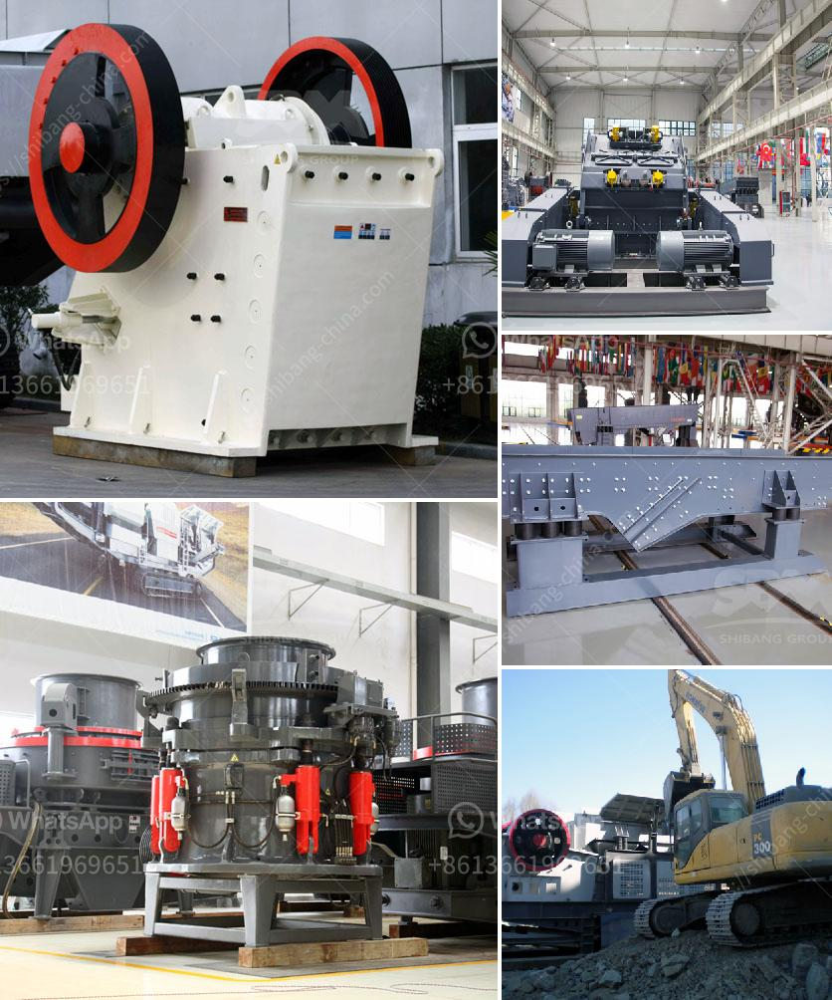

<h3>gypsum plant feasibility study</h3>
Gypsum is a versatile mineral that has numerous uses, including in construction, agriculture, and industrial applications. As the demand for gypsum continues to rise, the idea of setting up a gypsum plant has gained considerable attention. However, before embarking on such a venture, it is crucial to conduct a feasibility study to assess the viability and profitability of the project.

A feasibility study is a comprehensive analysis of a proposed project to determine its potential profitability. It involves evaluating various factors, including market demand, competition, financial projections, and operational costs. In the case of a gypsum plant, the study will provide insights into the demand for gypsum products, the competitive landscape, and the financial viability of the venture.

One of the crucial aspects that a feasibility study will assess is the market demand for gypsum products. This involves understanding the current and future demand for gypsum in various sectors, such as construction and agriculture. The study will analyze the growth potential of these industries and determine if there is a sufficient market to support the proposed gypsum plant.

Additionally, a feasibility study will examine the competitive landscape of the gypsum market. This involves identifying existing gypsum suppliers and understanding their product offerings, pricing strategies, and market share. By understanding competitor strengths and weaknesses, a feasibility study can help identify opportunities for differentiation and market positioning for the new plant.

Financial projections also play a significant role in a feasibility study. It includes analyzing the cost of setting up the plant, including equipment, raw materials, and labor. The study will also estimate the operational costs, such as energy consumption and maintenance expenses. By considering these costs, a feasibility study can provide an estimate of the investment required and the potential returns on that investment.

Moreover, a feasibility study will address potential risks and challenges associated with setting up a gypsum plant. It may include investigating regulatory requirements, environmental concerns, and other operational challenges. By identifying and assessing these risks, the study can provide recommendations to mitigate them and ensure the success of the project.

In conclusion, a feasibility study is essential before establishing a gypsum plant. It provides a detailed analysis of the market demand, competitive landscape, financial projections, and potential risks associated with the venture. By conducting a feasibility study, one can make informed decisions regarding the viability and profitability of the project. Ultimately, a well-executed study can guide the project's planning and implementation, leading to a successful gypsum plant.
<h3>Contact us</h3><ul><li><strong>Whatsapp:&nbsp;<a href="https://wa.me/8613661969651">+8613661969651</a></strong></li><li><a href="https://swt.shibang-china.com/?git&amp;zhl&amp;gypsum plant feasibility study"><strong>Online Service(chat now)</strong></a></li></ul><h3>Related</h3><ul><li><a href='mini cement plant capacity of ton per day.md'>mini cement plant capacity of ton per day</a></li><li><a href='list of quarry crusher company in the philippines.md'>list of quarry crusher company in the philippines</a></li><li><a href='the roller grinding mill.md'>the roller grinding mill</a></li><li><a href='small scale mining plant layout.md'>small scale mining plant layout</a></li><li><a href='quarry crusher machine.md'>quarry crusher machine</a></li></ul>