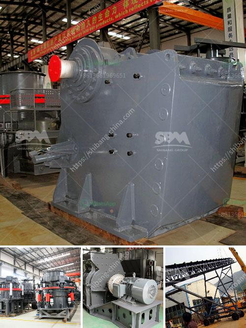

<h3>gypsum powder factory feasibility study</h3>
Gypsum powder, a natural product derived from the mineral ore gypsum, is primarily used in construction materials such as drywall and plaster. It is also used as a soil amendment, in agricultural settings, and as an ingredient in cement and wallboard. Given its versatile applications, establishing a gypsum powder factory can be a lucrative venture. However, conducting a feasibility study is crucial before embarking on such an endeavor.

A feasibility study for a gypsum powder factory examines several important aspects to determine the potential success of the project. Firstly, it analyzes the market demand and competition in the target region. This includes assessing the current and future needs for gypsum powder, identifying potential customers, and evaluating the pricing and demand-supply dynamics. Market analysis helps in understanding the potential market size and growth rate, enabling the factory to establish competitive pricing strategies.

Secondly, a feasibility study analyzes the availability and cost of raw materials. Gypsum is a widely available mineral in many countries, but access to high-quality gypsum reserves is crucial for the long-term sustainability of the factory. The study examines the local and international sources of gypsum, transportation costs, and any restrictions or regulations related to mining and extraction.

Furthermore, a feasibility study assesses the technical and financial aspects of setting up the factory. It determines the required machinery, equipment, and technology for gypsum powder production. The study also evaluates the factory's location, considering factors such as access to transportation, utilities, and workforce availability. Financial analysis involves estimating the initial investment required, determining operating costs, and forecasting revenue and profitability based on market demand projections.

In conclusion, establishing a gypsum powder factory can be a profitable venture. However, conducting a comprehensive feasibility study is essential to understand the market potential, raw material availability, and financial feasibility of the project. By conducting such a study, entrepreneurs can make informed decisions and increase their chances of success in this industry.
<h3>Contact us</h3><ul><li><strong>Whatsapp:&nbsp;<a href="https://wa.me/8613661969651">+8613661969651</a></strong></li><li><a href="https://swt.shibang-china.com/?git&amp;zhl&amp;gypsum powder factory feasibility study"><strong>Online Service(chat now)</strong></a></li></ul><h3>Related</h3><ul><li><a href='cost of crusher machine.md'>cost of crusher machine</a></li><li><a href='diagram of hammer mill machine.md'>diagram of hammer mill machine</a></li><li><a href='stne crusher for sale south africa.md'>stne crusher for sale south africa</a></li><li><a href='decibels declined jaw crusher hebro.md'>decibels declined jaw crusher hebro</a></li><li><a href='low cost jaw crusher price.md'>low cost jaw crusher price</a></li></ul>