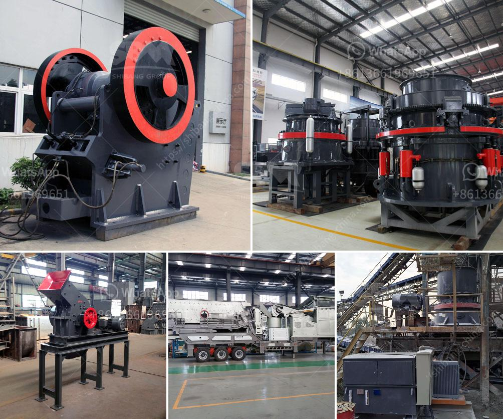

<h3>gypsum powder production line capacity 80 tons per hour</h3>
Gypsum is a versatile and essential material for several industries that play a crucial role in the global economy. Its high demand is mainly due to its versatile applications in construction, agriculture, and industrial uses. The production of gypsum powder is a vital process, requiring advanced machinery and a well-designed production line. In this article, we will explore the capacity of a gypsum powder production line capable of producing 80 tons per hour.

To meet the increasing demand for gypsum powder, manufacturers are striving to enhance production efficiency and expand production capacity. The 80-ton-per-hour gypsum powder production line is designed to support a high level of production and ensure exceptional quality. This production line efficiently processes raw gypsum into high-quality powder that is required for various applications, such as drywall, cement additives, soil amendments, and many others.

The key equipment involved in the production line includes a gypsum rock crusher, a grinding mill, a multi-head weighing system, and a bagging machine. The crusher breaks down large-sized gypsum rocks into smaller pieces, enabling the subsequent grinding process. The grinding mill, equipped with advanced technology and precise control systems, finely grinds the gypsum into powder form by rotating and grinding the material against a set of rollers. This process ensures uniform particle size and high purity of the gypsum powder.

The multi-head weighing system measures the precise amount of powdered gypsum required for each bag. This system ensures accuracy in the bagging process, reducing waste and optimizing productivity. The bagging machine automatically packs the produced powder into bags of the desired weight, providing convenience for distribution and use.

The 80-ton-per-hour capacity of the production line is achieved through a combination of high-efficiency equipment and seamless automation. The continuous operation of the production line guarantees a consistent output of high-quality gypsum powder, meeting the demands of various industries. Additionally, the production line incorporates advanced monitoring systems to track and optimize production parameters, ensuring maximum productivity and minimal downtime.

Furthermore, the production line is designed to be environmentally friendly and energy-efficient. Modern technology and equipment reduce energy consumption, lower emission levels, and minimize waste generation. Manufacturers are increasingly adopting sustainable practices to promote a greener environment, and the gypsum powder production industry is no exception.

The 80-ton-per-hour gypsum powder production line is a testament to the progress made in gypsum processing technology. It showcases advanced machinery, excellent engineering, and optimized processes. With this remarkable capacity, manufacturers can meet the rising demand for gypsum powder while maintaining superior quality standards.

In conclusion, the capacity of the gypsum powder production line, capable of producing 80 tons per hour, showcases the advancements in gypsum processing technology. This state-of-the-art production line efficiently produces high-quality gypsum powder required for diverse industries. With a focus on sustainability and efficiency, manufacturers can meet the increasing demand for gypsum powder while minimizing environmental impact.
<h3>Contact us</h3><ul><li><strong>Whatsapp:&nbsp;<a href="https://wa.me/8613661969651">+8613661969651</a></strong></li><li><a href="https://swt.shibang-china.com/?git&amp;zhl&amp;gypsum powder production line capacity 80 tons per hour"><strong>Online Service(chat now)</strong></a></li></ul><h3>Related</h3><ul><li><a href='crusher equipment in sweden.md'>crusher equipment in sweden</a></li><li><a href='stone crusher plant for sale in saudi.md'>stone crusher plant for sale in saudi</a></li><li><a href='price of ball mill.md'>price of ball mill</a></li><li><a href='kenya jaw crushers south africa.md'>kenya jaw crushers south africa</a></li><li><a href='ton crushing machine.md'>ton crushing machine</a></li></ul>