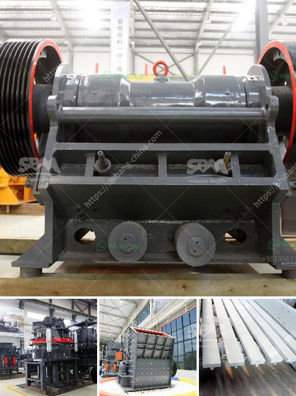

<h3>gypsum powder production</h3>
Gypsum powder, also known as calcium sulfate dihydrate, is a versatile mineral widely used in various industries. The application of this fine powder is endless, ranging from the construction industry to the food industry. The process of gypsum powder production is relatively straightforward, but it requires high-quality equipment to ensure the final product's purity and consistency.

The first step in gypsum powder production is the quarrying of gypsum ore. The raw material is extracted from underground or open-cast mines, depending on its depth and quality. Once the gypsum ore is obtained, it is crushed into smaller particles and heated to remove any moisture content. This process is known as calcination and is crucial to achieving the desired quality of gypsum powder.

The next step involves grinding the calcined gypsum into a fine powder. This is achieved using a specialized grinding mill, which features rotating blades that crush the gypsum into small particles. The resulting powder is then screened to remove any impurities and ensure a consistent particle size distribution.

To optimize the properties of gypsum powder, various additives may be incorporated during the grinding process. These additives enhance characteristics such as setting time, strength, and fire resistance. Common additives include limestone, fly ash, and silica fume.

Once the grinding and screening processes are complete, the gypsum powder is packaged in bags or stored in silos for distribution. The purity and consistency of the final product are critical, as gypsum powder is extensively used in construction materials like wall plaster, cement, and gypsum boards.

In addition to construction materials, gypsum powder finds applications in the food industry as a stabilizer, thickening agent, and emulsifier. It is commonly used in the production of tofu, confectionery, and baking products, among others.

Overall, the production of gypsum powder involves a series of steps, including quarrying, calcination, grinding, and packaging. High-quality equipment and consistent quality control measures are essential to ensure the purity, fineness, and consistency of the final product. Gypsum powder's wide range of applications makes it a valuable mineral in various industries.
<h3>Contact us</h3><ul><li><strong>Whatsapp:&nbsp;<a href="https://wa.me/8613661969651">+8613661969651</a></strong></li><li><a href="https://swt.shibang-china.com/?git&amp;zhl&amp;gypsum powder production"><strong>Online Service(chat now)</strong></a></li></ul><h3>Related</h3><ul><li><a href='feldspar powder making machine in india.md'>feldspar powder making machine in india</a></li><li><a href='vibrating screen made in the philippines.md'>vibrating screen made in the philippines</a></li><li><a href='hammer mill buy.md'>hammer mill buy</a></li><li><a href='cannabis mechoire cannabis crusher in pakistan.md'>cannabis mechoire cannabis crusher in pakistan</a></li><li><a href='granite crusher machine.md'>granite crusher machine</a></li></ul>