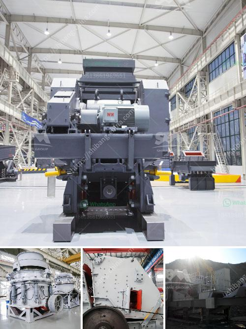

<h3>gypsum production line price</h3>
Gypsum production line is used to produce gypsum powder. The common gypsum production line equipment includes crusher, mill, conveyor, dust collector, and other equipment. Here, we introduce the price of the gypsum production line.

The price of gypsum production line varies depending on the different equipment configurations. In general, the price of an ordinary gypsum production line will be between $100,000 and $500,000. The specific price depends on the configuration of the equipment. For example, the higher the degree of automation, the higher the price, and the larger the production capacity, the higher the price. Additionally, the quality and performance of the equipment also have an impact on the price.

1. Equipment configuration: The gypsum production line has different equipment configurations according to different production needs. The more advanced the equipment configuration, the higher the price will be.

2. Production capacity: Different production capacities require different equipment. The larger the production capacity, the higher the price.

3. Quality of equipment: The price of high-quality equipment will be higher, as it is more durable and can ensure stable and efficient production.

4. Manufacturer: Different manufacturers have different pricing strategies. Well-known brand manufacturers tend to have higher prices due to their reputation and quality assurance.

1. Define your production needs: Before purchasing a gypsum production line, it is important to understand your specific production needs. Determine the required production capacity, particle size, and quality requirements. This will help you select the appropriate equipment configuration for your needs.

2. Compare prices: Obtaining multiple quotes from different manufacturers will help you compare prices and choose the most cost-effective option. However, remember not to focus solely on price, but also consider the quality and reputation of the manufacturer.

3. Visit manufacturers and inspect equipment: If conditions permit, it is recommended to visit the manufacturer's production site, inspect the equipment in person, and communicate with the manufacturer to reach a better understanding. This will help you make a more informed decision.

In summary, the price of a gypsum production line varies depending on factors such as equipment configuration, production capacity, equipment quality, and manufacturer. It is important to define your specific production needs and compare prices from different manufacturers before making a purchase. Remember to consider not only the price but also the quality and reputation of the manufacturer. With careful evaluation, you can find a cost-effective gypsum production line that meets your requirements.
<h3>Contact us</h3><ul><li><strong>Whatsapp:&nbsp;<a href="https://wa.me/8613661969651">+8613661969651</a></strong></li><li><a href="https://swt.shibang-china.com/?git&amp;zhl&amp;gypsum production line price"><strong>Online Service(chat now)</strong></a></li></ul><h3>Related</h3><ul><li><a href='process of mining silica rock crusher.md'>process of mining silica rock crusher</a></li><li><a href='zinc ash crusher machine required.md'>zinc ash crusher machine required</a></li><li><a href='cement plant for sale intpd.md'>cement plant for sale intpd</a></li><li><a href='cement plant in brazil.md'>cement plant in brazil</a></li><li><a href='aggregate quarry crusher philippines.md'>aggregate quarry crusher philippines</a></li></ul>