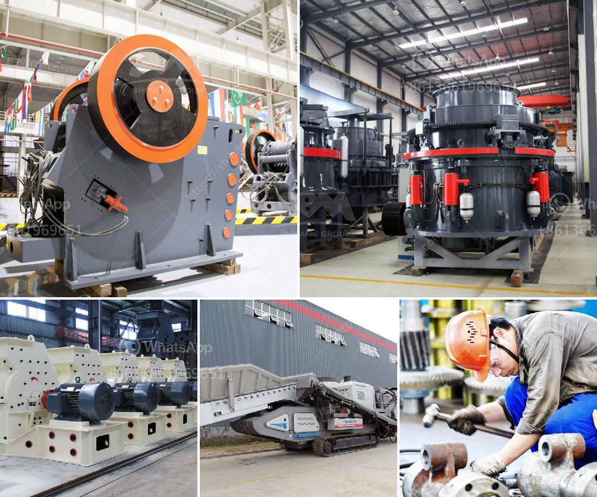

<h3>gypsum production plant suppliers in pakistan</h3>
Gypsum is a soft, water-soluble mineral that is commonly used in the construction industry for manufacturing building materials like cement, plaster, and drywall. With its abundance in Pakistan, it is the fourth-largest producer of gypsum globally. Gypsum production plant suppliers in Pakistan have been established to cater to the growing demand of gypsum across the country.

Pakistan's gypsum reserves are estimated at 300 million tons, which are largely found in the districts of Punjab, Sindh, and Balochistan. The mineral is widely used to manufacture cement, fertilizer, and plaster of Paris, among other products. The demand for gypsum has been steadily increasing due to the robust growth of the construction industry in Pakistan.

Gypsum production plants in Pakistan are continually striving to enhance their production capacities and meet the increasing demand for gypsum in the country. Many suppliers have established state-of-the-art facilities to ensure a steady supply of gypsum to the market. These facilities utilize advanced technology and machinery to extract, process, and refine gypsum into high-quality materials that can be used in various construction applications.

One of the key gypsum production plant suppliers in Pakistan is M/s Lafarge Pakistan Cement Limited. Being a professional supplier of gypsum, it has been providing excellent quality products to the construction industry. Lafarge Pakistan has a production capacity of approximately 2.5 million tons per year, making it one of the major suppliers in Pakistan.

Another prominent supplier is M/s Fauji Cement Company Limited. With a production capacity of 3.4 million tons per annum, Fauji Cement plays a significant role in fulfilling the country's gypsum requirements. The company has adopted modern and eco-friendly techniques to produce high-quality gypsum products for the construction industry.

M/s Kohinoor Gypsum Company Limited is also a leading supplier of gypsum in Pakistan. It has a state-of-the-art manufacturing facility located in Punjab. The company specializes in producing gypsum boards, ceiling tiles, and plaster of Paris. Kohinoor Gypsum is known for its commitment to quality and customer satisfaction.

Apart from these major suppliers, there are several other gypsum production plant suppliers in Pakistan catering to the local market. These suppliers ensure a steady supply of gypsum in various forms to meet the diverse needs of the construction industry. They offer a wide range of gypsum-based products such as gypsum powder, gypsum boards, and gypsum ceiling tiles.

The growth of gypsum production plants in Pakistan has also had a positive impact on employment opportunities. These facilities create numerous direct and indirect jobs in the regions where they are located, contributing to the overall economic development of Pakistan.

In conclusion, gypsum production plant suppliers in Pakistan play a crucial role in meeting the growing demand for gypsum in the construction industry. With their state-of-the-art facilities and commitment to quality, these suppliers ensure a steady and reliable supply of gypsum to support the country's infrastructure development. The presence of these suppliers strengthens Pakistan's position as a major player in the global market for gypsum.
<h3>Contact us</h3><ul><li><strong>Whatsapp:&nbsp;<a href="https://wa.me/8613661969651">+8613661969651</a></strong></li><li><a href="https://swt.shibang-china.com/?git&amp;zhl&amp;gypsum production plant suppliers in pakistan"><strong>Online Service(chat now)</strong></a></li></ul><h3>Related</h3><ul><li><a href='are vertical ultrafine mill roller.md'>are vertical ultrafine mill roller</a></li><li><a href='vermiculite processing equipment.md'>vermiculite processing equipment</a></li><li><a href='sayaji stone crusher machine.md'>sayaji stone crusher machine</a></li><li><a href='iron washer making machine with price in india.md'>iron washer making machine with price in india</a></li><li><a href='alluvial mining wash plant in canada.md'>alluvial mining wash plant in canada</a></li></ul>