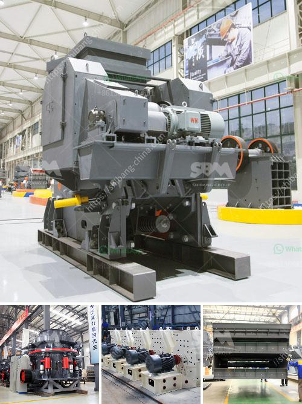

<h3>gypsum production process plant design</h3>
Gypsum is a mineral composed of calcium sulfate dihydrate (CaSO4·2H2O) and is often used in various industrial applications, such as construction materials, plasterboard, fertilizers, and soil amendment. Gypsum production process involves extracting the gypsum rock from the ground, crushing it, heating it, and subsequently grinding it to obtain a fine powder.

Gypsum production plant design involves identifying various factors such as capacity requirements, space availability, equipment, and technology selection, as well as economic feasibility. The process design must also consider other factors, such as sustainability, energy efficiency, and environmental impact.

The first step in designing a gypsum production plant is to determine the geological properties of the gypsum deposit. This includes analyzing the quality and quantity of the gypsum rock present, as well as any impurities or contaminants. It is crucial to choose a suitable mining method to extract the gypsum and minimize environmental impact.

Once the gypsum rock is extracted, it is transported to the crushing plant, where it is further processed into smaller pieces. The size reduction process ensures that the gypsum particles are of the desired size for further processing. Crushing equipment, such as jaw crushers or cone crushers, is used to reduce the size of the gypsum rock.

The next step in the gypsum production process is heating the crushed rock. This process, known as calcination, involves exposing the gypsum to high temperatures, which removes any remaining water molecules and converts the calcium sulfate dihydrate into calcium sulfate hemihydrate (CaSO4·0.5H2O), commonly known as stucco.

After the calcination process, the stucco is then ground into a fine powder in a grinding mill. This grinding step ensures that the gypsum powder has a consistent particle size distribution, which is essential for its various applications. The grinding process can be performed using ball mills, roller mills, or impact mills, depending on the desired fineness of the gypsum powder.

Once the gypsum powder is obtained, it is stored in silos or bags before being transported for further processing or sale. The design of the storage and handling systems must consider factors such as moisture control, dust suppression, and ease of transportation.

In conclusion, the design of a gypsum production plant involves several crucial steps, including determining the geological properties of the gypsum deposit, selecting suitable equipment for crushing and grinding, and designing efficient storage and handling systems. A well-designed plant not only ensures the production of high-quality gypsum products but also considers aspects of sustainability and environmental impact.
<h3>Contact us</h3><ul><li><strong>Whatsapp:&nbsp;<a href="https://wa.me/8613661969651">+8613661969651</a></strong></li><li><a href="https://swt.shibang-china.com/?git&amp;zhl&amp;gypsum production process plant design"><strong>Online Service(chat now)</strong></a></li></ul><h3>Related</h3><ul><li><a href='cost of a hammer mill.md'>cost of a hammer mill</a></li><li><a href='list iron ore pellet plants in india.md'>list iron ore pellet plants in india</a></li><li><a href='ball mill outpot capicity 180 tph.md'>ball mill outpot capicity 180 tph</a></li><li><a href='harga sewa beli stone crusher kapasitas 30 ton per jam.md'>harga sewa beli stone crusher kapasitas 30 ton per jam</a></li><li><a href='jaw crushers machine for sale.md'>jaw crushers machine for sale</a></li></ul>