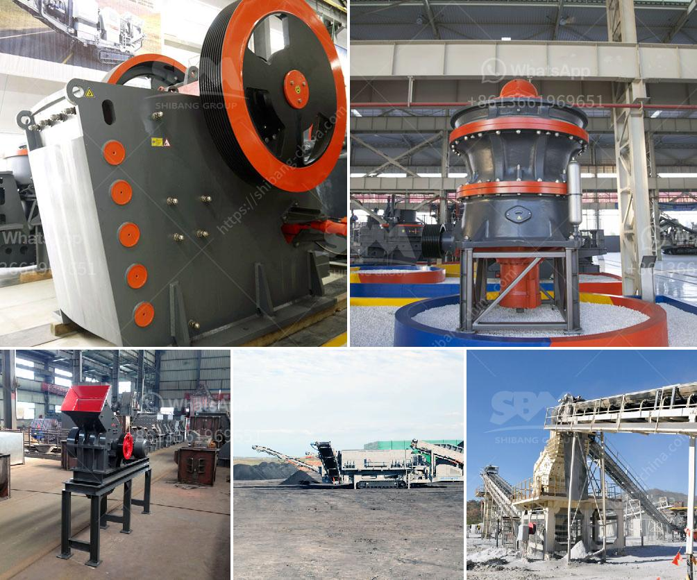

<h3>gypsum stone crusher</h3>
Gypsum stone crusher is suitable for crushing gypsum stones into small particles for crafts production. Gypsum stone crusher is widely used in gypsum crushing plant and gypsum grinding plant. The gypsum stone crusher includes jaw crusher, cone crusher, impact crusher, hammer crusher, roll crusher, mobile crusher and so on. These crushers are suitable for crushing gypsum stones into different sizes.

Gypsum stone crusher has a variety of types and specifications. They are mainly used to crush gypsum stones into desired fineness for various applications. Gypsum grinding plant is also called gypsum grinding mill, which is used for grinding gypsum stones into powder. Therefore, gypsum stone crusher can be used to crush large-sized gypsum stones into small particles for further processing.

Jaw Crusher: Jaw crusher is designed to crush all rock types from the hardest granites to abrasive ones and recycle materials. Combining with high quality cast steel components and tip-top ball roller bearing, the unique design fully ensures high yielding and efficiency, low cost crushing process.

Cone Crusher: Cone crusher is generally applied as secondary or tertiary crushing machine in stone quarry plant. Cone crusher use for sale is with low price and the highest capacities. Cone crusher for stone quarry crushing machine is the key equipment in stone quarrying operation. Cone crusher is generally applied as secondary or tertiary crushing machine in stone quarry plant.

Impact Crusher: Impact crushers are based upon several decades of experience with the impact method. Crusher for gypsum recycling and gypsum waste recycling. The ACA crusher is highly qualified for crushing of collected gypsum from recycling stations, work places, demolition of buildings, cutting of plates.

Hammer Crusher: HAMMER CRUSHER for Crushing Thermal coal, slag, cement, gypsum, clay, limestone, ore etc. In the fields of power plant coal, slag, cement, gypsum, clay, limestone powder, ore and other fields, the solid materials need to be crushed in a single stage crushing machine to increase the over crushing rate and minimize the product size grade.

In the gypsum grinding plant, gypsum grinding mill is used to grind the gypsum particles into powder size. To make concrete, making Portland cement, gypsum is ground to powder and heated to about 350F (175C). Powdered gypsum is added to the mixers and heated to remove most of the excess water. The next step in the process is to boil the gypsum powder with water, and the water is returned to the heating process. The next step in the process is to re-grind the gypsum to about 90 micrometers, or less, and serve as a filler or cement additive.

Gypsum grinding mill is also called gypsum stone grinding mill, which mainly used for processing more than 280 kinds of high fine powder materials, non flammable and explosive mines with no more than 9.3 Mohs hardness and below 6% humidity such as gypsum stone, barite, limestone, marble, mineral, activated carbon, calcite, dolomite, talcum, carbon black, kaolin, bentonite, mica, talc, magnesite, illite, pyrophyllite, vermiculite, sepiolite, attapulgite, rectorite, diatomite, graphite, alunite, fluorite, potassium feldspar, phosphorite, pigment, up to 200 kinds.
<h3>Contact us</h3><ul><li><strong>Whatsapp:&nbsp;<a href="https://wa.me/8613661969651">+8613661969651</a></strong></li><li><a href="https://swt.shibang-china.com/?git&amp;zhl&amp;gypsum stone crusher"><strong>Online Service(chat now)</strong></a></li></ul><h3>Related</h3><ul><li><a href='quartz processing machine.md'>quartz processing machine</a></li><li><a href='grinding mill prices in zimbabwe.md'>grinding mill prices in zimbabwe</a></li><li><a href='rock crusher for sale philippines.md'>rock crusher for sale philippines</a></li><li><a href='mobile crusher in codelco.md'>mobile crusher in codelco</a></li><li><a href='technical specification limestone milling system.md'>technical specification limestone milling system</a></li></ul>